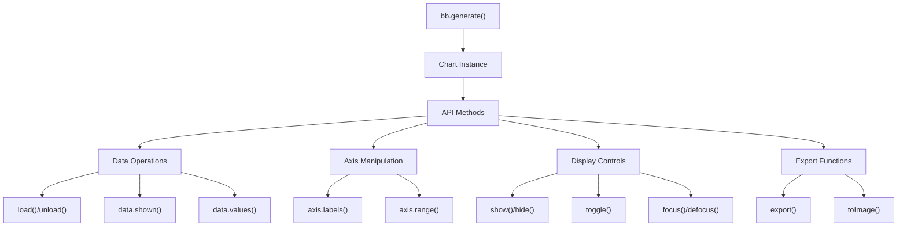
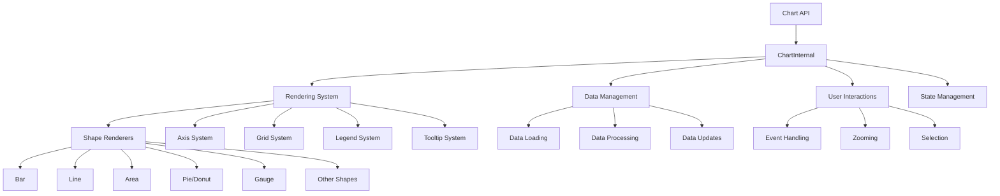
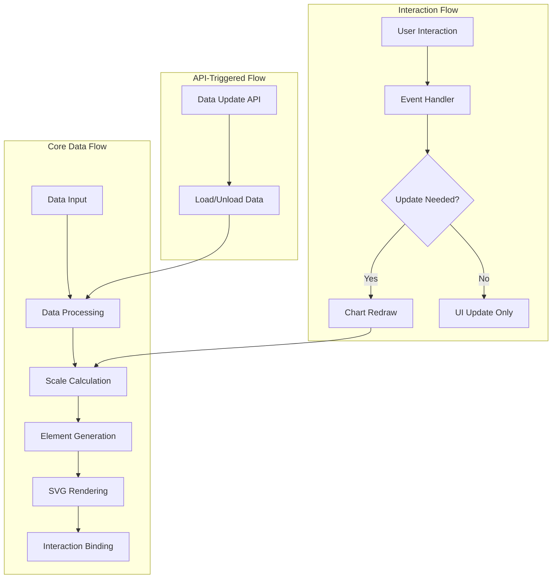
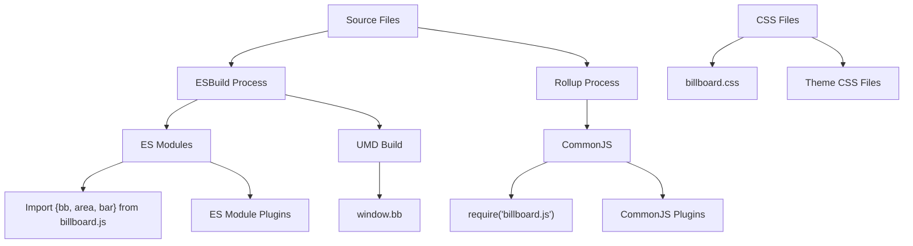
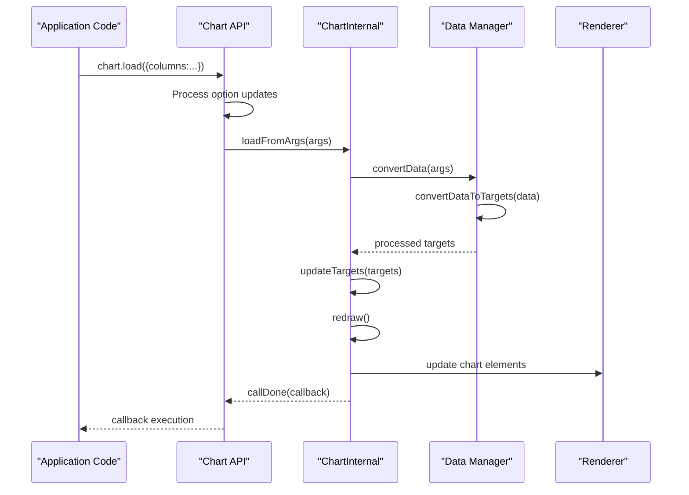

# Overview

<details>
<summary>Relevant source files</summary>

The following files were used as context for generating this wiki page:

- [.gitignore](https://github.com/naver/billboard.js/blob/d6229c39/.gitignore)
- [.yarnrc.yml](https://github.com/naver/billboard.js/blob/d6229c39/.yarnrc.yml)
- [AUTHORS.txt](https://github.com/naver/billboard.js/blob/d6229c39/AUTHORS.txt)
- [CHANGELOG.md](https://github.com/naver/billboard.js/blob/d6229c39/CHANGELOG.md)
- [README.md](https://github.com/naver/billboard.js/blob/d6229c39/README.md)
- [demo/types/index.html](https://github.com/naver/billboard.js/blob/d6229c39/demo/types/index.html)
- [demo/types/types.css](https://github.com/naver/billboard.js/blob/d6229c39/demo/types/types.css)
- [demo/types/types.js](https://github.com/naver/billboard.js/blob/d6229c39/demo/types/types.js)
- [package.json](https://github.com/naver/billboard.js/blob/d6229c39/package.json)
- [src/Chart/api/load.ts](https://github.com/naver/billboard.js/blob/d6229c39/src/Chart/api/load.ts)
- [src/ChartInternal/data/load.ts](https://github.com/naver/billboard.js/blob/d6229c39/src/ChartInternal/data/load.ts)
- [test/api/load-spec.ts](https://github.com/naver/billboard.js/blob/d6229c39/test/api/load-spec.ts)
- [test/shape/radar-spec.ts](https://github.com/naver/billboard.js/blob/d6229c39/test/shape/radar-spec.ts)
- [types/chart.d.ts](https://github.com/naver/billboard.js/blob/d6229c39/types/chart.d.ts)
- [yarn.lock](https://github.com/naver/billboard.js/blob/d6229c39/yarn.lock)

</details>


Billboard.js is a reusable, easy interface JavaScript chart library based on D3.js. This document provides a comprehensive overview of the library's architecture, components, and usage patterns for developers who want to understand how it works or contribute to the project.

For installation and basic usage instructions, see [Installation and Usage](#1.1). For a deeper dive into the architecture details, see [Architecture Overview](#1.2).

## Core Concepts

Billboard.js provides a declarative API for creating and manipulating interactive data visualizations. It wraps the powerful D3.js library with a more accessible interface that makes creating common chart types straightforward while still allowing for extensive customization.



Sources: [package.json:1-171](https://github.com/naver/billboard.js/blob/d6229c39/package.json#L1-L171), [README.md:1-315](https://github.com/naver/billboard.js/blob/d6229c39/README.md#L1-L315), [types/chart.d.ts:1-127](https://github.com/naver/billboard.js/blob/d6229c39/types/chart.d.ts#L1-L127)

## Library Architecture

Billboard.js follows a layered architecture with a clean separation between the public API and the internal implementation.



Sources: [src/ChartInternal/data/load.ts:1-194](https://github.com/naver/billboard.js/blob/d6229c39/src/ChartInternal/data/load.ts#L1-L194), [src/Chart/api/load.ts:1-255](https://github.com/naver/billboard.js/blob/d6229c39/src/Chart/api/load.ts#L1-L255), [package.json:1-171](https://github.com/naver/billboard.js/blob/d6229c39/package.json#L1-L171)

### Key Components

| Component | Description |
|-----------|-------------|
| Chart API | Public interface exposed to users. Created via `bb.generate()` and provides methods for chart manipulation |
| ChartInternal | Core implementation that handles the rendering, data management and maintains state |
| Rendering System | Components that draw chart elements (shapes, axes, grid, legends, tooltips) |
| Data Management | Handles data loading, processing, and updates |
| User Interactions | Manages events, zooming, selection, and user interactions |
| State Management | Maintains the internal state of the chart |

Sources: [types/chart.d.ts:1-127](https://github.com/naver/billboard.js/blob/d6229c39/types/chart.d.ts#L1-L127), [src/ChartInternal/data/load.ts:1-194](https://github.com/naver/billboard.js/blob/d6229c39/src/ChartInternal/data/load.ts#L1-L194)

## Data Flow

The data flow in Billboard.js follows specific patterns for both initial rendering and subsequent updates.



Sources: [src/ChartInternal/data/load.ts:22-115](https://github.com/naver/billboard.js/blob/d6229c39/src/ChartInternal/data/load.ts#L22-L115), [src/Chart/api/load.ts:10-146](https://github.com/naver/billboard.js/blob/d6229c39/src/Chart/api/load.ts#L10-L146), [test/api/load-spec.ts:12-134](https://github.com/naver/billboard.js/blob/d6229c39/test/api/load-spec.ts#L12-L134)

### Initial Rendering Flow

1. **Data Input**: Data is provided through configuration options
2. **Data Processing**: Data is normalized and transformed into the internal format
3. **Scale Calculation**: Appropriate scales for axes are computed
4. **Element Generation**: SVG elements are created for the chart
5. **SVG Rendering**: Elements are positioned and styled
6. **Interaction Binding**: Event handlers are attached to elements

### Update Flow

When data is updated through the API:

1. The `chart.load()` method is called with new data
2. New data is processed and merged with existing data
3. Scales are recalculated based on the updated dataset
4. Chart elements are updated to reflect the new data

Sources: [src/Chart/api/load.ts:146-187](https://github.com/naver/billboard.js/blob/d6229c39/src/Chart/api/load.ts#L146-L187), [test/api/load-spec.ts:134-175](https://github.com/naver/billboard.js/blob/d6229c39/test/api/load-spec.ts#L134-L175)

## Module System and Distribution

Billboard.js uses a modular architecture for both development and distribution, supporting multiple module formats.



Sources: [package.json:3-15](https://github.com/naver/billboard.js/blob/d6229c39/package.json#L3-L15), [package.json:24-38](https://github.com/naver/billboard.js/blob/d6229c39/package.json#L24-L38), [README.md:144-227](https://github.com/naver/billboard.js/blob/d6229c39/README.md#L144-L227)

### Distribution Formats

| Format | Path | Usage |
|--------|------|-------|
| UMD | `dist/billboard.js` | Direct browser inclusion via script tag |
| UMD (minified) | `dist/billboard.min.js` | Production browser use |
| ES Modules | `dist-esm/billboard.js` | Modern bundlers with tree-shaking |
| CommonJS | `dist/billboard.pkgd.js` | Node.js environments |
| CSS | `dist/billboard.css` | Default styling |
| Themes | `dist/theme/*.css` | Alternative styling options |

The build process uses ESBuild for modern module formats and Rollup for CommonJS to optimize for different environments.

Sources: [package.json:1-171](https://github.com/naver/billboard.js/blob/d6229c39/package.json#L1-L171), [README.md:47-118](https://github.com/naver/billboard.js/blob/d6229c39/README.md#L47-L118), [package.json:24-38](https://github.com/naver/billboard.js/blob/d6229c39/package.json#L24-L38)

## Supported Chart Types

Billboard.js supports a wide range of chart types to visualize different kinds of data.

```mermaid
graph TD
    ChartTypes["Chart Types"] --> Basic["Basic Charts"]
    ChartTypes --> Area["Area Charts"]
    ChartTypes --> BarVariants["Bar Variants"]
    ChartTypes --> Circular["Circular Charts"]
    ChartTypes --> Specialized["Specialized Charts"]
    
    Basic --> line["Line"]
    Basic --> spline["Spline"]
    Basic --> step["Step"]
    Basic --> bar["Bar"]
    Basic --> scatter["Scatter"]
    
    Area --> area["Area"]
    Area --> areaspline["Area-Spline"]
    Area --> areastep["Area-Step"]
    Area --> arearange["Area-Line-Range"]
    Area --> areaStepRange["Area-Step-Range"]
    
    BarVariants --> groupedbar["Grouped Bar"]
    BarVariants --> stackedbar["Stacked Bar"]
    BarVariants --> normalized["Normalized Bar"]
    
    Circular --> pie["Pie"]
    Circular --> donut["Donut"]
    Circular --> gauge["Gauge"]
    Circular --> gaugeMulti["Gauge Multi"]
    
    Specialized --> radar["Radar"]
    Specialized --> polar["Polar"]
    Specialized --> treemap["TreeMap"]
    Specialized --> candlestick["Candlestick"] 
    Specialized --> funnel["Funnel"]
```



Sources: [demo/types/types.js:1-580](https://github.com/naver/billboard.js/blob/d6229c39/demo/types/types.js#L1-L580), [demo/types/index.html:1-19](https://github.com/naver/billboard.js/blob/d6229c39/demo/types/index.html#L1-L19), [demo/types/types.css:1-37](https://github.com/naver/billboard.js/blob/d6229c39/demo/types/types.css#L1-L37)

The library currently supports over 30 chart types, including common ones like line, bar, and pie charts, as well as more specialized types like radar, treemap, and candlestick charts. New chart types are regularly added with each release, as seen in the changelog.

Sources: [CHANGELOG.md:1-240](https://github.com/naver/billboard.js/blob/d6229c39/CHANGELOG.md#L1-L240), [demo/types/types.js:1-37](https://github.com/naver/billboard.js/blob/d6229c39/demo/types/types.js#L1-L37)

## Data Management

Billboard.js provides flexible options for data loading and manipulation. Data can be provided in various formats, including columns, rows, JSON, and through URL loading.

### Data Loading Process

The data loading system is handled primarily by the `load` method in the Chart API:



Sources: [src/ChartInternal/data/load.ts:22-115](https://github.com/naver/billboard.js/blob/d6229c39/src/ChartInternal/data/load.ts#L22-L115), [src/Chart/api/load.ts:146-187](https://github.com/naver/billboard.js/blob/d6229c39/src/Chart/api/load.ts#L146-L187), [test/api/load-spec.ts:20-134](https://github.com/naver/billboard.js/blob/d6229c39/test/api/load-spec.ts#L20-L134)

### Data Formats

Billboard.js supports multiple data formats:

| Format | Description | Example |
|--------|-------------|---------|
| Columns | Array of arrays, first item is id | `[["data1", 30, 200, 100]]` |
| Rows | Array of arrays, first array contains ids | `[["data1", "data2"], [30, 50], [200, 20]]` |
| JSON | JSON object with keys as data ids | `{"data1": [30, 200, 100]}` |
| URL | Load data from external source | `url: '/data/chart.json'` |

Sources: [src/Chart/api/load.ts:21-127](https://github.com/naver/billboard.js/blob/d6229c39/src/Chart/api/load.ts#L21-L127), [test/api/load-spec.ts:274-309](https://github.com/naver/billboard.js/blob/d6229c39/test/api/load-spec.ts#L274-L309)

## Working with Charts

### Chart Initialization

Creating a chart with Billboard.js involves calling the `bb.generate()` function with a configuration object:

```javascript
const chart = bb.generate({
  bindto: "#chart",  // CSS selector or DOM element
  data: {
    columns: [
      ["data1", 30, 200, 100, 400, 150, 250],
      ["data2", 50, 20, 10, 40, 15, 25]
    ],
    type: "line"  // Specify chart type
  },
  axis: {
    x: {
      type: "category"  // Use category x-axis
    }
  }
});
```

Sources: [README.md:234-259](https://github.com/naver/billboard.js/blob/d6229c39/README.md#L234-L259), [test/api/load-spec.ts:22-27](https://github.com/naver/billboard.js/blob/d6229c39/test/api/load-spec.ts#L22-L27)

### Key API Methods

Billboard.js exposes several important API methods for chart manipulation:

| Method | Description |
|--------|-------------|
| `chart.load()` | Add or update data |
| `chart.unload()` | Remove data |
| `chart.show()` / `chart.hide()` | Show or hide specific data series |
| `chart.focus()` / `chart.defocus()` | Focus or defocus specific data series |
| `chart.zoom()` | Zoom to a specific domain |
| `chart.axis.range()` | Set or get axis range |
| `chart.resize()` | Resize the chart |
| `chart.destroy()` | Clean up and remove chart |

Sources: [types/chart.d.ts:102-507](https://github.com/naver/billboard.js/blob/d6229c39/types/chart.d.ts#L102-L507), [test/api/load-spec.ts:65-134](https://github.com/naver/billboard.js/blob/d6229c39/test/api/load-spec.ts#L65-L134)

## Integration with Other Libraries

Billboard.js works well with various frameworks and tools. It can be integrated:

- Directly in plain HTML/JavaScript
- Inside framework components (React, Vue, Angular, etc.)
- With module bundlers (webpack, Rollup, Vite)
- In Node.js environments for server-side rendering

The library also provides official React components through the `@billboard.js/react` package.

Sources: [README.md:144-227](https://github.com/naver/billboard.js/blob/d6229c39/README.md#L144-L227), [package.json:161-168](https://github.com/naver/billboard.js/blob/d6229c39/package.json#L161-L168)

## Browser Support

Billboard.js supports all modern browsers that support SVG and ES6+. It's built on D3.js, with different dependency versions depending on the Billboard.js version:

| D3.js version | Billboard.js version |
|---------------|----------------------|
| v4.x ~ v5.x | v1.x ~ v2.x |
| v6.x+ | v3.x+ |

For legacy browsers, it's recommended to use the packaged build or create a custom build.

Sources: [README.md:174-189](https://github.com/naver/billboard.js/blob/d6229c39/README.md#L174-L189), [package.json:87-102](https://github.com/naver/billboard.js/blob/d6229c39/package.json#L87-L102)

## Conclusion

Billboard.js provides a powerful yet accessible way to create data visualizations in web applications. By abstracting the complexity of D3.js while maintaining its flexibility, it offers a balanced approach for developers who want to create interactive charts without extensive configuration.

The modular architecture, comprehensive API, and support for various chart types make it suitable for a wide range of applications, from simple dashboards to complex data analysis tools.