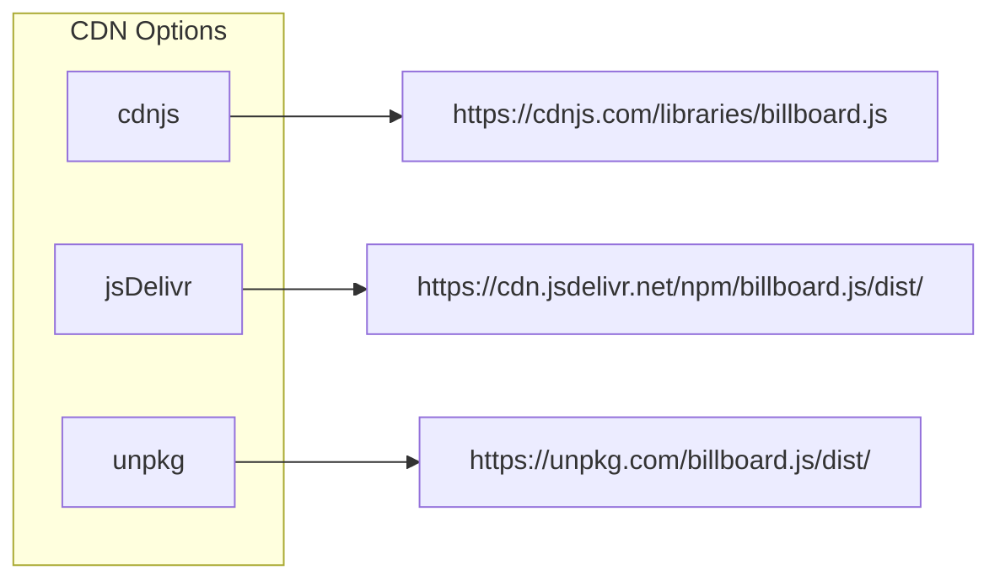
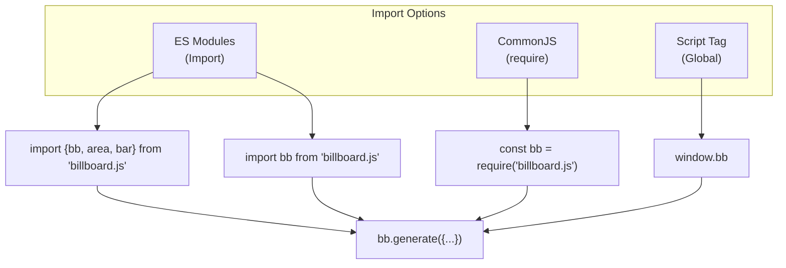
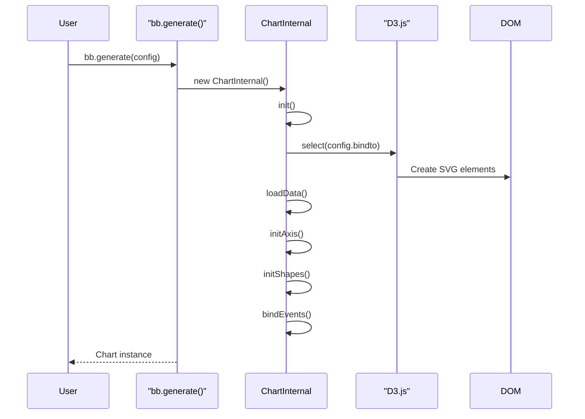
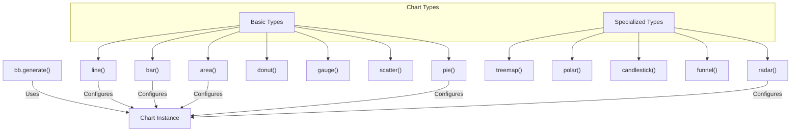

# Installation and Usage

<details>
<summary>Relevant source files</summary>

The following files were used as context for generating this wiki page:

- [.gitignore](https://github.com/naver/billboard.js/blob/d6229c39/.gitignore)
- [.yarnrc.yml](https://github.com/naver/billboard.js/blob/d6229c39/.yarnrc.yml)
- [CHANGELOG.md](https://github.com/naver/billboard.js/blob/d6229c39/CHANGELOG.md)
- [README.md](https://github.com/naver/billboard.js/blob/d6229c39/README.md)
- [demo/types/index.html](https://github.com/naver/billboard.js/blob/d6229c39/demo/types/index.html)
- [demo/types/types.css](https://github.com/naver/billboard.js/blob/d6229c39/demo/types/types.css)
- [demo/types/types.js](https://github.com/naver/billboard.js/blob/d6229c39/demo/types/types.js)
- [package.json](https://github.com/naver/billboard.js/blob/d6229c39/package.json)
- [yarn.lock](https://github.com/naver/billboard.js/blob/d6229c39/yarn.lock)

</details>


This page documents how to install and use billboard.js in various environments. Billboard.js is a reusable JavaScript chart library based on D3.js that provides an easy-to-use interface for creating interactive data visualizations.

For information about the overall architecture and design of billboard.js, see [Architecture Overview](#1.2). For build system details, see [Build System and Module Structure](#1.3).

## Package Structure

Before diving into installation, it's helpful to understand how billboard.js is structured.

```mermaid
flowchart TD
    subgraph "Package Structure"
        main["Main Entry Points"]
        dist["Distribution Files"]
        types["TypeScript Types"]
        plugins["Plugins"]
        themes["Theme Files"]
    end

    main --> mainJs["dist/billboard.js (CommonJS)"]
    main --> esmJs["dist-esm/billboard.js (ESM)"]
    main --> typeDefs["types/index.d.ts"]
    
    dist --> standard["billboard.js\nbillboard.min.js"]
    dist --> pkgd["billboard.pkgd.js\n(bundled with D3.js)"]
    dist --> pkgdMin["billboard.pkgd.min.js\n(minified bundle)"]
    
    themes --> base["billboard.css\nbillboard.min.css"]
    themes --> datalab["theme/datalab.css"]
    themes --> dark["theme/dark.css"]
    themes --> insight["theme/insight.css"] 
    themes --> graph["theme/graph.css"]
    themes --> modern["theme/modern.css"]
    
    plugins --> pluginDist["dist/plugin/*.js"]
    plugins --> pluginEsm["dist-esm/plugin/*.js"]
    plugins --> pluginTypes["types/plugin/*.d.ts"]
```

Sources: [package.json:5-23](https://github.com/naver/billboard.js/blob/d6229c39/package.json#L5-L23), [README.md:50-119](https://github.com/naver/billboard.js/blob/d6229c39/README.md#L50-L119)

## Installation Methods

There are several ways to install and include billboard.js in your project.

### Using npm or yarn

The recommended way to install billboard.js is using a package manager like npm or yarn:

```bash
# Using npm
npm install billboard.js

# Using yarn
yarn add billboard.js
```

For the release candidate version:

```bash
npm install billboard.js@next --save
```

For the nightly (latest development) version:

```bash
npm install git+https://github.com/naver/billboard.js.git#nightly --save
```

Sources: [README.md:147-171](https://github.com/naver/billboard.js/blob/d6229c39/README.md#L147-L171), [package.json:1-5](https://github.com/naver/billboard.js/blob/d6229c39/package.json#L1-L5)

### Using CDN

If you prefer not to install billboard.js locally, you can load it directly from various CDN providers:



Example using jsDelivr CDN:

```html
<!-- Load D3.js separately -->
<script src="https://d3js.org/d3.v6.min.js"></script>

<!-- Load billboard.js with base style -->
<link rel="stylesheet" href="https://cdn.jsdelivr.net/npm/billboard.js/dist/billboard.css">
<script src="https://cdn.jsdelivr.net/npm/billboard.js/dist/billboard.js"></script>

<!-- Or, load the packaged version that includes D3.js -->
<link rel="stylesheet" href="https://cdn.jsdelivr.net/npm/billboard.js/dist/billboard.css">
<script src="https://cdn.jsdelivr.net/npm/billboard.js/dist/billboard.pkgd.js"></script>
```

Sources: [README.md:166-172](https://github.com/naver/billboard.js/blob/d6229c39/README.md#L166-L172), [README.md:193-207](https://github.com/naver/billboard.js/blob/d6229c39/README.md#L193-L207)

### Direct Download

You can also download the files directly from the GitHub repository:

#### For development (Uncompressed)
- Latest version:
  - https://naver.github.io/billboard.js/release/latest/dist/billboard.js
  - https://naver.github.io/billboard.js/release/latest/dist/billboard.css

#### For production (Compressed)
- Latest version:
  - https://naver.github.io/billboard.js/release/latest/dist/billboard.min.js
  - https://naver.github.io/billboard.js/release/latest/dist/billboard.min.css

#### Packaged version (with D3.js bundled)
- Latest version:
  - https://naver.github.io/billboard.js/release/latest/dist/billboard.pkgd.js
  - https://naver.github.io/billboard.js/release/latest/dist/billboard.pkgd.min.js

Sources: [README.md:50-87](https://github.com/naver/billboard.js/blob/d6229c39/README.md#L50-L87)

### Themes

Billboard.js comes with several built-in themes that you can use instead of the default styling:

| Theme | Files |
|-------|-------|
| Default | billboard.css / billboard.min.css |
| Datalab | theme/datalab.css / theme/datalab.min.css |
| Dark | theme/dark.css / theme/dark.min.css |
| Insight | theme/insight.css / theme/insight.min.css |
| Graph | theme/graph.css / theme/graph.min.css |
| Modern | theme/modern.css / theme/modern.min.css |

Sources: [README.md:90-119](https://github.com/naver/billboard.js/blob/d6229c39/README.md#L90-L119), [CHANGELOG.md:237-238](https://github.com/naver/billboard.js/blob/d6229c39/CHANGELOG.md#L237-L238)

## Module Formats and Imports

Billboard.js supports multiple module formats to accommodate different build systems and environments.



Sources: [package.json:6-23](https://github.com/naver/billboard.js/blob/d6229c39/package.json#L6-L23), [README.md:213-226](https://github.com/naver/billboard.js/blob/d6229c39/README.md#L213-L226)

### Global Script Tag

When loaded via a script tag, billboard.js creates a global `bb` object:

```html
<script src="billboard.js"></script>
<script>
  var chart = bb.generate({
    // configuration options
  });
</script>
```

### ES Modules Import

Using modern JavaScript module syntax:

```javascript
// Import the core and specific modules
import {bb, area, bar, zoom} from "billboard.js";

// Or import as default
import bb from "billboard.js";

// Import CSS (if your build system supports it)
import "billboard.js/dist/billboard.css";

// Or import a theme
import "billboard.js/dist/theme/insight.css";
```

### CommonJS Import

In Node.js or CommonJS environments:

```javascript
const bb = require("billboard.js");
```

Sources: [package.json:10-23](https://github.com/naver/billboard.js/blob/d6229c39/package.json#L10-L23), [README.md:213-226](https://github.com/naver/billboard.js/blob/d6229c39/README.md#L213-L226)

## Basic Usage

Here's a step-by-step guide to creating your first chart with billboard.js:

### 1. Create an HTML Container

First, create an HTML element that will contain your chart:

```html
<div id="chart"></div>
```

### 2. Initialize with Configuration

Next, initialize the chart with a configuration object:

```javascript
// Generate the chart
var chart = bb.generate({
  // Element to bind the chart to
  bindto: "#chart",
  
  // Chart data
  data: {
    type: "line", // Chart type
    columns: [
      ["data1", 30, 200, 100, 400, 150, 250]
    ]
  }
});
```



### 3. Using Methods on the Chart

Once created, you can call methods on the chart instance:

```javascript
// Load new data
chart.load({
  columns: [
    ["data2", 50, 300, 200, 300, 100, 100]
  ]
});

// Update specific data
chart.update({
  data: {
    columns: [
      ["data1", 100, 250, 150, 200, 300, 150]
    ]
  }
});

// Hide/show specific data
chart.hide("data1");
chart.show("data1");
```

Sources: [README.md:234-261](https://github.com/naver/billboard.js/blob/d6229c39/README.md#L234-L261)

## Using Chart Types

Billboard.js supports a wide variety of chart types. You can specify the chart type in the configuration:

```javascript
// Basic chart type specification
var chart = bb.generate({
  data: {
    type: "bar", // Use 'bar' chart type
    columns: [
      ["data1", 30, 200, 100, 400, 150, 250]
    ]
  }
});
```

### Modular Import with Chart Types

When using ES modules, you can import specific chart types and use them like this:

```javascript
// Import specific chart types
import {bb, bar, line, pie} from "billboard.js";

// Use them in the configuration
var chart = bb.generate({
  data: {
    // For ESM import usage, execute the imported module
    type: bar(),
    columns: [
      ["data1", 30, 200, 100, 400, 150, 250]
    ]
  }
});
```

Here's a diagram showing the chart type module structure:



Sources: [demo/types/types.js:1-37](https://github.com/naver/billboard.js/blob/d6229c39/demo/types/types.js#L1-L37), [README.md:241-258](https://github.com/naver/billboard.js/blob/d6229c39/README.md#L241-L258)

## Using Plugins

Billboard.js provides a plugin system to extend functionality. Plugins are available in the `dist/plugin/` directory.

```javascript
// CommonJS
const bb = require("billboard.js");
const textPlugin = require("billboard.js/dist/plugin/billboardjs-plugin-text");

// ES Modules
import {bb} from "billboard.js";
import textPlugin from "billboard.js/dist/plugin/billboardjs-plugin-text";

// Register the plugin
bb.plugin(textPlugin);

// Use in chart configuration
var chart = bb.generate({
  // chart configuration
  plugins: [
    // plugin configuration
  ]
});
```

Sources: [package.json:16-22](https://github.com/naver/billboard.js/blob/d6229c39/package.json#L16-L22)

## Using with Other Technologies

### React

There's an official React component for billboard.js:

```bash
npm install @billboard.js/react
```

```javascript
import { BillboardChart } from "@billboard.js/react";

function App() {
  const chartOptions = {
    data: {
      type: "line",
      columns: [
        ["data1", 30, 200, 100, 400, 150, 250]
      ]
    }
  };

  return <BillboardChart bb={bb} options={chartOptions} />;
}
```

Sources: [README.md:161-164](https://github.com/naver/billboard.js/blob/d6229c39/README.md#L161-L164)

## Dependency Requirements

Billboard.js has different version requirements for D3.js:

| D3.js Version | billboard.js Version |
|---------------|---------------------|
| 4.x ~ 5.x     | 1.x ~ 2.x           |
| 6.x+          | 3.x+                |

Sources: [README.md:186-189](https://github.com/naver/billboard.js/blob/d6229c39/README.md#L186-L189)

## Browser Compatibility

Billboard.js works with all modern browsers that support SVG and ES6+. For legacy browsers, it's recommended to use the packaged build or follow the instructions in the wiki for bundling for legacy browsers.

Sources: [README.md:176-182](https://github.com/naver/billboard.js/blob/d6229c39/README.md#L176-L182)

## Advanced Configuration

Billboard.js offers extensive configuration options. Here's a simple example showing some common options:

```javascript
var chart = bb.generate({
  // Element binding
  bindto: "#chart",
  
  // Data configuration
  data: {
    type: "line",
    columns: [
      ["data1", 30, 200, 100, 400, 150, 250],
      ["data2", 50, 20, 10, 40, 15, 25]
    ],
    colors: {
      data1: "#ff0000",
      data2: "#00ff00"
    }
  },
  
  // Axis configuration
  axis: {
    x: {
      type: "category",
      categories: ["Jan", "Feb", "Mar", "Apr", "May", "Jun"]
    },
    y: {
      label: {
        text: "Value",
        position: "outer-middle"
      }
    }
  },
  
  // Grid configuration
  grid: {
    x: {
      show: true
    },
    y: {
      show: true
    }
  },
  
  // Tooltip configuration
  tooltip: {
    format: {
      title: function(d) { return 'Month: ' + d; },
      value: function(value, ratio, id) {
        return value + " units";
      }
    }
  }
});
```

For a complete list of configuration options, refer to the [API Documentation](https://naver.github.io/billboard.js/release/latest/doc/).

## Troubleshooting

### Common Issues

1. **D3.js Version Conflicts**: Ensure you're using the correct D3.js version that matches your billboard.js version.

2. **Module Import Errors**: Check that you're using the correct import syntax for your environment.

3. **CSS Not Loading**: Make sure you've included the CSS file either via import or a `<link>` tag.