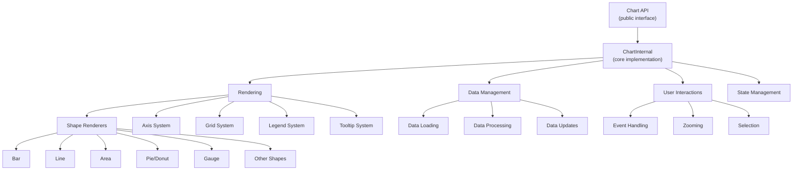
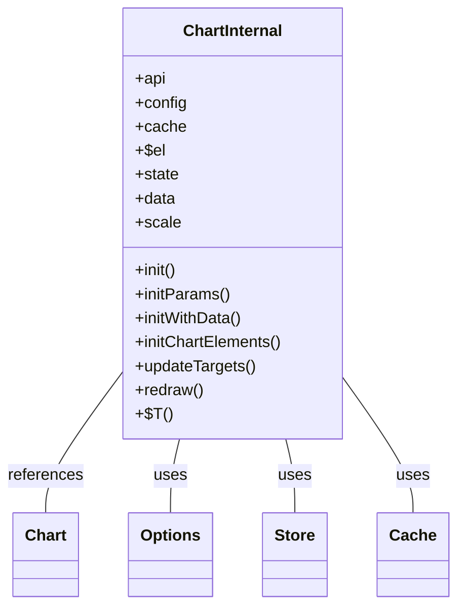
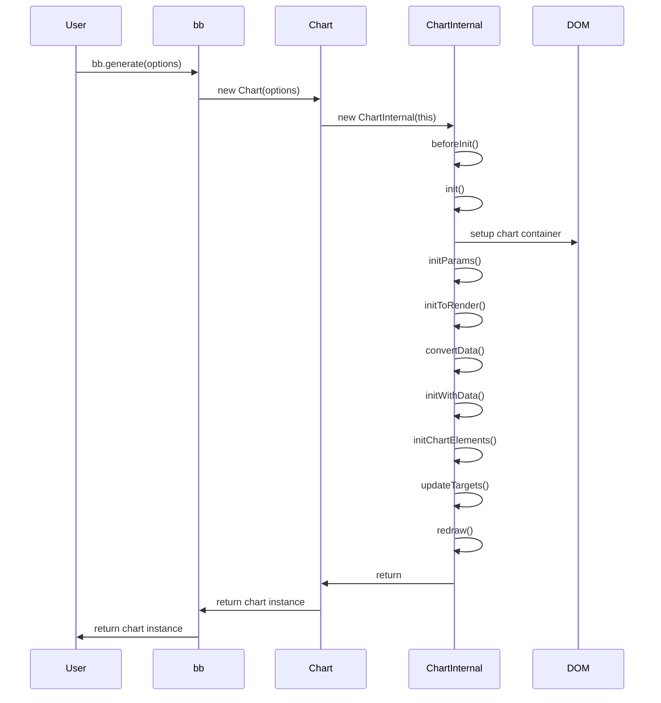
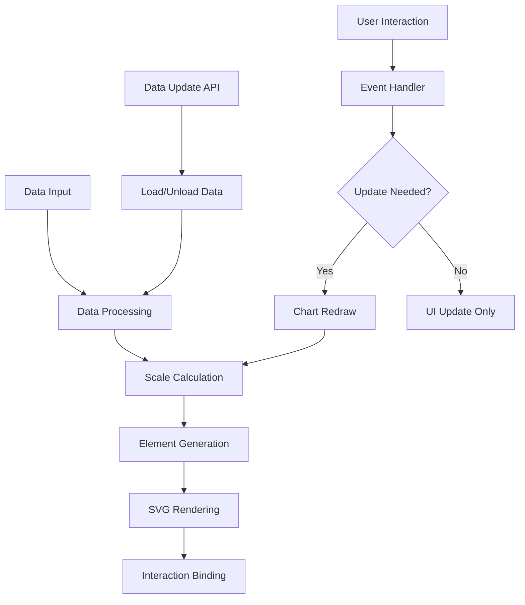
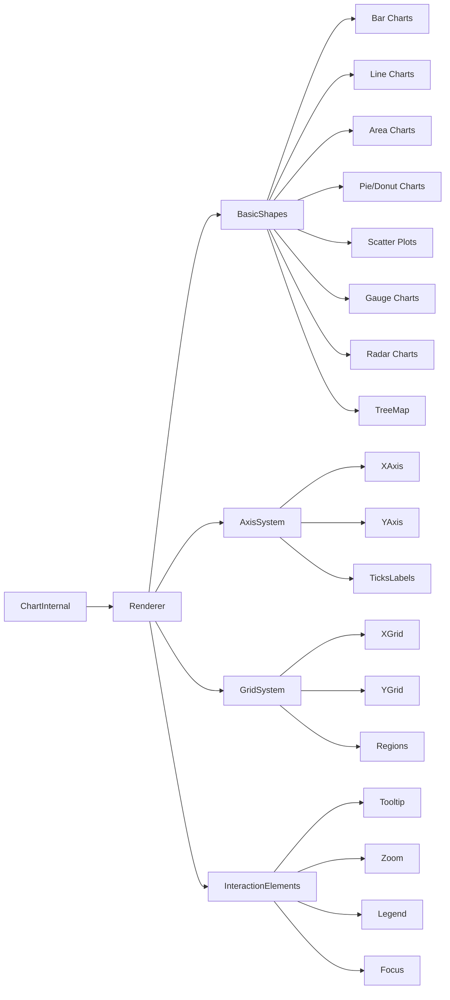
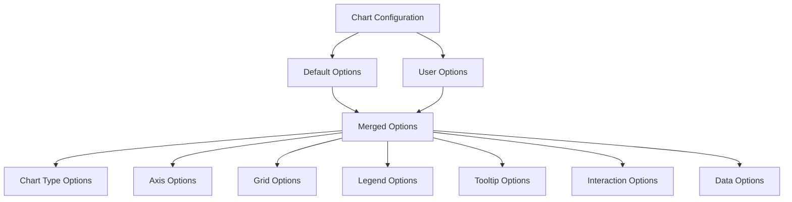

# Architecture Overview

<details>
<summary>Relevant source files</summary>

The following files were used as context for generating this wiki page:

- [src/Chart/Chart.ts](https://github.com/naver/billboard.js/blob/d6229c39/src/Chart/Chart.ts)
- [src/ChartInternal/ChartInternal.ts](https://github.com/naver/billboard.js/blob/d6229c39/src/ChartInternal/ChartInternal.ts)
- [src/ChartInternal/internals/redraw.ts](https://github.com/naver/billboard.js/blob/d6229c39/src/ChartInternal/internals/redraw.ts)
- [src/ChartInternal/internals/type.ts](https://github.com/naver/billboard.js/blob/d6229c39/src/ChartInternal/internals/type.ts)
- [src/config/Options/common/main.ts](https://github.com/naver/billboard.js/blob/d6229c39/src/config/Options/common/main.ts)
- [src/module/error.ts](https://github.com/naver/billboard.js/blob/d6229c39/src/module/error.ts)
- [src/module/generator.ts](https://github.com/naver/billboard.js/blob/d6229c39/src/module/generator.ts)
- [src/module/util.ts](https://github.com/naver/billboard.js/blob/d6229c39/src/module/util.ts)
- [test/assets/module/util.ts](https://github.com/naver/billboard.js/blob/d6229c39/test/assets/module/util.ts)
- [test/internals/bb-spec.ts](https://github.com/naver/billboard.js/blob/d6229c39/test/internals/bb-spec.ts)
- [test/internals/util-spec.ts](https://github.com/naver/billboard.js/blob/d6229c39/test/internals/util-spec.ts)

</details>


This document outlines the high-level architecture of billboard.js, explaining the main components, their relationships, and how data flows through the system. For information about installation and usage, see [Installation and Usage](#1.1), and for details about the build system, see [Build System and Module Structure](#1.3).

## Core Architecture

Billboard.js is designed with a clear separation between its public API and internal implementation. This separation allows for a clean and stable API while enabling complex internal operations.



Sources: [src/ChartInternal/ChartInternal.ts:69-845](https://github.com/naver/billboard.js/blob/d6229c39/src/ChartInternal/ChartInternal.ts#L69-L845), [src/Chart/Chart.ts:34-153](https://github.com/naver/billboard.js/blob/d6229c39/src/Chart/Chart.ts#L34-L153)

### Chart API

The Chart class provides the public API that users interact with. It is instantiated via `bb.generate()` and offers methods for manipulating charts, data, colors, exports, and more.

The Chart class delegates most of its functionality to the ChartInternal class, which handles the actual implementation details.

Sources: [src/Chart/Chart.ts:19-165](https://github.com/naver/billboard.js/blob/d6229c39/src/Chart/Chart.ts#L19-L165)

### ChartInternal

ChartInternal is the core class that implements the chart's functionality. It is responsible for:

1. Initializing the chart
2. Managing data
3. Rendering elements
4. Handling user interactions
5. Managing state



Sources: [src/ChartInternal/ChartInternal.ts:69-845](https://github.com/naver/billboard.js/blob/d6229c39/src/ChartInternal/ChartInternal.ts#L69-L845)

## Initialization Process

When a chart is created, it goes through several initialization steps:

1. **Chart instantiation**: The `bb.generate()` function creates a new Chart instance.
2. **ChartInternal initialization**: The Chart instance creates a ChartInternal instance.
3. **Configuration loading**: Options are loaded and processed.
4. **DOM preparation**: The chart container is set up.
5. **Data conversion**: Input data is converted to the internal format.
6. **Elements initialization**: Chart elements (axes, legends, etc.) are initialized.
7. **Rendering**: The chart is rendered.



Sources: [src/ChartInternal/ChartInternal.ts:119-545](https://github.com/naver/billboard.js/blob/d6229c39/src/ChartInternal/ChartInternal.ts#L119-L545), [src/Chart/Chart.ts:111-151](https://github.com/naver/billboard.js/blob/d6229c39/src/Chart/Chart.ts#L111-L151)

The initialization process can be lazy-loaded if the chart container is not visible. This is controlled by the `render` configuration option, which can be set to observe visibility changes or to manually trigger rendering.

## Data Flow

Data in Billboard.js flows through several stages, from input to rendering:



Sources: [src/ChartInternal/internals/redraw.ts:10-255](https://github.com/naver/billboard.js/blob/d6229c39/src/ChartInternal/internals/redraw.ts#L10-L255), [src/ChartInternal/ChartInternal.ts:350-545](https://github.com/naver/billboard.js/blob/d6229c39/src/ChartInternal/ChartInternal.ts#L350-L545)

### Data Processing

When data is provided to Billboard.js, it goes through these steps:

1. **Data conversion**: Raw data is converted to the internal format.
2. **Data binding**: Data is bound to chart elements.
3. **Scale domain calculation**: Scale domains are calculated based on the data.
4. **Element generation**: Chart elements are generated based on the data.

### Redraw Process

When the chart needs to be redrawn (due to data updates or user interactions), the redraw process is triggered:

1. **Update sizes**: Chart dimensions are updated.
2. **Update axes**: Axes are updated with new values.
3. **Update elements**: Chart elements are updated with new data.
4. **Apply transitions**: Transitions are applied to elements.

The redraw process is optimized to only update what's necessary, improving performance.

Sources: [src/ChartInternal/internals/redraw.ts:10-255](https://github.com/naver/billboard.js/blob/d6229c39/src/ChartInternal/internals/redraw.ts#L10-L255)

## Chart Types and Rendering System

Billboard.js supports various chart types, each with its own rendering logic:



Sources: [src/ChartInternal/internals/type.ts:9-293](https://github.com/naver/billboard.js/blob/d6229c39/src/ChartInternal/internals/type.ts#L9-L293), [src/ChartInternal/ChartInternal.ts:551-595](https://github.com/naver/billboard.js/blob/d6229c39/src/ChartInternal/ChartInternal.ts#L551-L595)

### Chart Type Detection

Billboard.js uses a type system to determine which chart type to render. This is based on the `data_type` or `data_types` configuration options. The system supports checking if a specific chart type is being used through methods like `hasType()`, `hasArcType()`, etc.

```javascript
// Type checking methods
hasType(type)           // Check if chart has specific type
hasTypeOf(type)         // Check if chart has any type in a category
hasArcType()            // Check if chart has any arc type (pie, donut, gauge)
hasPointType()          // Check if chart has any point type (line, bubble, scatter)
```

Sources: [src/ChartInternal/internals/type.ts:15-292](https://github.com/naver/billboard.js/blob/d6229c39/src/ChartInternal/internals/type.ts#L15-L292)

### Chart Elements Initialization

When a chart is initialized, the appropriate chart elements are created based on the chart type:

```javascript
initChartElements() {
    const $$ = this;
    const {hasAxis, hasRadar, hasTreemap} = $$.state;
    const types = [];

    // Add specific chart type initializers based on configuration
    if (hasAxis) {
        // For axis-based charts (bar, line, etc.)
        // ...
    } else if (hasTreemap) {
        types.push("Treemap");
    } else if ($$.hasType("funnel")) {
        types.push("Funnel");
    } else {
        // For non-axis charts (pie, donut, gauge, etc.)
        // ...
    }

    // Initialize each chart type
    types.forEach(v => {
        $$[`init${v}`]();
    });
}
```

Sources: [src/ChartInternal/ChartInternal.ts:551-595](https://github.com/naver/billboard.js/blob/d6229c39/src/ChartInternal/ChartInternal.ts#L551-L595)

## Configuration and Options System

Billboard.js has a comprehensive configuration system that allows customization of almost every aspect of the chart:



Sources: [src/config/Options/common/main.ts:10-452](https://github.com/naver/billboard.js/blob/d6229c39/src/config/Options/common/main.ts#L10-L452)

### Main Configuration Options

The main configuration options include:

- **bindto**: The element to bind the chart to
- **size**: Chart dimensions
- **padding**: Chart padding
- **resize**: Chart resize behavior
- **transition**: Animation duration
- **data**: Data configuration
- **axis**: Axis configuration
- **legend**: Legend configuration
- **tooltip**: Tooltip configuration
- **interaction**: User interaction configuration

```javascript
// Example configuration
const chart = bb.generate({
    bindto: "#chart",
    data: {
        columns: [
            ["data1", 30, 200, 100, 400],
            ["data2", 50, 20, 10, 40]
        ],
        type: "line"
    },
    axis: {
        x: {
            type: "category"
        }
    }
});
```

Sources: [src/config/Options/common/main.ts:10-452](https://github.com/naver/billboard.js/blob/d6229c39/src/config/Options/common/main.ts#L10-L452)

### Configuration Defaults

Billboard.js allows setting global defaults for all charts using `bb.defaults()`:

```javascript
bb.defaults({
    data: {
        type: "line"
    },
    axis: {
        x: {
            tick: {
                format: x => `${x}`
            }
        }
    }
});
```

Sources: [test/internals/bb-spec.ts:361-438](https://github.com/naver/billboard.js/blob/d6229c39/test/internals/bb-spec.ts#L361-L438)

## Event and Plugin System

Billboard.js provides a comprehensive event system that allows hooking into various chart lifecycle events:

### Lifecycle Events

- **beforeinit**: Called before chart initialization
- **init**: Called during chart initialization
- **afterinit**: Called after chart initialization
- **resize**: Called when chart is resized
- **resized**: Called after chart is resized
- **render**: Called when chart is rendered
- **rendered**: Called after chart is rendered

```javascript
// Example of using lifecycle events
const chart = bb.generate({
    data: {
        columns: [
            ["data1", 30, 200, 100, 400]
        ]
    },
    onbeforeinit: function() {
        // Called before initialization
    },
    oninit: function() {
        // Called during initialization
    },
    onafterinit: function() {
        // Called after initialization
    },
    onrendered: function() {
        // Called after chart is rendered
    }
});
```

Sources: [src/config/Options/common/main.ts:287-329](https://github.com/naver/billboard.js/blob/d6229c39/src/config/Options/common/main.ts#L287-L329), [test/internals/bb-spec.ts:440-498](https://github.com/naver/billboard.js/blob/d6229c39/test/internals/bb-spec.ts#L440-L498)

### Plugin System

Billboard.js supports plugins to extend its functionality. Plugins can hook into chart lifecycle events using the same hook names as the event system:

```javascript
// Plugin definition
const MyPlugin = {
    $beforeInit: function() {
        // Plugin initialization logic
    },
    $init: function() {
        // Plugin setup logic
    },
    $redraw: function() {
        // Plugin redraw logic
    }
};

// Using a plugin
const chart = bb.generate({
    plugins: [
        MyPlugin
    ],
    data: {
        columns: [
            ["data1", 30, 200, 100, 400]
        ]
    }
});
```

Sources: [src/ChartInternal/ChartInternal.ts:830-843](https://github.com/naver/billboard.js/blob/d6229c39/src/ChartInternal/ChartInternal.ts#L830-L843), [src/config/Options/common/main.ts:346-358](https://github.com/naver/billboard.js/blob/d6229c39/src/config/Options/common/main.ts#L346-L358)

## Lazy Rendering and Performance Optimization

Billboard.js includes several performance optimizations:

### Lazy Rendering

Charts can be lazily rendered when their container becomes visible. This is useful for charts in hidden tabs or containers:

```javascript
const chart = bb.generate({
    render: {
        lazy: true,      // Enable lazy rendering
        observe: true    // Observe visibility changes
    },
    data: {
        columns: [
            ["data1", 30, 200, 100, 400]
        ]
    }
});
```

When `lazy` is enabled, the chart isn't rendered until its container becomes visible. If `observe` is true, the chart automatically renders when visible; otherwise, `chart.flush()` must be called manually.

Sources: [src/config/Options/common/main.ts:360-402](https://github.com/naver/billboard.js/blob/d6229c39/src/config/Options/common/main.ts#L360-L402), [test/internals/bb-spec.ts:501-663](https://github.com/naver/billboard.js/blob/d6229c39/test/internals/bb-spec.ts#L501-L663)

### Transition Optimization

Transitions are optimized to only run when the browser tab is visible, improving performance when the tab is in the background:

```javascript
// Transition only runs when tab is visible
function generateWait() {
    let transitionsToWait = [];
    
    const f = function(selection, callback) {
        function loop() {
            // ...
            // when tab isn't visible exit loop
            if (isTabVisible() === false) {
                done = transitionsToWait.length;
                break;
            }
            // ...
        }
        // ...
    };
    
    // ...
    return f;
}
```

Sources: [src/module/generator.ts:56-101](https://github.com/naver/billboard.js/blob/d6229c39/src/module/generator.ts#L56-L101)

## Conclusion