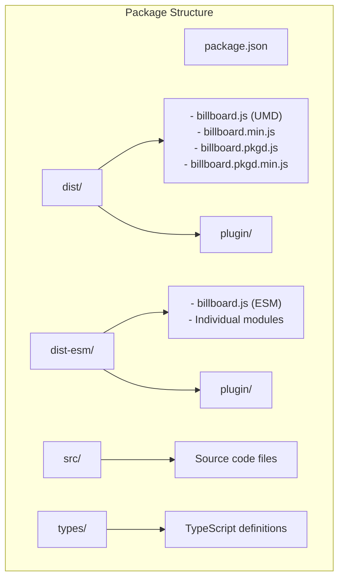
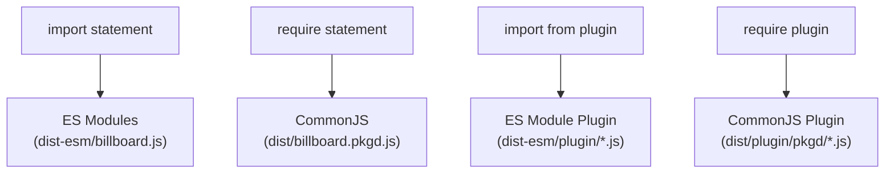
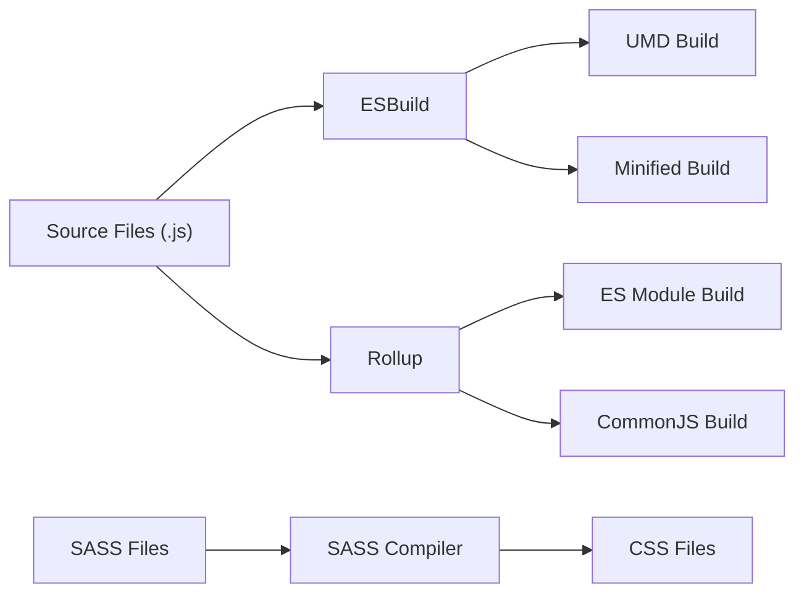
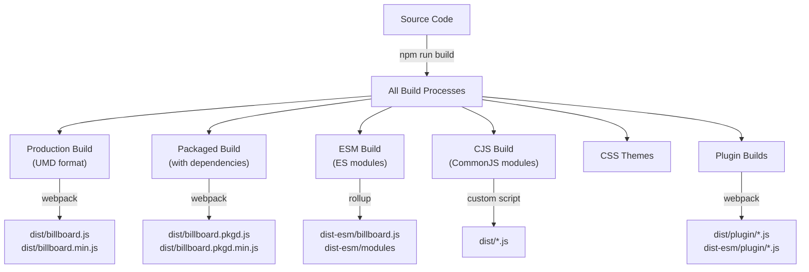
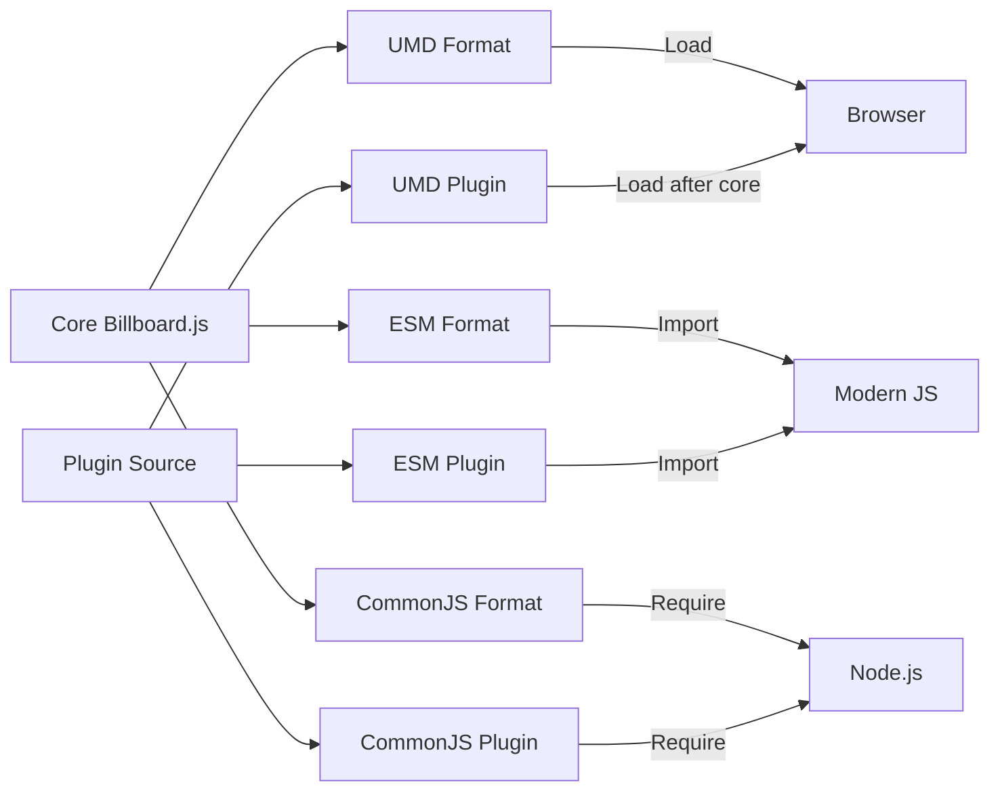
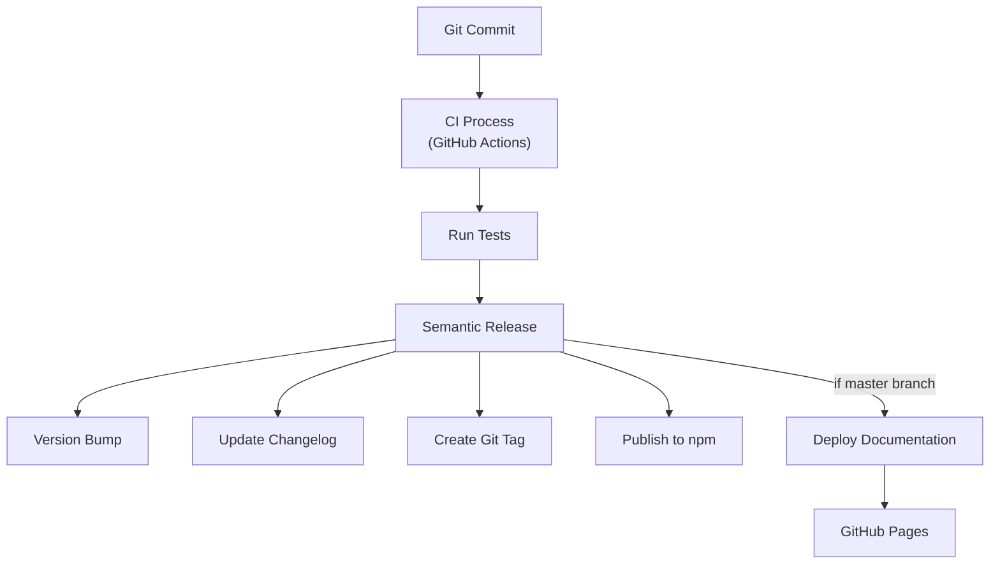
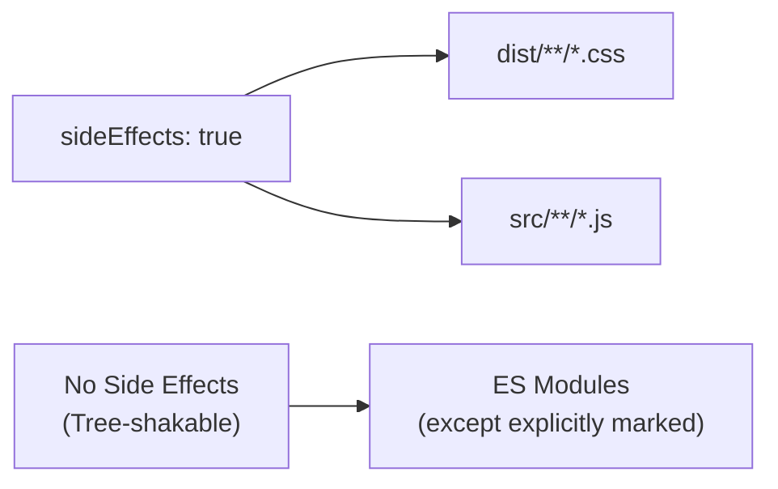

# Build System and Module Structure

<details>
<summary>Relevant source files</summary>

The following files were used as context for generating this wiki page:

- [.gitattributes](https://github.com/naver/billboard.js/blob/d6229c39/.gitattributes)
- [.github/workflows/ci.yml](https://github.com/naver/billboard.js/blob/d6229c39/.github/workflows/ci.yml)
- [.releaserc.json](https://github.com/naver/billboard.js/blob/d6229c39/.releaserc.json)
- [CHANGELOG.md](https://github.com/naver/billboard.js/blob/d6229c39/CHANGELOG.md)
- [CONTRIBUTING.md](https://github.com/naver/billboard.js/blob/d6229c39/CONTRIBUTING.md)
- [config/commit.template](https://github.com/naver/billboard.js/blob/d6229c39/config/commit.template)
- [config/deploy.sh](https://github.com/naver/billboard.js/blob/d6229c39/config/deploy.sh)
- [config/jsdoc.js](https://github.com/naver/billboard.js/blob/d6229c39/config/jsdoc.js)
- [config/jsdoc/static/analytics.js](https://github.com/naver/billboard.js/blob/d6229c39/config/jsdoc/static/analytics.js)
- [config/jsdoc/static/doc.css](https://github.com/naver/billboard.js/blob/d6229c39/config/jsdoc/static/doc.css)
- [jsdoc.json](https://github.com/naver/billboard.js/blob/d6229c39/jsdoc.json)
- [package.json](https://github.com/naver/billboard.js/blob/d6229c39/package.json)
- [yarn.lock](https://github.com/naver/billboard.js/blob/d6229c39/yarn.lock)

</details>


This page documents the build system, module formats, and package organization of billboard.js. It explains how the codebase is compiled into different distribution formats and how these can be used in various environments.

## Module Structure

Billboard.js is built and distributed in multiple module formats to support different usage patterns and environments.

### Package Organization



Sources: [package.json:6-23](https://github.com/naver/billboard.js/blob/d6229c39/package.json#L6-L23), [package.json:68-74](https://github.com/naver/billboard.js/blob/d6229c39/package.json#L68-L74)

The billboard.js repository is organized into several key directories:

- **dist**: Contains UMD and CommonJS builds for browser and Node.js usage
- **dist-esm**: Contains ES modules for modern JavaScript environments
- **src**: Contains the source code files
- **types**: Contains TypeScript type definitions

### Module Formats

Billboard.js is built into three main module formats to support different environments:

| Format | Main File | Usage | Import Style |
|--------|-----------|-------|--------------|
| UMD | dist/billboard.js | Browser via script tag or AMD/CommonJS | `<script src="billboard.js"></script>` or `require("billboard.js")` |
| CommonJS | dist/billboard.pkgd.js | Node.js via require | `const bb = require("billboard.js")` |
| ES Modules | dist-esm/billboard.js | Modern browsers/bundlers | `import {bb} from "billboard.js"` |

Sources: [package.json:6-23](https://github.com/naver/billboard.js/blob/d6229c39/package.json#L6-L23)

#### Package Exports Configuration

Billboard.js uses the "exports" field in package.json to define the entry points for different module systems:



Sources: [package.json:10-23](https://github.com/naver/billboard.js/blob/d6229c39/package.json#L10-L23)

The "exports" field in package.json maps import paths to file locations, ensuring the correct module format is selected based on the consumer's environment.

## Build System

Billboard.js uses a sophisticated build system that leverages multiple tools to optimize outputs for different environments.

### Build Tools



Sources: [package.json:24-38](https://github.com/naver/billboard.js/blob/d6229c39/package.json#L24-L38)

Billboard.js uses the following build tools:

- **ESBuild**: For fast JavaScript compilation and bundling
- **Rollup**: For module bundling, particularly for ESM output
- **Webpack**: For development and specialized bundling
- **SASS**: For processing CSS styles

### Build Scripts

Billboard.js defines several build scripts in package.json:

| Script | Purpose |
|--------|---------|
| `build` | Runs all build processes |
| `build:production` | Builds production UMD version |
| `build:packaged` | Builds bundled version with dependencies |
| `build:esm` | Builds ES modules version |
| `build:cjs` | Builds CommonJS version |
| `build:plugin` | Builds plugin files |
| `build:theme` | Builds CSS theme files |

Sources: [package.json:24-38](https://github.com/naver/billboard.js/blob/d6229c39/package.json#L24-L38)

### Build Process Flow



Sources: [package.json:24-38](https://github.com/naver/billboard.js/blob/d6229c39/package.json#L24-L38), [package.json:27-37](https://github.com/naver/billboard.js/blob/d6229c39/package.json#L27-L37)

## Plugin System

Billboard.js supports plugins that can be loaded separately to extend functionality.



Sources: [package.json:16-20](https://github.com/naver/billboard.js/blob/d6229c39/package.json#L16-L20), [package.json:36-37](https://github.com/naver/billboard.js/blob/d6229c39/package.json#L36-L37)

Plugins are built in multiple formats to match the main library's module formats, allowing consistent usage regardless of environment.

## Release and Deployment Process

Billboard.js uses semantic-release for version management and automated releases.



Sources: [.github/workflows/ci.yml:56-92](https://github.com/naver/billboard.js/blob/d6229c39/.github/workflows/ci.yml#L56-L92), [.releaserc.json](https://github.com/naver/billboard.js/blob/d6229c39/.releaserc.json), [config/deploy.sh](https://github.com/naver/billboard.js/blob/d6229c39/config/deploy.sh)

The release process:

1. Uses conventional commits to determine the next version
2. Automatically generates changelogs
3. Creates a new git tag
4. Publishes to npm
5. Deploys documentation to GitHub Pages (if on the latest branch)

## Usage Examples

### Browser (UMD)

```html
<!-- CSS -->
<link rel="stylesheet" href="billboard.css">

<!-- JS -->
<script src="billboard.js"></script>
<script>
  var chart = bb.generate({
    // chart configuration
  });
</script>
```

### ES Modules (Modern JavaScript)

```javascript
// Import the required modules
import {bb} from "billboard.js";
import "billboard.js/dist/billboard.css";

// Create chart
const chart = bb.generate({
  // chart configuration
});
```

### CommonJS (Node.js)

```javascript
// Require the package
const bb = require("billboard.js");

// Create chart
const chart = bb.generate({
  // chart configuration
});
```

### With Plugins

```javascript
// ES Modules
import {bb} from "billboard.js";
import {plugin1} from "billboard.js/dist/plugin/plugin1";

// Register plugin
bb.use(plugin1);

// Or UMD
// <script src="billboard.js"></script>
// <script src="billboard-plugin1.js"></script>
```

Sources: [package.json:10-23](https://github.com/naver/billboard.js/blob/d6229c39/package.json#L10-L23)

## Side Effects Configuration

Billboard.js specifies which files have side effects to assist tree-shaking in modern bundlers:



Sources: [package.json:51-54](https://github.com/naver/billboard.js/blob/d6229c39/package.json#L51-L54)