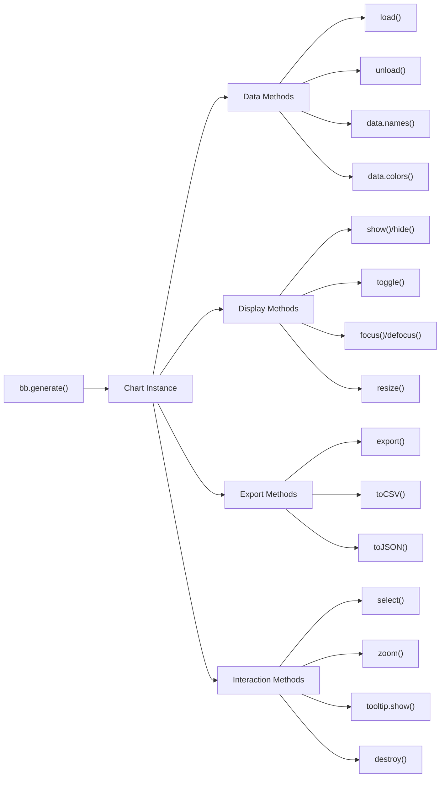
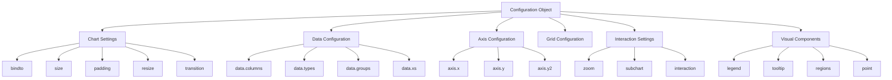
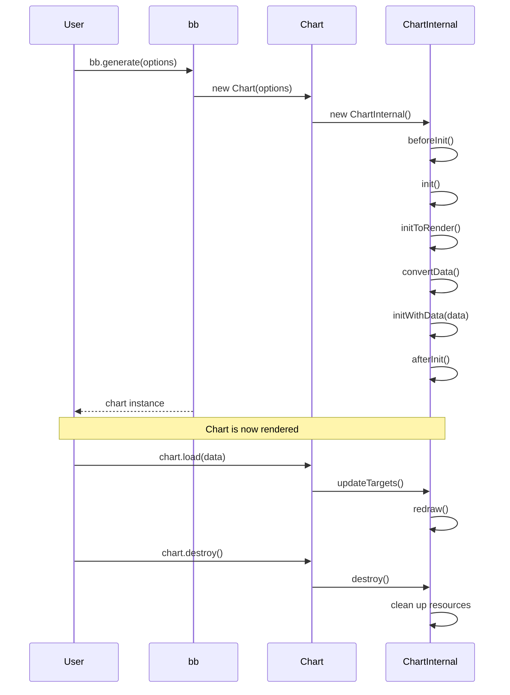

# Core API

<details>
<summary>Relevant source files</summary>

The following files were used as context for generating this wiki page:

- [.gitignore](https://github.com/naver/billboard.js/blob/d6229c39/.gitignore)
- [.yarnrc.yml](https://github.com/naver/billboard.js/blob/d6229c39/.yarnrc.yml)
- [README.md](https://github.com/naver/billboard.js/blob/d6229c39/README.md)
- [demo/demo.js](https://github.com/naver/billboard.js/blob/d6229c39/demo/demo.js)
- [demo/types/index.html](https://github.com/naver/billboard.js/blob/d6229c39/demo/types/index.html)
- [demo/types/types.css](https://github.com/naver/billboard.js/blob/d6229c39/demo/types/types.css)
- [demo/types/types.js](https://github.com/naver/billboard.js/blob/d6229c39/demo/types/types.js)
- [src/ChartInternal/ChartInternal.ts](https://github.com/naver/billboard.js/blob/d6229c39/src/ChartInternal/ChartInternal.ts)
- [src/ChartInternal/internals/redraw.ts](https://github.com/naver/billboard.js/blob/d6229c39/src/ChartInternal/internals/redraw.ts)
- [src/config/Options/common/main.ts](https://github.com/naver/billboard.js/blob/d6229c39/src/config/Options/common/main.ts)
- [test/internals/bb-spec.ts](https://github.com/naver/billboard.js/blob/d6229c39/test/internals/bb-spec.ts)
- [types/options.d.ts](https://github.com/naver/billboard.js/blob/d6229c39/types/options.d.ts)

</details>


The Core API of billboard.js provides the fundamental functions and methods for creating, manipulating, and controlling charts. This document outlines the main API structure, key functions, and basic usage patterns. For specific details on chart generation, see [Chart Generation](#2.1), data management, see [Data Loading and Management](#2.2), or chart export, see [Chart Export](#2.3).

## API Structure Overview

Billboard.js exposes a clean, intuitive API designed to make chart creation and manipulation straightforward. The library follows a modular architecture with a clear separation between public API and internal implementation.

```mermaid
classDiagram
    class "bb" {
        +generate(options)
        +version
        +instance[]
        +defaults(options)
    }
    
    class "Chart" {
        +load(data)
        +unload(ids)
        +show(ids)
        +hide(ids)
        +toggle(ids)
        +resize(size)
        +flush()
        +destroy()
        +config(key, value)
        +$: ChartElements
        +data: ChartData
    }
    
    class "ChartInternal" {
        -api
        -config
        -state
        -$el
        -data
        -scale
        -axis
        +init()
        +initWithData()
        +redraw()
        +updateAndRedraw()
    }
    
    bb --> Chart : creates
    Chart --> ChartInternal : uses
    
    note for bb "Global namespace\nEntry point"
    note for Chart "Public API\nUser-facing methods"
    note for ChartInternal "Implementation\nHandles rendering and updates"
```

Sources: [src/ChartInternal/ChartInternal.ts:69-172](https://github.com/naver/billboard.js/blob/d6229c39/src/ChartInternal/ChartInternal.ts#L69-L172). [README.md:192-262](https://github.com/naver/billboard.js/blob/d6229c39/README.md#L192-L262).

## Core Global Functions

Billboard.js exposes several global functions through the `bb` namespace:

| Function | Description |
|----------|-------------|
| `bb.generate(options)` | Main entry point to create a chart instance |
| `bb.version` | Returns the current version of billboard.js |
| `bb.instance` | Array containing all chart instances created |
| `bb.defaults(options)` | Sets or gets default options for all new charts |

Sources: [test/internals/bb-spec.ts:46-86](https://github.com/naver/billboard.js/blob/d6229c39/test/internals/bb-spec.ts#L46-L86). [README.md:241-258](https://github.com/naver/billboard.js/blob/d6229c39/README.md#L241-L258).

### bb.generate()

The most important function in the API is `bb.generate()`, which creates and returns a new chart instance:

```javascript
const chart = bb.generate({
    bindto: "#chart",
    data: {
        type: "line",
        columns: [
            ["data1", 30, 200, 100, 400, 150, 250]
        ]
    }
});
```

Sources: [README.md:241-258](https://github.com/naver/billboard.js/blob/d6229c39/README.md#L241-L258). [test/internals/bb-spec.ts:52-77](https://github.com/naver/billboard.js/blob/d6229c39/test/internals/bb-spec.ts#L52-L77).

## Chart Instance API

The chart instance returned by `bb.generate()` provides numerous methods for interacting with the chart:



Sources: [src/ChartInternal/ChartInternal.ts:119-172](https://github.com/naver/billboard.js/blob/d6229c39/src/ChartInternal/ChartInternal.ts#L119-L172). [README.md:241-262](https://github.com/naver/billboard.js/blob/d6229c39/README.md#L241-L262).

### Key Chart Methods

The chart instance provides a wide range of methods for manipulating the chart after creation:

| Category | Method | Description |
|----------|--------|-------------|
| **Data** | `load(data)` | Load additional data to the chart |
| | `unload(ids)` | Remove data from the chart |
| **Display** | `show(ids)` | Show specific data series |
| | `hide(ids)` | Hide specific data series |
| | `toggle(ids)` | Toggle visibility of data series |
| | `resize(size)` | Resize the chart |
| | `flush()` | Immediately render the chart |
| **Configuration** | `config(key, value)` | Get or set configuration values |
| **Lifecycle** | `destroy()` | Remove the chart and clean up resources |

Sources: [src/ChartInternal/internals/redraw.ts:10-254](https://github.com/naver/billboard.js/blob/d6229c39/src/ChartInternal/internals/redraw.ts#L10-L254). [README.md:241-262](https://github.com/naver/billboard.js/blob/d6229c39/README.md#L241-L262).

## Configuration Options

The `bb.generate()` function accepts a comprehensive configuration object that controls all aspects of the chart. Below are the main configuration categories:



Sources: [types/options.d.ts:45-417](https://github.com/naver/billboard.js/blob/d6229c39/types/options.d.ts#L45-L417). [src/config/Options/common/main.ts:10-405](https://github.com/naver/billboard.js/blob/d6229c39/src/config/Options/common/main.ts#L10-L405).

### Core Configuration Properties

| Category | Property | Description |
|----------|----------|-------------|
| **Chart** | `bindto` | CSS selector or element where chart will be rendered |
| | `size` | Chart dimensions (width/height) |
| | `padding` | Chart padding |
| | `resize` | Auto resize settings |
| **Data** | `data.columns` | Data columns to display |
| | `data.type` | Chart type (line, bar, etc.) |
| | `data.colors` | Colors for each data series |
| **Callbacks** | `oninit` | Called when chart is initialized |
| | `onrendered` | Called when chart is rendered |
| | `onresize` | Called when chart is resized |
| | `onmouseover` | Called when mouse over on data point |
| | `onmouseout` | Called when mouse out from data point |

Sources: [types/options.d.ts:45-417](https://github.com/naver/billboard.js/blob/d6229c39/types/options.d.ts#L45-L417). [src/config/Options/common/main.ts:10-196](https://github.com/naver/billboard.js/blob/d6229c39/src/config/Options/common/main.ts#L10-L196).

## Chart Initialization and Lifecycle

Understanding the chart lifecycle is crucial for proper utilization of the API:



Sources: [src/ChartInternal/ChartInternal.ts:173-545](https://github.com/naver/billboard.js/blob/d6229c39/src/ChartInternal/ChartInternal.ts#L173-L545). [test/internals/bb-spec.ts:28-151](https://github.com/naver/billboard.js/blob/d6229c39/test/internals/bb-spec.ts#L28-L151).

### Initialization Process

When `bb.generate()` is called, the following process occurs:

1. A new `Chart` instance is created
2. The `Chart` instance creates a `ChartInternal` instance
3. `ChartInternal.init()` is called:
   - DOM elements are initialized
   - Configuration is processed
   - Data is converted to internal format
4. `ChartInternal.initWithData()` is called:
   - Chart elements are created
   - Scales and axes are set up
   - Initial rendering occurs
5. The `Chart` instance is returned to the user

Sources: [src/ChartInternal/ChartInternal.ts:173-249](https://github.com/naver/billboard.js/blob/d6229c39/src/ChartInternal/ChartInternal.ts#L173-L249). [src/ChartInternal/ChartInternal.ts:250-282](https://github.com/naver/billboard.js/blob/d6229c39/src/ChartInternal/ChartInternal.ts#L250-L282).

### Update and Redraw Process

When chart data or options are updated:

1. User calls methods like `chart.load()`, `chart.resize()`, etc.
2. These methods update the internal state
3. `ChartInternal.redraw()` is called
4. The chart is redrawn with the updated data/options

Sources: [src/ChartInternal/internals/redraw.ts:10-254](https://github.com/naver/billboard.js/blob/d6229c39/src/ChartInternal/internals/redraw.ts#L10-L254).

## Element Access

Billboard.js provides access to chart elements through the `chart.$` property:

```javascript
// Access chart elements
const svg = chart.$.svg;
const main = chart.$.main;
const tooltip = chart.$.tooltip;
const legend = chart.$.legend;
```

This allows direct manipulation of chart elements if needed for advanced customization.

Sources: [src/ChartInternal/ChartInternal.ts:624-642](https://github.com/naver/billboard.js/blob/d6229c39/src/ChartInternal/ChartInternal.ts#L624-L642).

## Configuration Access and Modification

After chart creation, configuration can be accessed or modified using the `chart.config()` method:

```javascript
// Get current configuration value
const xAxisShow = chart.config("axis.x.show");

// Set new configuration value
chart.config("legend.show", false);
```

Sources: [test/internals/bb-spec.ts:394-437](https://github.com/naver/billboard.js/blob/d6229c39/test/internals/bb-spec.ts#L394-L437).

## Usage Patterns

### Basic Chart Creation

```javascript
// Create a basic chart
const chart = bb.generate({
    bindto: "#chart",
    data: {
        columns: [
            ["data1", 30, 200, 100, 400, 150, 250],
            ["data2", 50, 20, 10, 40, 15, 25]
        ],
        type: "line"
    }
});
```

### Loading Data After Initialization

```javascript
// Load additional data
chart.load({
    columns: [
        ["data3", 130, 150, 200, 300, 200, 100]
    ]
});

// Unload specific data
chart.unload({
    ids: ["data1"]
});
```

### Accessing Chart Elements

```javascript
// Get chart SVG element
const svg = chart.$.svg;

// Export as an image
const dataUrl = chart.export();
```

### Event Callbacks

```javascript
const chart = bb.generate({
    // Other options...
    
    // Event callbacks
    oninit: function() {
        console.log("Chart initialized");
    },
    onrendered: function() {
        console.log("Chart rendered");
    },
    onclick: function(d) {
        console.log("Clicked on data point:", d);
    }
});
```

Sources: [README.md:241-262](https://github.com/naver/billboard.js/blob/d6229c39/README.md#L241-L262). [demo/demo.js:441-449](https://github.com/naver/billboard.js/blob/d6229c39/demo/demo.js#L441-L449).

## Default Options

You can set default options for all charts using the `bb.defaults()` function:

```javascript
// Set default options for all charts
bb.defaults({
    data: {
        type: "line"
    },
    legend: {
        position: "right"
    }
});

// Get current default options
const defaults = bb.defaults();
```

Sources: [test/internals/bb-spec.ts:361-437](https://github.com/naver/billboard.js/blob/d6229c39/test/internals/bb-spec.ts#L361-L437).

## Chart Types

Billboard.js supports a wide range of chart types, which can be specified via the `data.type` property:

| Type | Description |
|------|-------------|
| `line` | Line chart |
| `spline` | Smooth line chart |
| `bar` | Bar chart |
| `scatter` | Scatter plot |
| `pie` | Pie chart |
| `donut` | Donut chart |
| `gauge` | Gauge chart |
| `area` | Area chart |
| `radar` | Radar chart |
| `treemap` | Treemap chart |
| `bubble` | Bubble chart |

Sources: [demo/types/types.js:1-36](https://github.com/naver/billboard.js/blob/d6229c39/demo/types/types.js#L1-L36). [demo/demo.js:8-1211](https://github.com/naver/billboard.js/blob/d6229c39/demo/demo.js#L8-L1211).

## Module Structure

When using ES modules, you can import only the specific functionalities you need:

```javascript
// Import specific modules
import {bb, line, bar, zoom} from "billboard.js";

// Create a chart with the imported modules
const chart = bb.generate({
    data: {
        type: line(), // use the imported module
        columns: [["data1", 30, 200, 100, 400, 150, 250]]
    },
    zoom: {
        enabled: zoom() // use the imported module
    }
});
```

Sources: [README.md:214-226](https://github.com/naver/billboard.js/blob/d6229c39/README.md#L214-L226).

## Conclusion