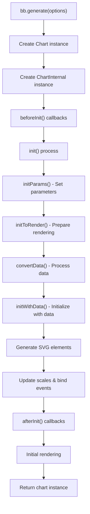
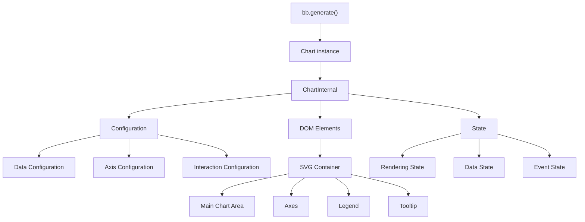
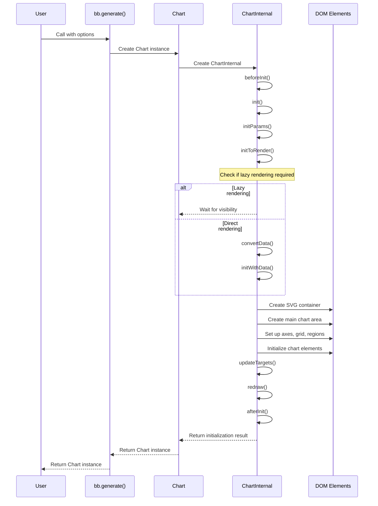

# Chart Generation

<details>
<summary>Relevant source files</summary>

The following files were used as context for generating this wiki page:

- [.gitignore](https://github.com/naver/billboard.js/blob/d6229c39/.gitignore)
- [.yarnrc.yml](https://github.com/naver/billboard.js/blob/d6229c39/.yarnrc.yml)
- [README.md](https://github.com/naver/billboard.js/blob/d6229c39/README.md)
- [demo/types/index.html](https://github.com/naver/billboard.js/blob/d6229c39/demo/types/index.html)
- [demo/types/types.css](https://github.com/naver/billboard.js/blob/d6229c39/demo/types/types.css)
- [demo/types/types.js](https://github.com/naver/billboard.js/blob/d6229c39/demo/types/types.js)
- [src/ChartInternal/ChartInternal.ts](https://github.com/naver/billboard.js/blob/d6229c39/src/ChartInternal/ChartInternal.ts)
- [src/ChartInternal/internals/redraw.ts](https://github.com/naver/billboard.js/blob/d6229c39/src/ChartInternal/internals/redraw.ts)
- [src/config/Options/common/main.ts](https://github.com/naver/billboard.js/blob/d6229c39/src/config/Options/common/main.ts)
- [test/internals/bb-spec.ts](https://github.com/naver/billboard.js/blob/d6229c39/test/internals/bb-spec.ts)

</details>


This document explains the chart generation process in billboard.js, detailing how to create charts with the `bb.generate()` function and covering the initialization flow. For information about data loading and management after chart creation, see [Data Loading and Management](#2.2).

## Overview

Chart generation is the process of creating a chart instance in billboard.js using the `bb.generate()` function. This function is the primary entry point to create charts with proper configuration, data binding, and rendering.

Sources: [README.md:240-258](https://github.com/naver/billboard.js/blob/d6229c39/README.md#L240-L258), [src/ChartInternal/ChartInternal.ts:119-132](https://github.com/naver/billboard.js/blob/d6229c39/src/ChartInternal/ChartInternal.ts#L119-L132)

## The Chart Generation Flow

### Diagram: Chart Generation Process



Sources: [src/ChartInternal/ChartInternal.ts:172-181](https://github.com/naver/billboard.js/blob/d6229c39/src/ChartInternal/ChartInternal.ts#L172-L181), [src/ChartInternal/ChartInternal.ts:182-189](https://github.com/naver/billboard.js/blob/d6229c39/src/ChartInternal/ChartInternal.ts#L182-L189), [src/ChartInternal/ChartInternal.ts:191-248](https://github.com/naver/billboard.js/blob/d6229c39/src/ChartInternal/ChartInternal.ts#L191-L248), [src/ChartInternal/ChartInternal.ts:256-281](https://github.com/naver/billboard.js/blob/d6229c39/src/ChartInternal/ChartInternal.ts#L256-L281), [src/ChartInternal/ChartInternal.ts:350-544](https://github.com/naver/billboard.js/blob/d6229c39/src/ChartInternal/ChartInternal.ts#L350-L544)

## Basic Usage

To generate a chart, you need to call the `bb.generate()` function with a configuration object. The function returns a chart instance that provides methods to manipulate the chart.

```javascript
// Basic chart generation
var chart = bb.generate({
    bindto: "#chart",
    data: {
        columns: [
            ["data1", 30, 200, 100, 400, 150, 250]
        ],
        type: "line"
    }
});
```

Sources: [README.md:234-262](https://github.com/naver/billboard.js/blob/d6229c39/README.md#L234-L262)

## Key Components of Chart Generation

### Diagram: Chart Components Relationship



Sources: [src/ChartInternal/ChartInternal.ts:69-101](https://github.com/naver/billboard.js/blob/d6229c39/src/ChartInternal/ChartInternal.ts#L69-L101), [src/ChartInternal/ChartInternal.ts:119-132](https://github.com/naver/billboard.js/blob/d6229c39/src/ChartInternal/ChartInternal.ts#L119-L132), [src/ChartInternal/ChartInternal.ts:350-544](https://github.com/naver/billboard.js/blob/d6229c39/src/ChartInternal/ChartInternal.ts#L350-L544)

## Configuration Options

The configuration object passed to `bb.generate()` controls the appearance and behavior of the chart. Here are the core configuration options for chart generation:

### Target Element Configuration

| Option | Type | Description |
|--------|------|-------------|
| `bindto` | string, HTMLElement, d3.selection | The element where the chart will be rendered. Can be a CSS selector, DOM element, or D3 selection. Default: `"#chart"` |
| `bindto.element` | string, HTMLElement, d3.selection | The element where the chart will be rendered when using object form |
| `bindto.classname` | string | Class name to be added to the chart container. Default: `"bb"` |

Sources: [src/config/Options/common/main.ts:12-37](https://github.com/naver/billboard.js/blob/d6229c39/src/config/Options/common/main.ts#L12-L37), [src/ChartInternal/ChartInternal.ts:223-245](https://github.com/naver/billboard.js/blob/d6229c39/src/ChartInternal/ChartInternal.ts#L223-L245)

### Size and Padding Configuration

| Option | Type | Description |
|--------|------|-------------|
| `size.width` | number | Width of the chart in pixels |
| `size.height` | number | Height of the chart in pixels |
| `padding` | boolean, object | Chart padding configuration. Set to `false` to disable all padding |
| `padding.top` | number | Top padding in pixels |
| `padding.right` | number | Right padding in pixels |
| `padding.bottom` | number | Bottom padding in pixels |
| `padding.left` | number | Left padding in pixels |
| `padding.mode` | string | When set to `"fit"`, reduces padding to make chart fit container |

Sources: [src/config/Options/common/main.ts:90-157](https://github.com/naver/billboard.js/blob/d6229c39/src/config/Options/common/main.ts#L90-L157)

### Resize Configuration

| Option | Type | Description |
|--------|------|-------------|
| `resize.auto` | boolean, string | Enables automatic resizing. Values: `true`, `false`, `"parent"`, `"viewBox"` |
| `resize.timer` | boolean, number | Controls the resize function timing. `true` uses `setTimeout()`, `false` uses `requestIdleCallback()` |

Sources: [src/config/Options/common/main.ts:159-200](https://github.com/naver/billboard.js/blob/d6229c39/src/config/Options/common/main.ts#L159-L200), [src/ChartInternal/ChartInternal.ts:788-827](https://github.com/naver/billboard.js/blob/d6229c39/src/ChartInternal/ChartInternal.ts#L788-L827)

### Transition Configuration

| Option | Type | Description |
|--------|------|-------------|
| `transition.duration` | number | Duration of transitions in milliseconds. Set to `0` to disable transitions. Default: `250` |

Sources: [src/config/Options/common/main.ts:332-344](https://github.com/naver/billboard.js/blob/d6229c39/src/config/Options/common/main.ts#L332-L344)

### Rendering Configuration

| Option | Type | Description |
|--------|------|-------------|
| `render.lazy` | boolean | When `true`, doesn't render chart if container is hidden. Default: `true` |
| `render.observe` | boolean | When `true`, observes container visibility and renders chart when visible. Default: `true` |

Sources: [src/config/Options/common/main.ts:360-403](https://github.com/naver/billboard.js/blob/d6229c39/src/config/Options/common/main.ts#L360-L403), [src/ChartInternal/ChartInternal.ts:256-281](https://github.com/naver/billboard.js/blob/d6229c39/src/ChartInternal/ChartInternal.ts#L256-L281)

## The Initialization Process

### Diagram: Chart Initialization Sequence



Sources: [src/ChartInternal/ChartInternal.ts:173-248](https://github.com/naver/billboard.js/blob/d6229c39/src/ChartInternal/ChartInternal.ts#L173-L248), [src/ChartInternal/ChartInternal.ts:256-281](https://github.com/naver/billboard.js/blob/d6229c39/src/ChartInternal/ChartInternal.ts#L256-L281), [src/ChartInternal/ChartInternal.ts:350-544](https://github.com/naver/billboard.js/blob/d6229c39/src/ChartInternal/ChartInternal.ts#L350-L544)

## Initialization Steps in Detail

1. **Create Instances**: When `bb.generate()` is called, it creates a `Chart` instance which then creates a `ChartInternal` instance.

2. **Pre-Initialization Hooks**: The `beforeInit()` method is called, which triggers the `onbeforeinit` callback.

3. **Initialize Parameters**: The `initParams()` method sets up various parameters like colors, formats, and other configurations.

4. **Rendering Preparation**: The `initToRender()` method determines if lazy rendering is required or if chart should render immediately.

5. **Data Conversion**: The data provided in the configuration is processed and converted to the internal format.

6. **Data Initialization**: `initWithData()` is called to initialize the chart with the processed data:
   - Initializes axes if chart has axes
   - Processes data targets
   - Updates sizes and scales
   - Creates SVG elements
   - Sets up event bindings

7. **Chart Elements Initialization**: `initChartElements()` initializes specific chart elements based on the chart type.

8. **Target Update**: `updateTargets()` updates visual elements based on the data.

9. **Initial Drawing**: The chart is initially drawn with `redraw()`.

10. **Post-Initialization Hooks**: The `afterInit()` method is called, which triggers the `onafterinit` callback.

Sources: [src/ChartInternal/ChartInternal.ts:173-189](https://github.com/naver/billboard.js/blob/d6229c39/src/ChartInternal/ChartInternal.ts#L173-L189), [src/ChartInternal/ChartInternal.ts:191-248](https://github.com/naver/billboard.js/blob/d6229c39/src/ChartInternal/ChartInternal.ts#L191-L248), [src/ChartInternal/ChartInternal.ts:284-348](https://github.com/naver/billboard.js/blob/d6229c39/src/ChartInternal/ChartInternal.ts#L284-L348), [src/ChartInternal/ChartInternal.ts:350-544](https://github.com/naver/billboard.js/blob/d6229c39/src/ChartInternal/ChartInternal.ts#L350-L544), [src/ChartInternal/ChartInternal.ts:550-594](https://github.com/naver/billboard.js/blob/d6229c39/src/ChartInternal/ChartInternal.ts#L550-L594)

## Lazy Rendering

Billboard.js supports lazy rendering, which means it can delay chart rendering until the chart container becomes visible:

1. **Automatic Detection**: By default, if the chart container is hidden (display: none or visibility: hidden), rendering is deferred.

2. **Visibility Observer**: When the container becomes visible, a MutationObserver triggers the rendering process.

3. **Manual Control**: You can control this behavior with the `render` configuration:
   ```javascript
   render: {
       lazy: true,  // Enable lazy rendering
       observe: true  // Observe visibility changes
   }
   ```

4. **Forcing Render**: If you set `lazy: false`, the chart will render regardless of visibility.

Sources: [src/config/Options/common/main.ts:360-403](https://github.com/naver/billboard.js/blob/d6229c39/src/config/Options/common/main.ts#L360-L403), [src/ChartInternal/ChartInternal.ts:256-281](https://github.com/naver/billboard.js/blob/d6229c39/src/ChartInternal/ChartInternal.ts#L256-L281), [test/internals/bb-spec.ts:521-627](https://github.com/naver/billboard.js/blob/d6229c39/test/internals/bb-spec.ts#L521-L627)

## Chart Types

Billboard.js supports many chart types that can be specified during chart generation. The chart type determines which specific initialization and rendering processes are used.

### Diagram: Supported Chart Types

```mermaid
graph TD
    subgraph "Axis-Based Charts"
        LineChart["Line Chart"]
        BarChart["Bar Chart"]
        AreaChart["Area Chart"]
        SplineChart["Spline Chart"]
        StepChart["Step Chart"]
        ScatterChart["Scatter Chart"]
        BubbleChart["Bubble Chart"]
        CandlestickChart["Candlestick Chart"]
    end
    
    subgraph "Non-Axis Charts"
        PieChart["Pie Chart"]
        DonutChart["Donut Chart"]
        GaugeChart["Gauge Chart"]
        RadarChart["Radar Chart"]
        PolarChart["Polar Chart"]
        FunnelChart["Funnel Chart"]
        TreemapChart["Treemap Chart"]
    end
    
    ChartGeneration["Chart Generation"] --> AxisBased["Axis-Based Initialization"]
    ChartGeneration --> NonAxisBased["Non-Axis Initialization"]
    
    AxisBased --> LineChart
    AxisBased --> BarChart
    AxisBased --> AreaChart
    AxisBased --> SplineChart
    AxisBased --> StepChart
    AxisBased --> ScatterChart
    AxisBased --> BubbleChart
    AxisBased --> CandlestickChart
    
    NonAxisBased --> PieChart
    NonAxisBased --> DonutChart
    NonAxisBased --> GaugeChart
    NonAxisBased --> RadarChart
    NonAxisBased --> PolarChart
    NonAxisBased --> FunnelChart
    NonAxisBased --> TreemapChart
```



Sources: [demo/types/types.js:1-36](https://github.com/naver/billboard.js/blob/d6229c39/demo/types/types.js#L1-L36), [src/ChartInternal/ChartInternal.ts:550-594](https://github.com/naver/billboard.js/blob/d6229c39/src/ChartInternal/ChartInternal.ts#L550-L594), [demo/types/types.js:170-482](https://github.com/naver/billboard.js/blob/d6229c39/demo/types/types.js#L170-L482)

## Lifecycle Callbacks

Billboard.js provides several callback functions that are triggered during chart generation and lifecycle:

| Callback | Triggered When |
|----------|---------------|
| `onbeforeinit` | Before chart initialization starts |
| `oninit` | When chart is initialized |
| `onafterinit` | After chart initialization completes |
| `onrendered` | After chart is rendered |
| `onresize` | When chart resize starts |
| `onresized` | After chart resize completes |
| `onclick` | When chart is clicked |
| `onover` | When mouse enters chart area |
| `onout` | When mouse leaves chart area |

Sources: [src/config/Options/common/main.ts:202-329](https://github.com/naver/billboard.js/blob/d6229c39/src/config/Options/common/main.ts#L202-L329), [src/ChartInternal/ChartInternal.ts:173-189](https://github.com/naver/billboard.js/blob/d6229c39/src/ChartInternal/ChartInternal.ts#L173-L189), [test/internals/bb-spec.ts:440-498](https://github.com/naver/billboard.js/blob/d6229c39/test/internals/bb-spec.ts#L440-L498)

## Chart Elements Access

After chart generation, you can access chart elements through the chart instance's `$` property:

```javascript
var chart = bb.generate({...});

// Access chart elements
chart.$.chart  // The chart container element
chart.$.svg    // The SVG element
chart.$.main   // The main chart area
chart.$.tooltip // The tooltip element
chart.$.legend  // The legend element
```

Sources: [src/ChartInternal/ChartInternal.ts:600-641](https://github.com/naver/billboard.js/blob/d6229c39/src/ChartInternal/ChartInternal.ts#L600-L641), [test/internals/bb-spec.ts:30-43](https://github.com/naver/billboard.js/blob/d6229c39/test/internals/bb-spec.ts#L30-L43)

## Background and Custom Styling

You can configure a background for the chart during generation:

```javascript
bb.generate({
    // Chart options
    background: {
        class: "myBackgroundClass",  // CSS class
        color: "lightgray",         // Background color
        imgUrl: "path/to/image.png" // Background image URL
    }
});
```

Sources: [src/config/Options/common/main.ts:39-58](https://github.com/naver/billboard.js/blob/d6229c39/src/config/Options/common/main.ts#L39-L58), [src/ChartInternal/ChartInternal.ts:645-668](https://github.com/naver/billboard.js/blob/d6229c39/src/ChartInternal/ChartInternal.ts#L645-L668), [test/internals/bb-spec.ts:666-724](https://github.com/naver/billboard.js/blob/d6229c39/test/internals/bb-spec.ts#L666-L724)

## Common Use Cases

### Basic Chart Generation

```javascript
// Generate a basic line chart
var chart = bb.generate({
    bindto: "#chart",
    data: {
        columns: [
            ["data1", 30, 200, 100, 400, 150, 250]
        ],
        type: "line"
    }
});
```

### Multiple Series with Different Types

```javascript
// Generate a combination chart
var chart = bb.generate({
    bindto: "#chart",
    data: {
        columns: [
            ["data1", 30, 200, 100, 400, 150, 250],
            ["data2", 50, 20, 10, 40, 15, 25]
        ],
        types: {
            data1: "line",
            data2: "bar"
        }
    }
});
```

### Chart with Specific Size and Custom Class

```javascript
// Generate a chart with custom size and class
var chart = bb.generate({
    bindto: {
        element: "#chart",
        classname: "custom-chart-class"
    },
    size: {
        width: 640,
        height: 480
    },
    data: {
        columns: [
            ["data1", 30, 200, 100, 400, 150, 250]
        ]
    }
});
```

Sources: [README.md:234-262](https://github.com/naver/billboard.js/blob/d6229c39/README.md#L234-L262), [test/internals/bb-spec.ts:113-128](https://github.com/naver/billboard.js/blob/d6229c39/test/internals/bb-spec.ts#L113-L128)

## ESM Import Usage

When using ESM imports, chart generation requires importing the necessary modules:

```javascript
// Import base and necessary modules
import {bb, line, bar, zoom} from "billboard.js";

// Generate chart with modules
const chart = bb.generate({
    bindto: "#chart",
    data: {
        columns: [
            ["data1", 30, 200, 100, 400, 150, 250]
        ],
        type: line() // Execute the imported module
    },
    zoom: {
        enabled: zoom() // Execute the imported module
    }
});
```

Sources: [README.md:214-227](https://github.com/naver/billboard.js/blob/d6229c39/README.md#L214-L227), [README.md:242-258](https://github.com/naver/billboard.js/blob/d6229c39/README.md#L242-L258)

## Best Practices

1. **Specifying Container**: Always provide a valid container element via the `bindto` option. If not provided, billboard.js will create a div element and append it to the document body.

2. **Size Management**: Let the chart size adapt to its container by not setting explicit width/height unless necessary.

3. **Transition Duration**: Consider setting `transition.duration: 0` for initial rendering when working with large datasets to improve performance.

4. **Lazy Rendering**: Use lazy rendering when appropriate to improve page load performance.

5. **Error Handling**: Check that your container element exists before initializing the chart to avoid unexpected behavior.