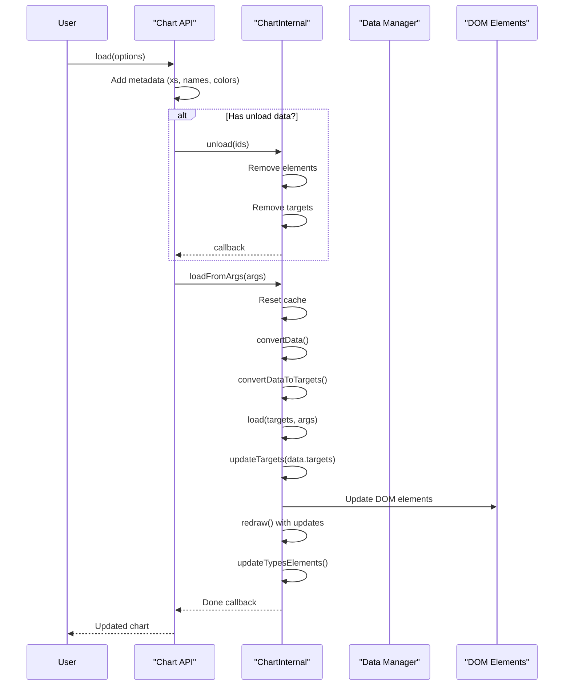
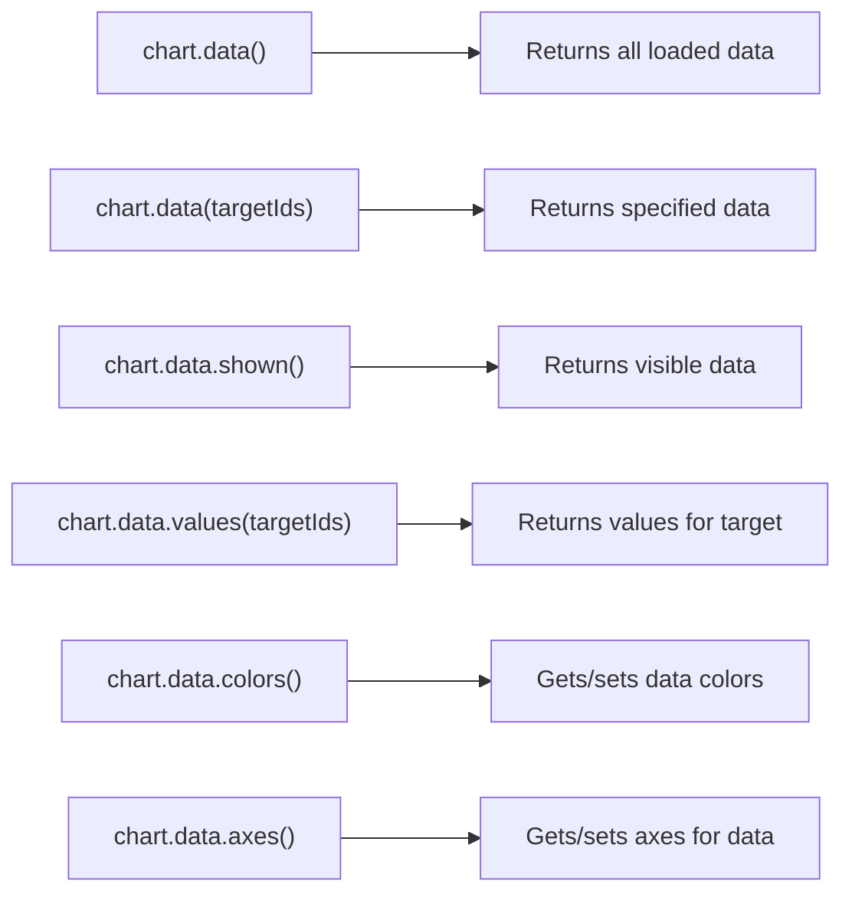
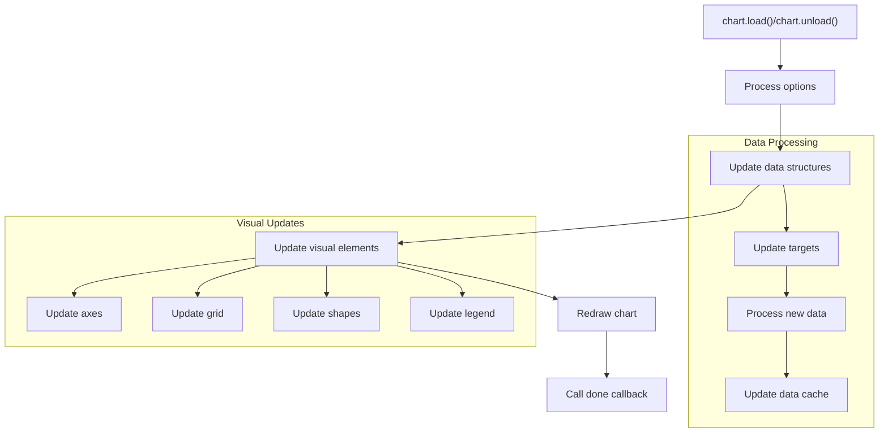
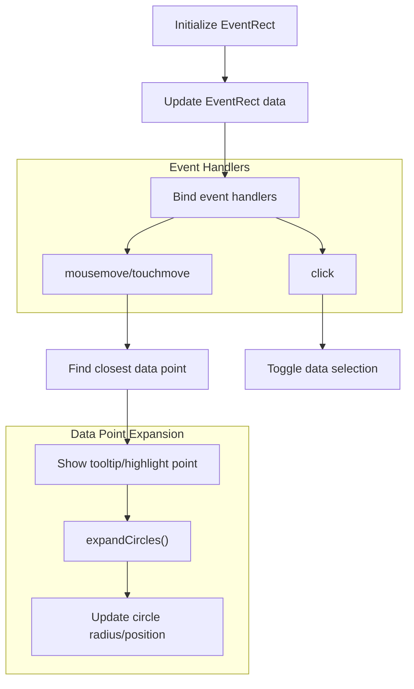
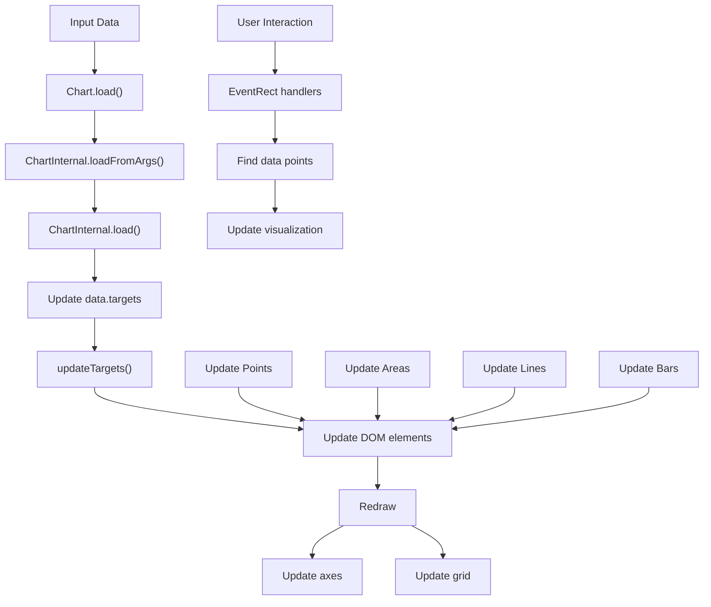
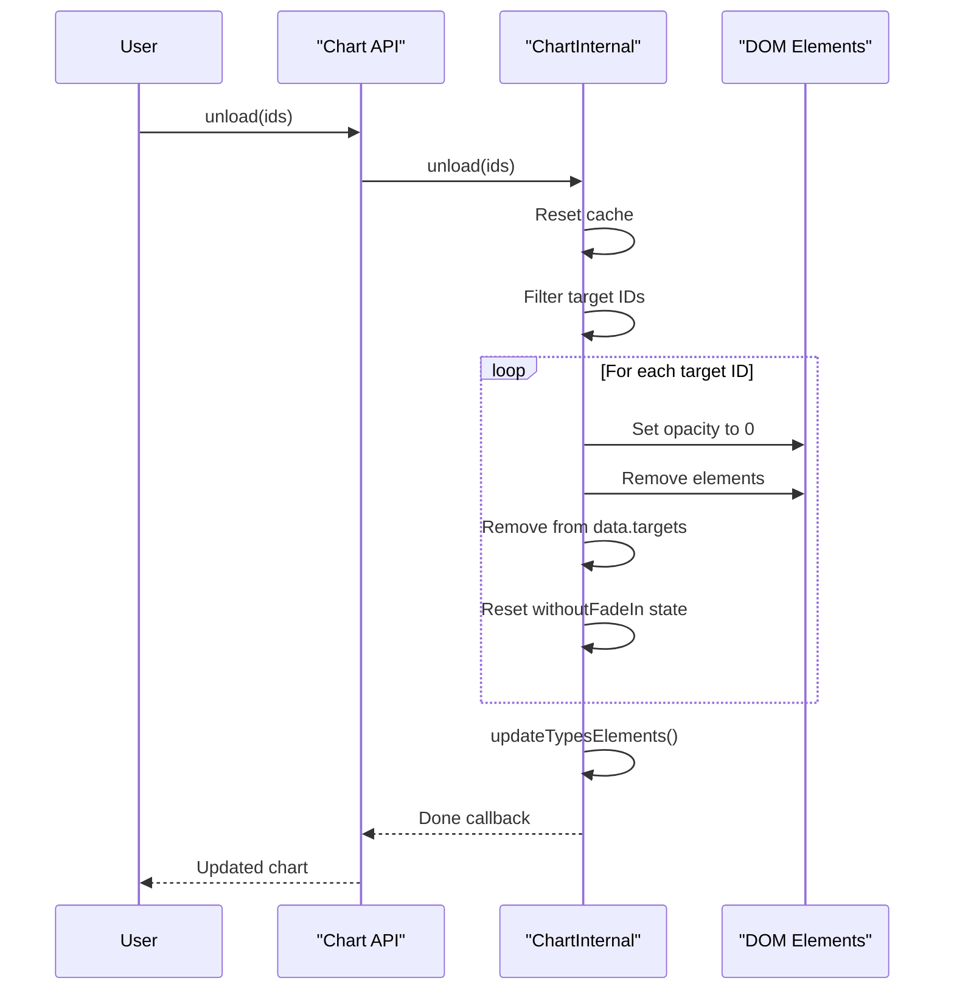
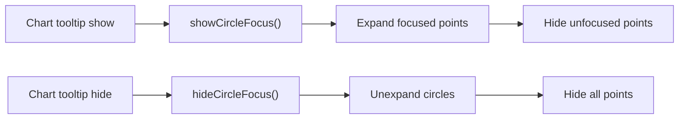

# Data Loading and Management

<details>
<summary>Relevant source files</summary>

The following files were used as context for generating this wiki page:

- [AUTHORS.txt](https://github.com/naver/billboard.js/blob/d6229c39/AUTHORS.txt)
- [src/Chart/api/load.ts](https://github.com/naver/billboard.js/blob/d6229c39/src/Chart/api/load.ts)
- [src/ChartInternal/data/data.ts](https://github.com/naver/billboard.js/blob/d6229c39/src/ChartInternal/data/data.ts)
- [src/ChartInternal/data/load.ts](https://github.com/naver/billboard.js/blob/d6229c39/src/ChartInternal/data/load.ts)
- [src/ChartInternal/interactions/eventrect.ts](https://github.com/naver/billboard.js/blob/d6229c39/src/ChartInternal/interactions/eventrect.ts)
- [src/ChartInternal/shape/point.ts](https://github.com/naver/billboard.js/blob/d6229c39/src/ChartInternal/shape/point.ts)
- [src/config/Options/common/point.ts](https://github.com/naver/billboard.js/blob/d6229c39/src/config/Options/common/point.ts)
- [src/config/Options/shape/area.ts](https://github.com/naver/billboard.js/blob/d6229c39/src/config/Options/shape/area.ts)
- [test/api/load-spec.ts](https://github.com/naver/billboard.js/blob/d6229c39/test/api/load-spec.ts)
- [test/shape/point-spec.ts](https://github.com/naver/billboard.js/blob/d6229c39/test/shape/point-spec.ts)
- [test/shape/radar-spec.ts](https://github.com/naver/billboard.js/blob/d6229c39/test/shape/radar-spec.ts)
- [types/chart.d.ts](https://github.com/naver/billboard.js/blob/d6229c39/types/chart.d.ts)

</details>


## Purpose and Scope

This document explains how billboard.js handles data loading, manipulation, and updates within the chart library. It covers the data structures, APIs for loading data, data transformation methods, and how data updates affect chart rendering. For information about exporting data from charts, see [Chart Export](#2.3).

## Data Structure Overview

Billboard.js organizes data into a hierarchical structure that manages both the raw input data and the processed data used for rendering charts. Understanding this structure is essential for effective data management.

```mermaid
classDiagram
    class "Chart" {
        data: Object
        $: Object
        load()
        unload()
    }
    
    class "ChartInternal" {
        data: Object
        scale: Object
        loadFromArgs()
        updateTargets()
        filterTargetsToShow()
    }
    
    class "Data Structure" {
        targets: Array
        xs: Object
        colors: Object
        classes: Object
        axes: Object
    }
    
    "Chart" --> "ChartInternal": internal
    "ChartInternal" --> "Data Structure": manages
    
    class "DataTarget" {
        id: String
        values: Array
        type: String
    }
    
    class "DataPoint" {
        x: Number/String/Date
        value: Number
        id: String
        index: Number
    }
    
    "Data Structure" --> "DataTarget": contains
    "DataTarget" --> "DataPoint": contains
```

Sources: [src/ChartInternal/data/data.ts:32-1141](https://github.com/naver/billboard.js/blob/d6229c39/src/ChartInternal/data/data.ts#L32-L1141), [src/Chart/api/load.ts:9-240](https://github.com/naver/billboard.js/blob/d6229c39/src/Chart/api/load.ts#L9-L240)

## Data Loading API

Billboard.js provides a flexible API for loading data into charts. The main entry point is the `chart.load()` method, which supports various data formats and configuration options.

### Supported Data Formats

Billboard.js supports multiple data input formats:

| Format | Description | Example |
|--------|-------------|---------|
| `columns` | Array of arrays with the first element as the data ID | `[["data1", 30, 200, 100], ["data2", 50, 20, 10]]` |
| `rows` | Array of arrays with each inner array as a row | `[[30, 50], [200, 20], [100, 10]]` |
| `json` | JSON object with keys as data IDs | `{"data1": [30, 200, 100], "data2": [50, 20, 10]}` |
| `url` | URL to fetch data from | `"data.json"` |

### Data Loading Flow

The loading process involves both public API methods and internal operations:



Sources: [src/Chart/api/load.ts:9-146](https://github.com/naver/billboard.js/blob/d6229c39/src/Chart/api/load.ts#L9-L146), [src/ChartInternal/data/load.ts:14-134](https://github.com/naver/billboard.js/blob/d6229c39/src/ChartInternal/data/load.ts#L14-L134)

### Key Load Method Parameters

The `chart.load()` method accepts several options to customize data loading behavior:

| Parameter | Type | Description |
|-----------|------|-------------|
| `columns` | Array | Data in column format |
| `rows` | Array | Data in row format |
| `json` | Object\|Array | Data in JSON format |
| `url` | String | URL to load data from |
| `append` | Boolean | If true, appends to existing data |
| `names` | Object | Custom data names mapping |
| `classes` | Object | Custom class names for data |
| `categories` | Array | X-axis categories |
| `axes` | Object | Y-axis assignment for data |
| `colors` | Object | Custom colors for data |
| `type` | String | Chart type for loaded data |
| `types` | Object | Chart types mapping for data |
| `unload` | Boolean\|Array | Data to unload before loading |
| `done` | Function | Callback after loading completes |
| `resizeAfter` | Boolean | If true, resizes chart after loading |

Sources: [src/Chart/api/load.ts:21-45](https://github.com/naver/billboard.js/blob/d6229c39/src/Chart/api/load.ts#L21-L45)

## Data Management

Billboard.js provides robust mechanisms for managing data once it's loaded into the chart.

### Data Retrieval Methods

The chart object provides several methods to access and manipulate data:



Sources: [types/chart.d.ts:131-167](https://github.com/naver/billboard.js/blob/d6229c39/types/chart.d.ts#L131-L167)

### Data Transformation and Filtering

The internal data management system provides numerous methods for transforming and filtering data:

| Method | Purpose |
|--------|---------|
| `filterTargetsToShow()` | Returns only visible targets |
| `mapToIds()` | Maps targets to their IDs |
| `getValuesAsIdKeyed()` | Gets values organized by ID |
| `hasNegativeValueInTargets()` | Checks for negative values |
| `filterByX()` | Filters data by X value |
| `filterRemoveNull()` | Removes null data points |
| `getMaxDataCount()` | Gets max data count |
| `getMinMaxData()` | Gets min/max data points |
| `updateDataIndexByX()` | Updates data index based on X values |

Sources: [src/ChartInternal/data/data.ts:467-482](https://github.com/naver/billboard.js/blob/d6229c39/src/ChartInternal/data/data.ts#L467-L482), [src/ChartInternal/data/data.ts:584-599](https://github.com/naver/billboard.js/blob/d6229c39/src/ChartInternal/data/data.ts#L584-L599), [src/ChartInternal/data/data.ts:669-707](https://github.com/naver/billboard.js/blob/d6229c39/src/ChartInternal/data/data.ts#L669-L707)

## Data Updates and Rendering

### Update Process

When data changes, billboard.js follows a specific process to update the chart elements:



Sources: [src/ChartInternal/data/load.ts:84-114](https://github.com/naver/billboard.js/blob/d6229c39/src/ChartInternal/data/load.ts#L84-L114)

### EventRect and Data Point Interaction

Billboard.js creates event rectangles to handle user interactions with data points. These are crucial for tooltip display and point selection:



Sources: [src/ChartInternal/interactions/eventrect.ts:14-699](https://github.com/naver/billboard.js/blob/d6229c39/src/ChartInternal/interactions/eventrect.ts#L14-L699), [src/ChartInternal/shape/point.ts:284-332](https://github.com/naver/billboard.js/blob/d6229c39/src/ChartInternal/shape/point.ts#L284-L332)

## Data Flow Through Components

The following diagram illustrates how data flows through the different components of billboard.js:



Sources: [src/ChartInternal/data/load.ts:22-115](https://github.com/naver/billboard.js/blob/d6229c39/src/ChartInternal/data/load.ts#L22-L115), [src/ChartInternal/interactions/eventrect.ts:100-189](https://github.com/naver/billboard.js/blob/d6229c39/src/ChartInternal/interactions/eventrect.ts#L100-L189)

## Data Unloading

Billboard.js provides mechanisms to remove data from charts:



Sources: [src/ChartInternal/data/load.ts:136-193](https://github.com/naver/billboard.js/blob/d6229c39/src/ChartInternal/data/load.ts#L136-L193), [src/Chart/api/load.ts:213-239](https://github.com/naver/billboard.js/blob/d6229c39/src/Chart/api/load.ts#L213-L239)

## Handling Specialized Data Types

Billboard.js provides special handling for various data types and chart scenarios:

### Point Focus Handling

For line charts with `point.focus.only` enabled, only the focused data points are shown:



Sources: [src/ChartInternal/shape/point.ts:214-265](https://github.com/naver/billboard.js/blob/d6229c39/src/ChartInternal/shape/point.ts#L214-L265), [src/ChartInternal/shape/point.ts:373-377](https://github.com/naver/billboard.js/blob/d6229c39/src/ChartInternal/shape/point.ts#L373-L377)

### Area and Bubble Chart Data

For area, bubble, and other specialized chart types, billboard.js performs additional data processing:

| Chart Type | Special Processing |
|------------|-------------------|
| Area | Converts data for step type, handles ranges |
| Bubble | Extracts z-dimension values, calculates bubble size |
| Radar | Processes data for radar chart coordinates |
| Bar | Handles grouped data, calculates bar positioning |
| Gauge | Normalizes values for gauge representation |

Sources: [src/ChartInternal/data/data.ts:884-942](https://github.com/naver/billboard.js/blob/d6229c39/src/ChartInternal/data/data.ts#L884-L942)

## Best Practices for Data Loading

1. **Prefer Unload Option over Separate Calls**: Use the `unload` option in the `load()` method rather than separate `unload()` and `load()` calls to avoid animation issues.

2. **Use Append for Streaming Data**: For streaming data, use the `append: true` option to add new data points without replacing existing data.

3. **Manage Memory with Cache Reset**: The internal cache is automatically reset on data load/unload operations, but be aware of memory usage with large datasets.

4. **Properly Format Time-Series Data**: When using time-series data, ensure dates are properly formatted or parsed using the `xFormat` configuration.

5. **Set Appropriate Callbacks**: Use the `done` callback for operations that need to be performed after data is loaded.