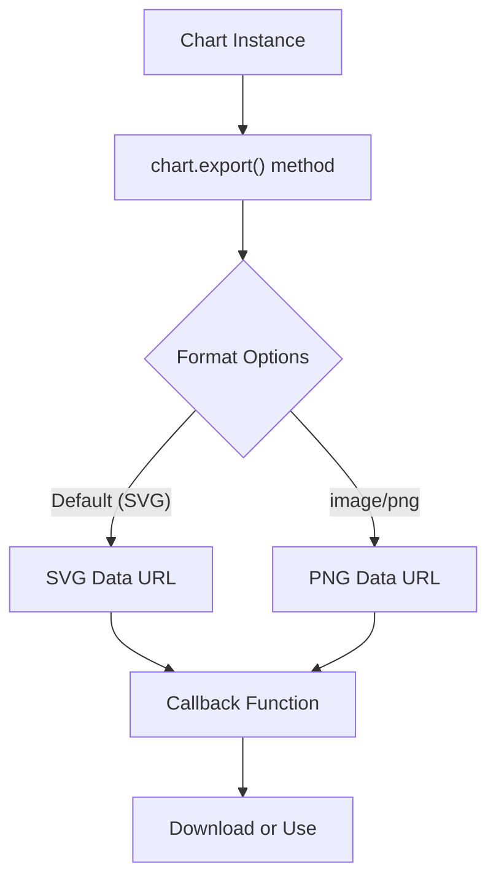
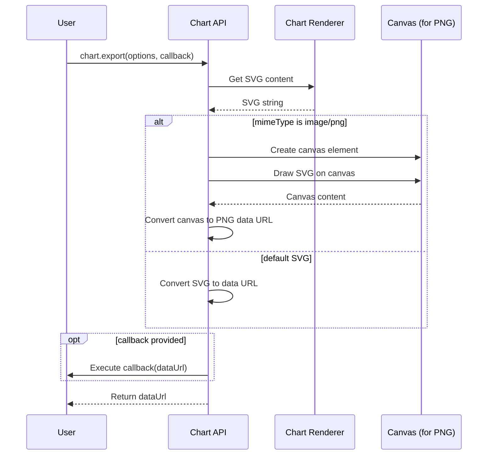
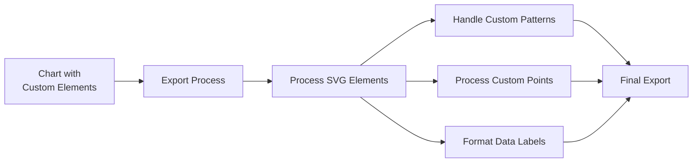
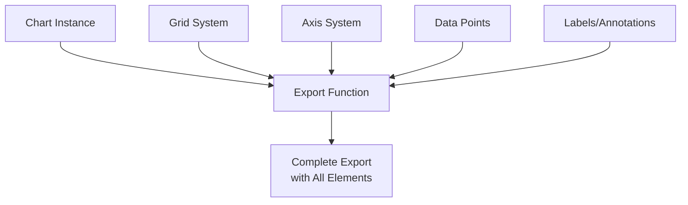

# Chart Export

<details>
<summary>Relevant source files</summary>

The following files were used as context for generating this wiki page:

- [src/Chart/api/axis.ts](https://github.com/naver/billboard.js/blob/d6229c39/src/Chart/api/axis.ts)
- [src/ChartInternal/Axis/AxisRenderer.ts](https://github.com/naver/billboard.js/blob/d6229c39/src/ChartInternal/Axis/AxisRenderer.ts)
- [src/ChartInternal/Axis/AxisRendererHelper.ts](https://github.com/naver/billboard.js/blob/d6229c39/src/ChartInternal/Axis/AxisRendererHelper.ts)
- [src/ChartInternal/internals/grid.ts](https://github.com/naver/billboard.js/blob/d6229c39/src/ChartInternal/internals/grid.ts)
- [test/api/axis-spec.ts](https://github.com/naver/billboard.js/blob/d6229c39/test/api/axis-spec.ts)
- [test/api/export-spec.ts](https://github.com/naver/billboard.js/blob/d6229c39/test/api/export-spec.ts)
- [test/internals/grid-spec.ts](https://github.com/naver/billboard.js/blob/d6229c39/test/internals/grid-spec.ts)

</details>


The Chart Export module provides functionality to export chart visualizations as images (SVG or PNG) for saving, sharing, or embedding in documents. This page documents the methods, options, and workflows for exporting charts rendered with billboard.js.

## Overview

Billboard.js allows charts to be exported in different formats with various customization options. The export functionality converts the rendered SVG chart into a data URL that can be used to download or display the chart elsewhere.



Sources: [test/api/export-spec.ts:28-66](https://github.com/naver/billboard.js/blob/d6229c39/test/api/export-spec.ts#L28-L66)

## Basic Usage

The chart export functionality is accessed through the `export()` method on the chart instance. It can be used with or without parameters.

```javascript
// Basic SVG export - returns data URL string immediately
const svgDataUrl = chart.export();

// Export with callback
chart.export(null, function(dataUrl) {
    // Use the data URL (e.g., create download link)
    const link = document.createElement("a");
    link.download = "chart.svg";
    link.href = dataUrl;
    link.click();
});
```

The returned data URL starts with `data:image/svg+xml;base64,` followed by the base64-encoded SVG content.

Sources: [test/api/export-spec.ts:28-37](https://github.com/naver/billboard.js/blob/d6229c39/test/api/export-spec.ts#L28-L37)

## Export Options

The `export()` method accepts an options object to customize the output:

| Option | Type | Default | Description |
|--------|------|---------|-------------|
| `mimeType` | string | "image/svg+xml" | Output format ("image/svg+xml" or "image/png") |
| `width` | number | Current chart width | Width of the exported image |
| `height` | number | Current chart height | Height of the exported image |
| `preserveAspectRatio` | boolean | true | Whether to maintain aspect ratio when specifying width/height |
| `preserveFontStyle` | boolean | false | Whether to preserve font styles in the exported image |

### Example with Options

```javascript
chart.export({
    mimeType: "image/png",
    width: 800,
    height: 600,
    preserveAspectRatio: false
}, function(dataUrl) {
    // Use the dataUrl
});
```

Sources: [test/api/export-spec.ts:39-79](https://github.com/naver/billboard.js/blob/d6229c39/test/api/export-spec.ts#L39-L79)

## Export Process

The following diagram illustrates the internal export workflow:



Sources: [test/api/export-spec.ts:28-66](https://github.com/naver/billboard.js/blob/d6229c39/test/api/export-spec.ts#L28-L66), [test/api/export-spec.ts:147-282](https://github.com/naver/billboard.js/blob/d6229c39/test/api/export-spec.ts#L147-L282)

## Advanced Features

### Font Style Preservation

When exporting charts with custom fonts, the default export might not include the font styling. To preserve font styles:

```javascript
chart.export({
    preserveFontStyle: true
}, function(dataUrl) {
    // The exported image will maintain custom fonts
});
```

This is particularly useful when using web fonts or custom font styles in your charts.

Sources: [test/api/export-spec.ts:238-281](https://github.com/naver/billboard.js/blob/d6229c39/test/api/export-spec.ts#L238-L281)

### Custom Sizes and Aspect Ratio

You can export a chart in a different size than its displayed size:

```javascript
chart.export({
    width: 1200,  // Wider size
    height: 600,  // Custom height
    preserveAspectRatio: false  // Allow stretching
}, callback);
```

Setting `preserveAspectRatio` to `false` allows the chart to stretch to fit the specified dimensions, which may be useful when embedding in specific layouts.

Sources: [test/api/export-spec.ts:53-65](https://github.com/naver/billboard.js/blob/d6229c39/test/api/export-spec.ts#L53-L65), [test/api/export-spec.ts:67-79](https://github.com/naver/billboard.js/blob/d6229c39/test/api/export-spec.ts#L67-L79)

## Export with Custom Elements

Billboard.js ensures that custom elements like patterns, specialized point shapes, or custom data labels are properly rendered in the exported image.



The system properly handles:
- Custom point patterns
- Grid lines and text
- Data labels with special formatting
- Axis labels and markers

Sources: [test/api/export-spec.ts:81-119](https://github.com/naver/billboard.js/blob/d6229c39/test/api/export-spec.ts#L81-L119), [test/api/export-spec.ts:120-144](https://github.com/naver/billboard.js/blob/d6229c39/test/api/export-spec.ts#L120-L144)

## CSS Handling and Safety

The export function handles potentially problematic CSS content, ensuring valid SVG output:

```javascript
// Even with problematic CSS, the export works
document.body.innerHTML += `<style>@font-face{src:url("#&<>'\0");}</style>`;
const dataURL = chart.export(); // Still produces valid SVG
```

This creates reliable exports even when the document contains CSS that could cause issues in SVG processing.

Sources: [test/api/export-spec.ts:132-144](https://github.com/naver/billboard.js/blob/d6229c39/test/api/export-spec.ts#L132-L144)

## Relationship with Grid and Axis Systems

The exported chart includes all grid lines, axis labels, and other components rendered in the chart. This ensures that what you see in the browser is what you get in the exported image.



Sources: [src/ChartInternal/internals/grid.ts](https://github.com/naver/billboard.js/blob/d6229c39/src/ChartInternal/internals/grid.ts), [src/ChartInternal/Axis/AxisRenderer.ts](https://github.com/naver/billboard.js/blob/d6229c39/src/ChartInternal/Axis/AxisRenderer.ts), [src/ChartInternal/Axis/AxisRendererHelper.ts](https://github.com/naver/billboard.js/blob/d6229c39/src/ChartInternal/Axis/AxisRendererHelper.ts)

## Common Use Cases

### Saving Charts as Images

```javascript
chart.export({
    mimeType: "image/png"
}, function(dataUrl) {
    const link = document.createElement("a");
    link.download = "chart.png";
    link.href = dataUrl;
    link.click();
});
```

### Embedding in Reports

```javascript
chart.export(null, function(dataUrl) {
    document.getElementById("report-image").src = dataUrl;
});
```

### Creating Thumbnails

```javascript
chart.export({
    width: 200,
    height: 150,
    preserveAspectRatio: true
}, function(dataUrl) {
    document.getElementById("thumbnail").src = dataUrl;
});
```

## Limitations and Considerations

1. **External Resources**: Font files or images referenced with external URLs may not be included in the export unless `preserveFontStyle` is set to `true`

2. **Browser Compatibility**: The export functionality uses HTML5 features like canvas and data URLs, which are supported in modern browsers but may have limitations in older browsers

3. **Performance**: Exporting very large or complex charts, especially to PNG format, can be resource-intensive

4. **Security**: When using the export functionality in a production environment, be aware of potential cross-origin resource sharing (CORS) issues if your chart includes external resources

Sources: [test/api/export-spec.ts:238-281](https://github.com/naver/billboard.js/blob/d6229c39/test/api/export-spec.ts#L238-L281)

## Related Topics

For more information about customizing charts and related features:
- For working with chart data and updates, see [Data Loading and Management](#2.2)
- For axis configuration options, see [Axis System](#4.1)