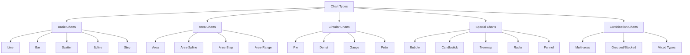
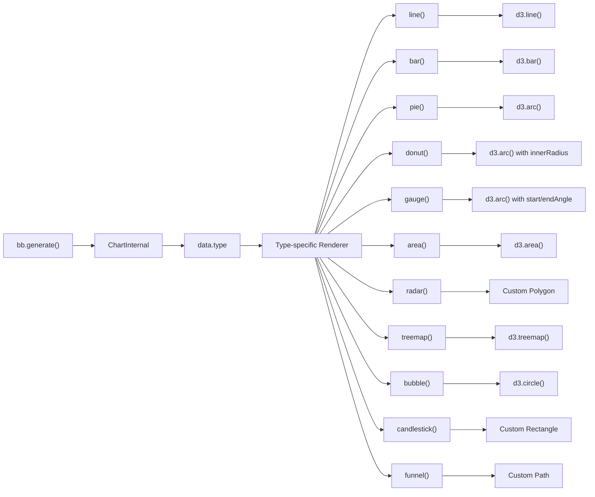
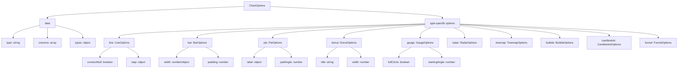

# Chart Types

<details>
<summary>Relevant source files</summary>

The following files were used as context for generating this wiki page:

- [.gitignore](https://github.com/naver/billboard.js/blob/d6229c39/.gitignore)
- [.yarnrc.yml](https://github.com/naver/billboard.js/blob/d6229c39/.yarnrc.yml)
- [README.md](https://github.com/naver/billboard.js/blob/d6229c39/README.md)
- [demo/demo.js](https://github.com/naver/billboard.js/blob/d6229c39/demo/demo.js)
- [demo/types/index.html](https://github.com/naver/billboard.js/blob/d6229c39/demo/types/index.html)
- [demo/types/types.css](https://github.com/naver/billboard.js/blob/d6229c39/demo/types/types.css)
- [demo/types/types.js](https://github.com/naver/billboard.js/blob/d6229c39/demo/types/types.js)
- [types/options.d.ts](https://github.com/naver/billboard.js/blob/d6229c39/types/options.d.ts)

</details>


This document provides a comprehensive overview of the chart types supported by billboard.js. It covers the available chart types, their configuration options, and how to implement them in your applications. For information about customizing chart components such as axes and tooltips, refer to the [Components](#4) documentation.

## Overview

Billboard.js supports a wide variety of chart types that can be specified using the `data.type` property when generating a chart. The library builds on top of D3.js to create highly customizable data visualizations that are both powerful and easy to implement.



Sources: [demo/types/types.js:1-36](https://github.com/naver/billboard.js/blob/d6229c39/demo/types/types.js#L1-L36), [README.md:42-44](https://github.com/naver/billboard.js/blob/d6229c39/README.md#L42-L44)

## Chart Type Implementation

In billboard.js, chart types are specified through the `data.type` option or the `types` object for mixed-type charts. The chart rendering system then processes this information to create the appropriate visualization.



Sources: [types/options.d.ts:10-26](https://github.com/naver/billboard.js/blob/d6229c39/types/options.d.ts#L10-L26), [demo/demo.js:6-1211](https://github.com/naver/billboard.js/blob/d6229c39/demo/demo.js#L6-L1211)

## Basic Charts

### Line Chart

Line charts connect data points with straight lines, ideal for showing trends over time.

```javascript
bb.generate({
    data: {
        type: "line",
        columns: [
            ["data1", 30, 200, 100, 400, 150, 250],
            ["data2", 50, 20, 10, 40, 15, 25]
        ]
    }
});
```

Sources: [demo/demo.js:626-661](https://github.com/naver/billboard.js/blob/d6229c39/demo/demo.js#L626-L661)

### Bar Chart

Bar charts use rectangular bars to represent data values, with bar length proportional to the value.

```javascript
bb.generate({
    data: {
        type: "bar",
        columns: [
            ["data1", 30, 200, 100, 400, 150, 250],
            ["data2", 130, 100, 140, 200, 150, 50]
        ]
    },
    bar: {
        width: {
            ratio: 0.5 // Controls the width of bars relative to available space
        }
    }
});
```

Sources: [demo/demo.js:148-206](https://github.com/naver/billboard.js/blob/d6229c39/demo/demo.js#L148-L206)

### Scatter Plot

Scatter plots display individual data points in a two-dimensional space, useful for showing relationships between variables.

```javascript
bb.generate({
    data: {
        xs: {
            setosa: "setosa_x",
            versicolor: "versicolor_x",
        },
        columns: [
            ["setosa_x", 3.5, 3.0, 3.2, 3.1, 3.6, 3.9],
            ["versicolor_x", 3.2, 3.2, 3.1, 2.3, 2.8, 2.8],
            ["setosa", 0.2, 0.2, 0.2, 0.2, 0.2, 0.4],
            ["versicolor", 1.4, 1.5, 1.5, 1.3, 1.5, 1.3]
        ],
        type: "scatter"
    }
});
```

Sources: [demo/demo.js:789-846](https://github.com/naver/billboard.js/blob/d6229c39/demo/demo.js#L789-L846)

### Spline Chart

Spline charts are similar to line charts but use curved lines to connect data points.

```javascript
bb.generate({
    data: {
        columns: [
            ["data1", 30, 200, 100, 400, 150, 250],
            ["data2", 130, 100, 140, 200, 150, 50]
        ],
        type: "spline"
    }
});
```

Sources: [demo/demo.js:885-895](https://github.com/naver/billboard.js/blob/d6229c39/demo/demo.js#L885-L895)

### Step Chart

Step charts connect data points with horizontal and vertical lines, creating a step-like appearance.

```javascript
bb.generate({
    data: {
        columns: [
            ["data1", 300, 350, 300, 20, 240, 100],
            ["data2", 130, 100, 140, 200, 150, 50]
        ],
        types: {
            data1: "step",
            data2: "area-step"
        }
    }
});
```

Sources: [demo/demo.js:993-1057](https://github.com/naver/billboard.js/blob/d6229c39/demo/demo.js#L993-L1057)

## Area Charts

### Area Chart

Area charts are line charts with the area below the line filled, emphasizing volume.

```javascript
bb.generate({
    data: {
        columns: [
            ["data1", 300, 350, 300, 0, 0, 0],
            ["data2", 130, 100, 140, 200, 150, 50]
        ],
        types: {
            data1: "area",
            data2: "area-spline"
        }
    }
});
```

Sources: [demo/demo.js:8-21](https://github.com/naver/billboard.js/blob/d6229c39/demo/demo.js#L8-L21)

### Area Range Charts

Area range charts visualize a range of values for each data point, useful for showing uncertainty or min/max values.

```javascript
bb.generate({
    data: {
        columns: [
            ["data1",
                [150, 140, 110], // [high, mid, low]
                [155, 130, 115],
                [160, 135, 120],
                [135, 120, 110],
                [180, 150, 130],
                [199, 160, 125]
            ]
        ],
        type: "area-line-range" // Also available: area-spline-range, area-step-range
    }
});
```

Sources: [demo/demo.js:22-146](https://github.com/naver/billboard.js/blob/d6229c39/demo/demo.js#L22-L146), [demo/types/types.js:54-66](https://github.com/naver/billboard.js/blob/d6229c39/demo/types/types.js#L54-L66)

## Circular Charts

### Pie Chart

Pie charts represent data as proportional slices of a circle.

```javascript
bb.generate({
    data: {
        columns: [
            ["data1", 30],
            ["data2", 120]
        ],
        type: "pie"
    }
});
```

Sources: [demo/demo.js:697-734](https://github.com/naver/billboard.js/blob/d6229c39/demo/demo.js#L697-L734)

### Donut Chart

Donut charts are pie charts with a hollow center, allowing for additional information display.

```javascript
bb.generate({
    data: {
        columns: [
            ["data1", 30],
            ["data2", 120]
        ],
        type: "donut"
    },
    donut: {
        title: "Iris Petal Width" // Text displayed in the center
    }
});
```

Sources: [demo/demo.js:433-477](https://github.com/naver/billboard.js/blob/d6229c39/demo/demo.js#L433-L477)

### Gauge Chart

Gauge charts display a single value within a range, similar to a speedometer.

```javascript
bb.generate({
    data: {
        columns: [
            ["data", 91.4]
        ],
        type: "gauge"
    },
    gauge: {
        // Configuration options
        // min: 0,
        // max: 100,
        // units: "%"
    },
    color: {
        pattern: ['#FF0000', '#F97600', '#F6C600', '#60B044'], // Color thresholds
        threshold: {
            values: [30, 60, 90, 100]
        }
    }
});
```

Sources: [demo/demo.js:551-624](https://github.com/naver/billboard.js/blob/d6229c39/demo/demo.js#L551-L624)

### Polar Chart

Polar charts display data on a circular grid, with data points extending from the center.

```javascript
bb.generate({
    data: {
        columns: [
            ["data1", 60],
            ["data2", 120],
            ["data3", 75]
        ],
        type: "polar",
        order: null
    },
    polar: {
        label: {
            format: function(value, ratio, id) {
                return value + "\n" + (ratio * 100).toFixed(0) + "%";
            }
        }
    }
});
```

Sources: [demo/demo.js:736-762](https://github.com/naver/billboard.js/blob/d6229c39/demo/demo.js#L736-L762)

## Special Charts

### Bubble Chart

Bubble charts extend scatter plots by adding a third dimension represented by the size of the bubble.

```javascript
bb.generate({
    data: {
        columns: [
            ["data1", 30, 350, 200, 380, 150, 250, 50, 80, 55, 220],
            ["data2", 130, 100, 10, 200, 80, 50, 200, 123, 185, 98]
        ],
        type: "bubble",
        labels: true
    },
    bubble: {
        maxR: 50 // Maximum bubble radius
    }
});
```

Sources: [demo/demo.js:207-257](https://github.com/naver/billboard.js/blob/d6229c39/demo/demo.js#L207-L257)

### Candlestick Chart

Candlestick charts display price movements, commonly used in financial data visualization.

```javascript
bb.generate({
    data: {
        columns: [
            ["data1",
                // open, high, low, close
                [1327, 1369, 1289, 1348],
                [1348, 1371, 1314, 1320],
                [1320, 1412, 1314, 1394]
            ]
        ],
        type: "candlestick"
    },
    candlestick: {
        color: {
            down: "red" // Color for decreasing values
        },
        width: {
            ratio: 0.5 // Width ratio of the candles
        }
    }
});
```

Sources: [demo/demo.js:284-407](https://github.com/naver/billboard.js/blob/d6229c39/demo/demo.js#L284-L407), [demo/types/types.js:56-65](https://github.com/naver/billboard.js/blob/d6229c39/demo/types/types.js#L56-L65)

### Treemap Chart

Treemap charts use nested rectangles to visualize hierarchical data structures.

```javascript
bb.generate({
    data: {
        columns: [
            ["data1", 1300],
            ["data2", 200],
            ["data3", 500],
            ["data4", 50],
            ["data5", 100],
            ["data6", 70]
        ],
        type: "treemap",
        labels: {
            colors: "#fff" // Text color for labels
        }
    },
    treemap: {
        label: {
            threshold: 0.03 // Minimum area ratio to show label
        }
    }
});
```

Sources: [demo/demo.js:1092-1211](https://github.com/naver/billboard.js/blob/d6229c39/demo/demo.js#L1092-L1211)

### Radar Chart

Radar charts (also known as spider or web charts) display multivariate data on axes radiating from a center point.

```javascript
bb.generate({
    data: {
        x: "x",
        columns: [
            ["x", "Data A", "Data B", "Data C", "Data D", "Data E"],
            ["data1", 330, 350, 200, 380, 150],
            ["data2", 130, 100, 30, 200, 80]
        ],
        type: "radar",
        labels: true
    },
    radar: {
        axis: {
            max: 400 // Maximum value for axes
        },
        level: {
            depth: 4 // Number of level circles
        },
        direction: {
            clockwise: true // Direction of polygon
        }
    }
});
```

Sources: [demo/demo.js:763-788](https://github.com/naver/billboard.js/blob/d6229c39/demo/demo.js#L763-L788)

### Funnel Chart

Funnel charts show values in progressively decreasing stages, useful for sales or conversion processes.

```javascript
bb.generate({
    data: {
        columns: [
            ["data1", 30],
            ["data2", 45],
            ["data3", 25],
            ["data4", 55]
        ],
        type: "funnel",
        order: null,
        labels: {
            format: function(v, id, i, texts) {
                return id;
            }
        }
    }
});
```

Sources: [demo/demo.js:478-549](https://github.com/naver/billboard.js/blob/d6229c39/demo/demo.js#L478-L549)

## Combination Charts

### Mixed Type Charts

Mixed type charts combine multiple chart types in a single visualization.

```javascript
bb.generate({
    data: {
        columns: [
            ["data1", 30, 20, 50, 40, 60, 50],
            ["data2", 200, 130, 90, 240, 130, 220],
            ["data3", 300, 200, 160, 400, 250, 250]
        ],
        type: "bar",
        types: {
            data3: "spline",
            data2: "line"
        }
    }
});
```

Sources: [demo/demo.js:408-432](https://github.com/naver/billboard.js/blob/d6229c39/demo/demo.js#L408-L432)

### Stacked/Grouped Bar Charts

Stacked or grouped bar charts combine multiple series into a single visualization.

```javascript
bb.generate({
    data: {
        columns: [
            ["data1", -30, 200, 200, 400, -150, 250],
            ["data2", 130, 100, -100, 200, -150, 50]
        ],
        type: "bar",
        groups: [
            ["data1", "data2"]
        ]
    },
    grid: {
        y: {
            lines: [{value: 0}]
        }
    }
});
```

Sources: [demo/demo.js:914-991](https://github.com/naver/billboard.js/blob/d6229c39/demo/demo.js#L914-L991)

## Chart Type Configuration

Each chart type has specific configuration options that can be set in the chart configuration object. These options allow for customizing the appearance and behavior of the chart.



Sources: [types/options.d.ts:10-309](https://github.com/naver/billboard.js/blob/d6229c39/types/options.d.ts#L10-L309)

### Chart Type Options Reference

The following table provides an overview of the chart-specific options available in billboard.js:

| Chart Type | Option | Description |
|------------|--------|-------------|
| Line | `line.connectNull` | Connect null data points |
| | `line.step.type` | Step line type (step-before, step-after) |
| Bar | `bar.width` | Width of bars (absolute or ratio) |
| | `bar.padding` | Padding between bars |
| Pie/Donut | `pie.padAngle` | Padding between slices |
| | `donut.title` | Text in center of donut |
| | `donut.width` | Width of donut ring |
| Gauge | `gauge.fullCircle` | Show as full circle |
| | `gauge.startingAngle` | Starting angle of gauge |
| | `gauge.label` | Value label configuration |
| Radar | `radar.axis.max` | Maximum value for axes |
| | `radar.level.depth` | Number of level circles |
| Bubble | `bubble.maxR` | Maximum bubble radius |
| Treemap | `treemap.label` | Label configuration |
| | `treemap.tile` | Tiling algorithm (binary, dice, slice) |

Sources: [types/options.d.ts:294-308](https://github.com/naver/billboard.js/blob/d6229c39/types/options.d.ts#L294-L308), [demo/demo.js:6-1211](https://github.com/naver/billboard.js/blob/d6229c39/demo/demo.js#L6-L1211)

## Dynamic Chart Type Configuration

Billboard.js allows for dynamic updates to chart types and configurations through its API.

```javascript
// Generate initial chart
var chart = bb.generate({
    data: {
        columns: [
            ["data1", 30, 200, 100, 400, 150, 250],
            ["data2", 130, 100, 140, 200, 150, 50]
        ],
        type: "line"
    }
});

// Change chart type
chart.transform("bar");

// Change specific series type
chart.transform("spline", "data1");
```

Sources: [demo/demo.js:636-659](https://github.com/naver/billboard.js/blob/d6229c39/demo/demo.js#L636-L659)

## Conclusion

Billboard.js provides a comprehensive set of chart types to visualize various kinds of data. By selecting the appropriate chart type and customizing its configuration, you can create effective data visualizations tailored to your specific needs.