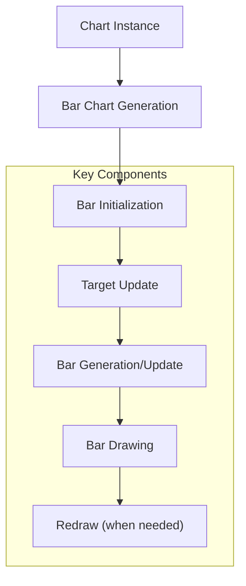
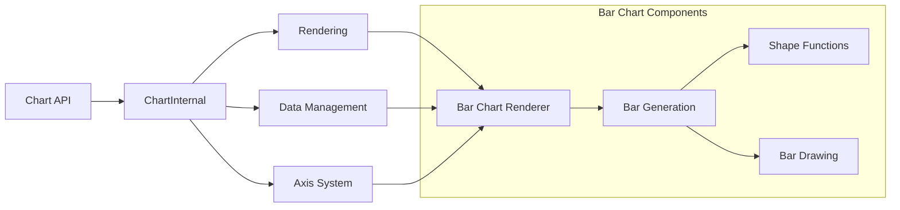
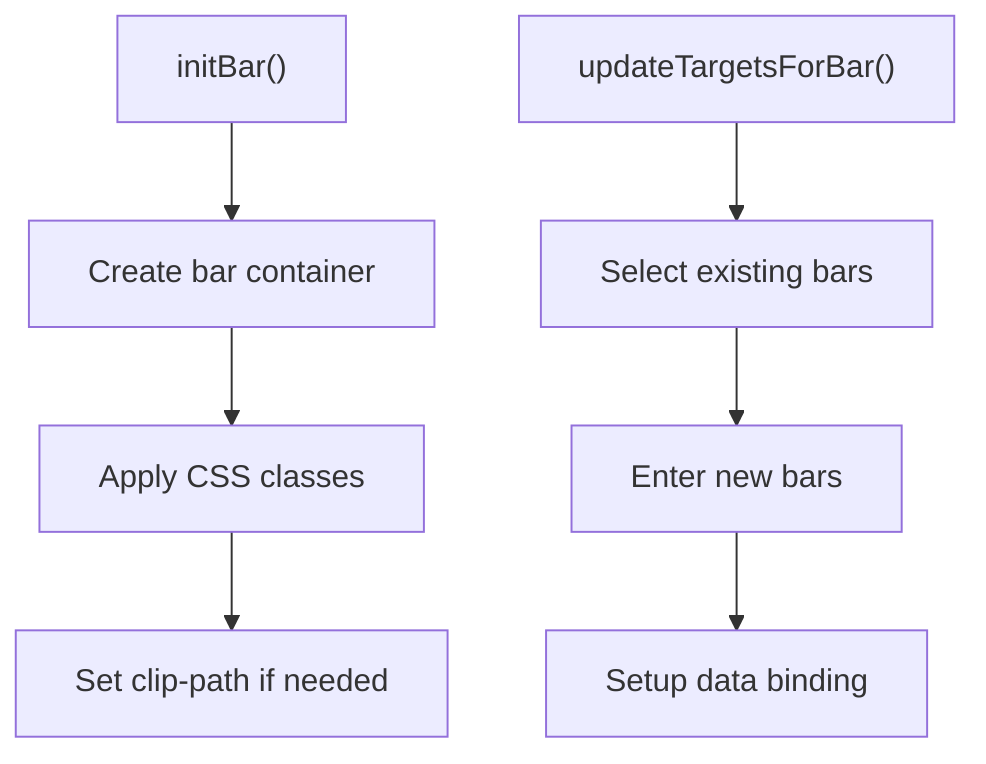
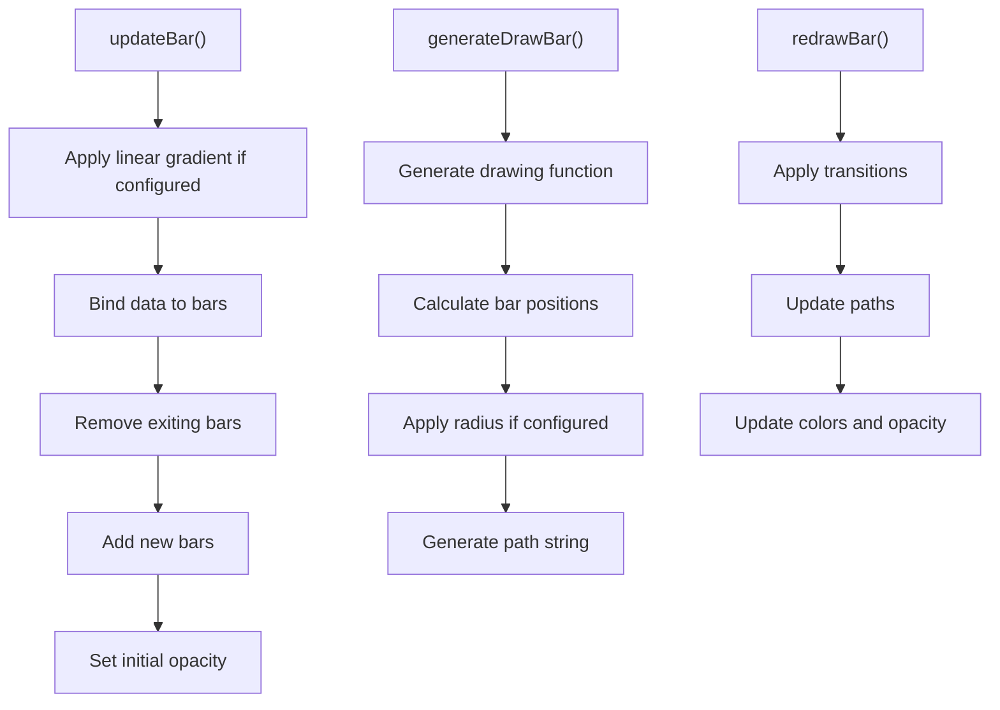
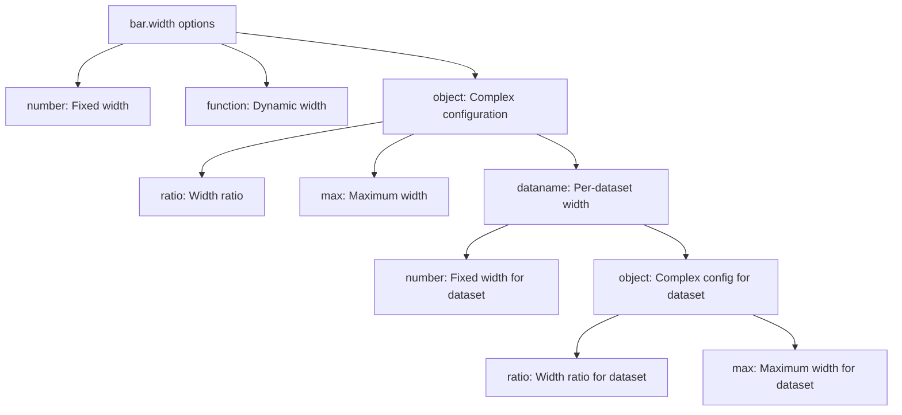
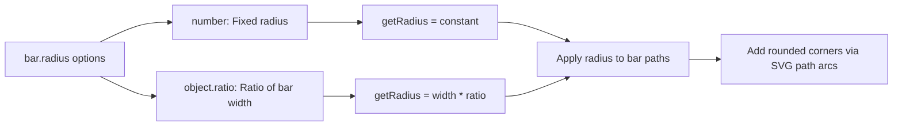
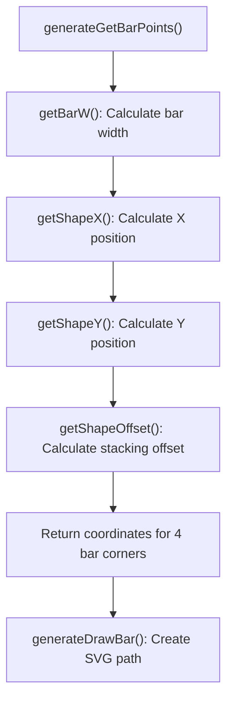
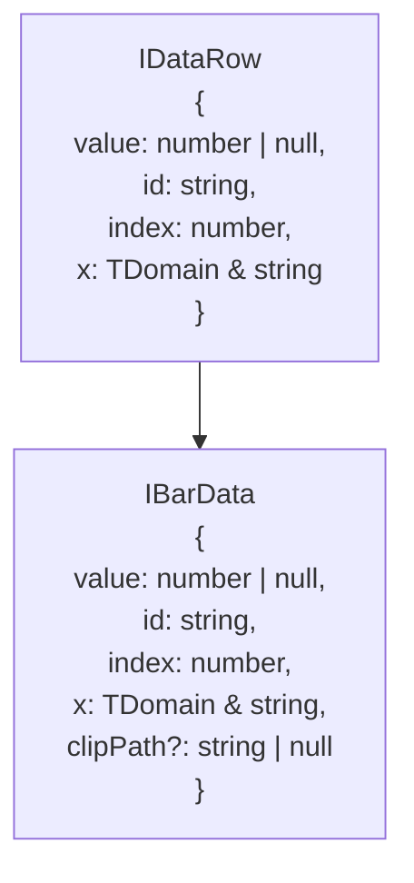

# Bar Charts

<details>
<summary>Relevant source files</summary>

The following files were used as context for generating this wiki page:

- [demo/demo.js](https://github.com/naver/billboard.js/blob/d6229c39/demo/demo.js)
- [src/ChartInternal/data/IData.ts](https://github.com/naver/billboard.js/blob/d6229c39/src/ChartInternal/data/IData.ts)
- [src/ChartInternal/shape/bar.ts](https://github.com/naver/billboard.js/blob/d6229c39/src/ChartInternal/shape/bar.ts)
- [src/ChartInternal/shape/shape.ts](https://github.com/naver/billboard.js/blob/d6229c39/src/ChartInternal/shape/shape.ts)
- [src/config/Options/shape/bar.ts](https://github.com/naver/billboard.js/blob/d6229c39/src/config/Options/shape/bar.ts)
- [test/shape/bar-spec.ts](https://github.com/naver/billboard.js/blob/d6229c39/test/shape/bar-spec.ts)
- [types/options.d.ts](https://github.com/naver/billboard.js/blob/d6229c39/types/options.d.ts)

</details>


This document explains the bar chart functionality in billboard.js, including configuration options, implementation details, and advanced features. Bar charts are a fundamental chart type that display data using rectangular bars with heights or lengths proportional to the values they represent.

## 1. Overview

Bar charts in billboard.js support various customization options including grouped bars, stacked bars, bar width adjustment, rounded corners, and more. The implementation provides support for both vertical (default) and horizontal (via rotated axis) orientations.



Sources: [src/ChartInternal/shape/bar.ts:13-130](https://github.com/naver/billboard.js/blob/d6229c39/src/ChartInternal/shape/bar.ts#L13-L130), [demo/demo.js:148-205](https://github.com/naver/billboard.js/blob/d6229c39/demo/demo.js#L148-L205)

## 2. Integration with Core Architecture

Bar charts are part of the shape rendering system in Billboard.js. The bar chart implementation inherits from the base chart functionality and interacts with other components like axis systems and data management.



Sources: [src/ChartInternal/shape/bar.ts:13-342](https://github.com/naver/billboard.js/blob/d6229c39/src/ChartInternal/shape/bar.ts#L13-L342), [src/ChartInternal/shape/shape.ts:13-606](https://github.com/naver/billboard.js/blob/d6229c39/src/ChartInternal/shape/shape.ts#L13-L606)

## 3. Core Bar Chart Components

The bar chart implementation consists of several key components:

### 3.1 Bar Initialization and Setup

The bar chart initialization process creates the SVG container elements and sets up event handlers:



Sources: [src/ChartInternal/shape/bar.ts:14-62](https://github.com/naver/billboard.js/blob/d6229c39/src/ChartInternal/shape/bar.ts#L14-L62)

### 3.2 Bar Generation and Drawing

The bar generation process creates the actual bar elements based on data:



Sources: [src/ChartInternal/shape/bar.ts:71-130](https://github.com/naver/billboard.js/blob/d6229c39/src/ChartInternal/shape/bar.ts#L71-L130), [src/ChartInternal/shape/bar.ts:152-244](https://github.com/naver/billboard.js/blob/d6229c39/src/ChartInternal/shape/bar.ts#L152-L244)

## 4. Configuration Options

Bar charts offer extensive customization options that control appearance and behavior:

| Option | Type | Default | Description |
|--------|------|---------|-------------|
| `bar.front` | boolean | false | Position bars over other elements |
| `bar.indices.removeNull` | boolean | false | Remove null data points |
| `bar.label.threshold` | number | 0 | Threshold for showing labels |
| `bar.linearGradient` | boolean/object | false | Apply gradient to bars |
| `bar.overlap` | boolean | false | Allow bars to overlap |
| `bar.padding` | number | 0 | Space between bars |
| `bar.radius` | number/object | undefined | Round bar corners |
| `bar.sensitivity` | number | 2 | Interaction sensitivity |
| `bar.width` | number/function/object | undefined | Control bar width |
| `bar.zerobased` | boolean | true | Start bars from zero |

Sources: [src/config/Options/shape/bar.ts:8-155](https://github.com/naver/billboard.js/blob/d6229c39/src/config/Options/shape/bar.ts#L8-L155)

### 4.1 Bar Width Configuration

The `bar.width` option offers flexible control over bar widths:



Sources: [src/config/Options/shape/bar.ts:29-43](https://github.com/naver/billboard.js/blob/d6229c39/src/config/Options/shape/bar.ts#L29-L43), [src/ChartInternal/shape/shape.ts:443-494](https://github.com/naver/billboard.js/blob/d6229c39/src/ChartInternal/shape/shape.ts#L443-L494)

### 4.2 Bar Radius (Rounded Corners)

Bar radius can be set as a fixed value or as a ratio of the bar width:



Sources: [src/ChartInternal/shape/bar.ts:157-201](https://github.com/naver/billboard.js/blob/d6229c39/src/ChartInternal/shape/bar.ts#L157-L201), [src/config/Options/shape/bar.ts:26-27](https://github.com/naver/billboard.js/blob/d6229c39/src/config/Options/shape/bar.ts#L26-L27)

## 5. Bar Chart Types

Billboard.js supports different types of bar charts through configuration options:

### 5.1 Basic Bar Chart

A simple bar chart displays individual data values as separate bars:

```javascript
{
  data: {
    columns: [
      ["data1", 30, 200, 100, 400, 150, 250],
      ["data2", 50, 20, 10, 40, 15, 25]
    ],
    type: "bar"
  }
}
```

### 5.2 Stacked Bar Chart

Stacked bars display multiple data series on top of each other:

```javascript
{
  data: {
    columns: [
      ["data1", 30, 200, 100, 400, 150, 250],
      ["data2", 50, 20, 10, 40, 15, 25]
    ],
    type: "bar",
    groups: [
      ["data1", "data2"]
    ]
  }
}
```

Sources: [test/shape/bar-spec.ts:20-48](https://github.com/naver/billboard.js/blob/d6229c39/test/shape/bar-spec.ts#L20-L48), [demo/demo.js:148-205](https://github.com/naver/billboard.js/blob/d6229c39/demo/demo.js#L148-L205)

## 6. Implementation Details

### 6.1 Bar Position Calculation

The bar position is calculated using these key functions:

1. `getShapeX()`: Calculates the X position of the bar
2. `getShapeY()`: Calculates the Y position of the bar
3. `getShapeOffset()`: Calculates offsets for stacked bars
4. `getBarW()`: Determines the width of the bar
5. `generateGetBarPoints()`: Generates the four points that define a bar



Sources: [src/ChartInternal/shape/bar.ts:296-341](https://github.com/naver/billboard.js/blob/d6229c39/src/ChartInternal/shape/bar.ts#L296-L341), [src/ChartInternal/shape/shape.ts:225-275](https://github.com/naver/billboard.js/blob/d6229c39/src/ChartInternal/shape/shape.ts#L225-L275), [src/ChartInternal/shape/shape.ts:363-421](https://github.com/naver/billboard.js/blob/d6229c39/src/ChartInternal/shape/shape.ts#L363-L421)

### 6.2 Bar Drawing Process

The bar drawing process generates SVG path elements:

1. `generateDrawBar()` creates a function that returns path data
2. The path data defines rectangular bars, with optional rounded corners
3. `redrawBar()` applies the drawing function to each data point
4. The SVG path is updated with transitions for smooth animation

Sources: [src/ChartInternal/shape/bar.ts:119-130](https://github.com/naver/billboard.js/blob/d6229c39/src/ChartInternal/shape/bar.ts#L119-L130), [src/ChartInternal/shape/bar.ts:152-244](https://github.com/naver/billboard.js/blob/d6229c39/src/ChartInternal/shape/bar.ts#L152-L244)

### 6.3 Bar Data Structure

Bar data extends the base data structure with additional properties:



Sources: [src/ChartInternal/data/IData.ts:26-28](https://github.com/naver/billboard.js/blob/d6229c39/src/ChartInternal/data/IData.ts#L26-L28), [src/ChartInternal/data/IData.ts:53-55](https://github.com/naver/billboard.js/blob/d6229c39/src/ChartInternal/data/IData.ts#L53-L55)

## 7. Advanced Features

### 7.1 Rounded Corners

Bar charts can have rounded corners using the `bar.radius` option:

```javascript
{
  bar: {
    radius: 10  // Fixed radius in pixels
  }
}

// OR

{
  bar: {
    radius: {
      ratio: 0.5  // Radius as a ratio of bar width
    }
  }
}
```

The implementation handles the complexities of applying radius to both vertical and horizontal bars, and correctly handles negative values.

Sources: [src/ChartInternal/shape/bar.ts:157-244](https://github.com/naver/billboard.js/blob/d6229c39/src/ChartInternal/shape/bar.ts#L157-L244), [test/shape/bar-spec.ts:640-707](https://github.com/naver/billboard.js/blob/d6229c39/test/shape/bar-spec.ts#L640-L707)

### 7.2 Stacking Behavior

Billboard.js provides flexible stacking options through data groups:

1. Simple stacking: Multiple data series stacked on top of each other
2. Custom stacking order: Control the stacking order with `data.order`
3. Multiple stacking groups: Separate groups of stacked data series

The stacking behavior is implemented in `getShapeOffset()` which calculates the proper Y position for each stacked element.

Sources: [test/shape/bar-spec.ts:139-318](https://github.com/naver/billboard.js/blob/d6229c39/test/shape/bar-spec.ts#L139-L318), [src/ChartInternal/shape/shape.ts:363-421](https://github.com/naver/billboard.js/blob/d6229c39/src/ChartInternal/shape/shape.ts#L363-L421)

### 7.3 Bar Width Calculations

Bar width is determined through a sophisticated process that considers:

1. Chart width
2. Number of data points
3. Number of data series
4. Axis type (timeseries, category, etc.)
5. Custom width configuration (fixed, ratio-based, or per-dataset)

For grouped bars, the width is divided among the series, while for stacked bars, all series share the same width.

Sources: [src/ChartInternal/shape/shape.ts:443-494](https://github.com/naver/billboard.js/blob/d6229c39/src/ChartInternal/shape/shape.ts#L443-L494), [test/shape/bar-spec.ts:701-840](https://github.com/naver/billboard.js/blob/d6229c39/test/shape/bar-spec.ts#L701-L840)

## 8. Common Bar Chart Patterns

### 8.1 Basic Bar Chart

```javascript
bb.generate({
  data: {
    columns: [
      ["data1", 30, 200, 100, 400, 150, 250],
      ["data2", 130, 100, 140, 200, 150, 50]
    ],
    type: "bar"
  }
});
```

### 8.2 Stacked Bar Chart

```javascript
bb.generate({
  data: {
    columns: [
      ["data1", 30, 200, 100, 400, 150, 250],
      ["data2", 130, 100, 140, 200, 150, 50]
    ],
    type: "bar",
    groups: [["data1", "data2"]]
  }
});
```

### 8.3 Custom Width Bar Chart

```javascript
bb.generate({
  data: {
    columns: [
      ["data1", 30, 200, 100, 400, 150, 250],
      ["data2", 130, 100, 140, 200, 150, 50]
    ],
    type: "bar"
  },
  bar: {
    width: {
      ratio: 0.5,
      max: 50
    }
  }
});
```

Sources: [demo/demo.js:148-205](https://github.com/naver/billboard.js/blob/d6229c39/demo/demo.js#L148-L205), [test/shape/bar-spec.ts:621-707](https://github.com/naver/billboard.js/blob/d6229c39/test/shape/bar-spec.ts#L621-L707)