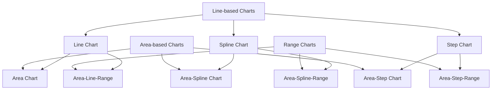
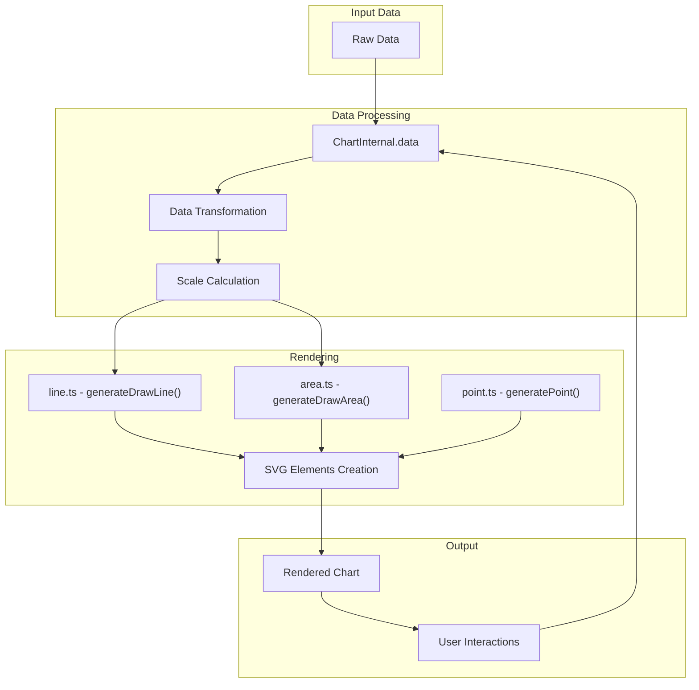
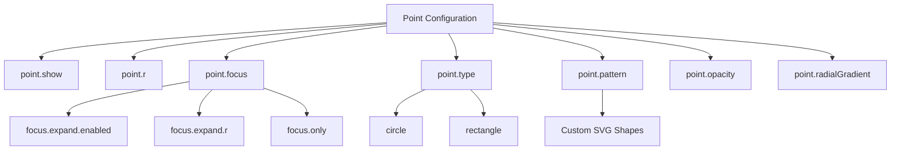
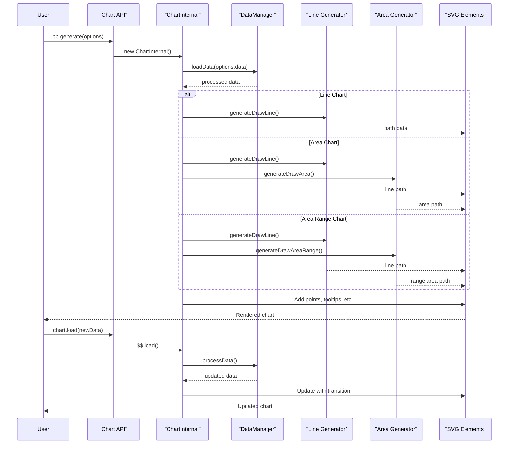

# Line and Area Charts

<details>
<summary>Relevant source files</summary>

The following files were used as context for generating this wiki page:

- [demo/demo.js](https://github.com/naver/billboard.js/blob/d6229c39/demo/demo.js)
- [src/ChartInternal/data/data.ts](https://github.com/naver/billboard.js/blob/d6229c39/src/ChartInternal/data/data.ts)
- [src/ChartInternal/interactions/eventrect.ts](https://github.com/naver/billboard.js/blob/d6229c39/src/ChartInternal/interactions/eventrect.ts)
- [src/ChartInternal/internals/text.ts](https://github.com/naver/billboard.js/blob/d6229c39/src/ChartInternal/internals/text.ts)
- [src/ChartInternal/shape/line.ts](https://github.com/naver/billboard.js/blob/d6229c39/src/ChartInternal/shape/line.ts)
- [src/ChartInternal/shape/point.ts](https://github.com/naver/billboard.js/blob/d6229c39/src/ChartInternal/shape/point.ts)
- [src/config/Options/common/point.ts](https://github.com/naver/billboard.js/blob/d6229c39/src/config/Options/common/point.ts)
- [src/config/Options/data/data.ts](https://github.com/naver/billboard.js/blob/d6229c39/src/config/Options/data/data.ts)
- [src/config/Options/shape/area.ts](https://github.com/naver/billboard.js/blob/d6229c39/src/config/Options/shape/area.ts)
- [test/internals/data-spec.ts](https://github.com/naver/billboard.js/blob/d6229c39/test/internals/data-spec.ts)
- [test/shape/point-spec.ts](https://github.com/naver/billboard.js/blob/d6229c39/test/shape/point-spec.ts)
- [types/options.d.ts](https://github.com/naver/billboard.js/blob/d6229c39/types/options.d.ts)

</details>


This document explains how to use and customize line and area charts in Billboard.js. Line and area charts are fundamental visualization types that display data points connected by straight or curved lines, with areas optionally filled below, above, or between lines.

Billboard.js provides extensive customization options for these chart types, including different line styles, area fills, gradients, and interactive behaviors.

## Chart Type Overview



Sources: [src/config/Options/data/data.ts:85-104](https://github.com/naver/billboard.js/blob/d6229c39/src/config/Options/data/data.ts#L85-L104), [demo/demo.js:8-21](https://github.com/naver/billboard.js/blob/d6229c39/demo/demo.js#L8-L21), [demo/demo.js:626-661](https://github.com/naver/billboard.js/blob/d6229c39/demo/demo.js#L626-L661), [demo/demo.js:885-895](https://github.com/naver/billboard.js/blob/d6229c39/demo/demo.js#L885-L895), [demo/demo.js:896-912](https://github.com/naver/billboard.js/blob/d6229c39/demo/demo.js#L896-L912), [demo/demo.js:993-1056](https://github.com/naver/billboard.js/blob/d6229c39/demo/demo.js#L993-L1056)

## Basic Configuration

### Line Chart

The simplest way to create a line chart is by setting the `type` property to "line" in the data configuration:

```javascript
data: {
  columns: [
    ["data1", 30, 200, 100, 400, 150, 250],
    ["data2", 50, 20, 10, 40, 15, 25]
  ],
  type: "line"
}
```

Sources: [demo/demo.js:626-661](https://github.com/naver/billboard.js/blob/d6229c39/demo/demo.js#L626-L661)

### Area Chart

Similarly, area charts can be created by setting the `type` property to "area" or specifying individual series types:

```javascript
data: {
  columns: [
    ["data1", 300, 350, 300, 0, 0, 0],
    ["data2", 130, 100, 140, 200, 150, 50]
  ],
  types: {
    data1: "area",
    data2: 'area-spline'
  }
}
```

Sources: [demo/demo.js:8-21](https://github.com/naver/billboard.js/blob/d6229c39/demo/demo.js#L8-L21)

## Data Structure and Rendering Flow



Sources: [src/ChartInternal/data/data.ts](https://github.com/naver/billboard.js/blob/d6229c39/src/ChartInternal/data/data.ts), [src/ChartInternal/shape/line.ts](https://github.com/naver/billboard.js/blob/d6229c39/src/ChartInternal/shape/line.ts), [src/ChartInternal/shape/point.ts](https://github.com/naver/billboard.js/blob/d6229c39/src/ChartInternal/shape/point.ts), [src/ChartInternal/interactions/eventrect.ts](https://github.com/naver/billboard.js/blob/d6229c39/src/ChartInternal/interactions/eventrect.ts)

## Line Chart Options

Line charts have several customization options including:

| Option | Description | Default |
|--------|-------------|---------|
| `line.connectNull` | Connect points with null values | `false` |
| `line.step.type` | Step type (step, step-before, step-after) | `step` |
| `line.step.tooltipMatch` | Match tooltip position to step type | `false` |

### Point Customization

Points on line charts can be extensively customized:



Sources: [src/config/Options/common/point.ts:11-135](https://github.com/naver/billboard.js/blob/d6229c39/src/config/Options/common/point.ts#L11-L135), [src/ChartInternal/shape/point.ts](https://github.com/naver/billboard.js/blob/d6229c39/src/ChartInternal/shape/point.ts)

## Area Chart Options

Area charts extend line charts with additional fill options:

| Option | Description | Default |
|--------|-------------|---------|
| `area.above` | Fill area above the line | `false` |
| `area.below` | Fill area below the line (default behavior) | `false` |
| `area.front` | Place area in front of line | `true` |
| `area.linearGradient` | Apply linear gradient to area fill | `false` |
| `area.zerobased` | Ensure area starts from zero value | `true` |

Sources: [src/config/Options/shape/area.ts:8-75](https://github.com/naver/billboard.js/blob/d6229c39/src/config/Options/shape/area.ts#L8-L75)

## Area Range Chart

Area range charts display data ranges by filling areas between high and low values:

```javascript
data: {
  columns: [
    ["data1", 
      [150, 140, 110],  // [high, mid, low]
      [155, 130, 115],
      [160, 135, 120],
      [135, 120, 110],
      [180, 150, 130],
      [199, 160, 125]
    ]
  ],
  type: "area-line-range"
}
```

Alternatively, you can use object notation:

```javascript
data: {
  columns: [
    ["data4",
      {high: 155, mid: 150, low: 145},
      {high: 200, mid: 190, low: 150},
      // etc.
    ]
  ],
  types: {
    data4: "area-spline-range"
  }
}
```

Sources: [demo/demo.js:22-118](https://github.com/naver/billboard.js/blob/d6229c39/demo/demo.js#L22-L118)

## Data Processing and Rendering Pipeline



Sources: [src/ChartInternal/data/data.ts](https://github.com/naver/billboard.js/blob/d6229c39/src/ChartInternal/data/data.ts), [src/ChartInternal/shape/line.ts](https://github.com/naver/billboard.js/blob/d6229c39/src/ChartInternal/shape/line.ts)

## Key Components for Line and Area Charts

The primary internal components responsible for rendering line and area charts include:

### Line Generation

The `generateDrawLine` method in `line.ts` creates the SVG path data for lines. It handles different line types (normal, spline, step) and supports various customization options.

```javascript
generateDrawLine(lineIndices, isSub) {
  // Creates a function that generates line path data
  // based on configured options and data points
}
```

Sources: [src/ChartInternal/shape/line.ts:221-332](https://github.com/naver/billboard.js/blob/d6229c39/src/ChartInternal/shape/line.ts#L221-L332)

### Points Handling

Points on lines are managed through the `point.ts` module, which handles:
- Point rendering and styling
- Expansion/focus behaviors
- Various point shapes
- Interaction sensitivity

Sources: [src/ChartInternal/shape/point.ts:21-531](https://github.com/naver/billboard.js/blob/d6229c39/src/ChartInternal/shape/point.ts#L21-L531)

### Event Interactions

Interactions like hovering, clicking, and tooltips are managed by the event rectangle system which:
- Detects mouse/touch events
- Shows/hides tooltips
- Highlights points and lines
- Manages selection behavior

Sources: [src/ChartInternal/interactions/eventrect.ts:9-674](https://github.com/naver/billboard.js/blob/d6229c39/src/ChartInternal/interactions/eventrect.ts#L9-L674)

## Common Customization Examples

### Spline Charts

Spline charts use curved lines instead of straight lines:

```javascript
data: {
  columns: [
    ["data1", 30, 200, 100, 400, 150, 250],
    ["data2", 130, 100, 140, 200, 150, 50]
  ],
  type: "spline"
}
```

Sources: [demo/demo.js:885-895](https://github.com/naver/billboard.js/blob/d6229c39/demo/demo.js#L885-L895)

### Step Charts

Step charts display changes in discrete steps rather than continuous lines:

```javascript
data: {
  columns: [
    ["data1", 300, 350, 300, 20, 240, 100],
    ["data2", 130, 100, 140, 200, 150, 50]
  ],
  types: {
    data1: "step",
    data2: 'area-step'
  }
}
```

Step charts can be customized with different step types:

```javascript
line: {
  step: {
    type: "step-after",  // or "step-before"
    tooltipMatch: true
  }
}
```

Sources: [demo/demo.js:993-1056](https://github.com/naver/billboard.js/blob/d6229c39/demo/demo.js#L993-L1056)

### Stacked Area Charts

Multiple area series can be stacked on top of each other:

```javascript
data: {
  columns: [
    ["data1", 300, 350, 300, 0, 0, 120],
    ["data2", 130, 100, 140, 200, 150, 50]
  ],
  types: {
    data1: 'area-spline',
    data2: 'area-spline'
  },
  groups: [
    ["data1", "data2"]
  ]
}
```

Sources: [demo/demo.js:896-912](https://github.com/naver/billboard.js/blob/d6229c39/demo/demo.js#L896-L912)

## Conclusion

Line and area charts in Billboard.js provide flexible ways to visualize continuous data. They support various styling options, interaction behaviors, and data formats to suit different visualization needs.

For more advanced customization, refer to specific configuration options for points, tooltips, axes, and interactions documented in their respective sections.