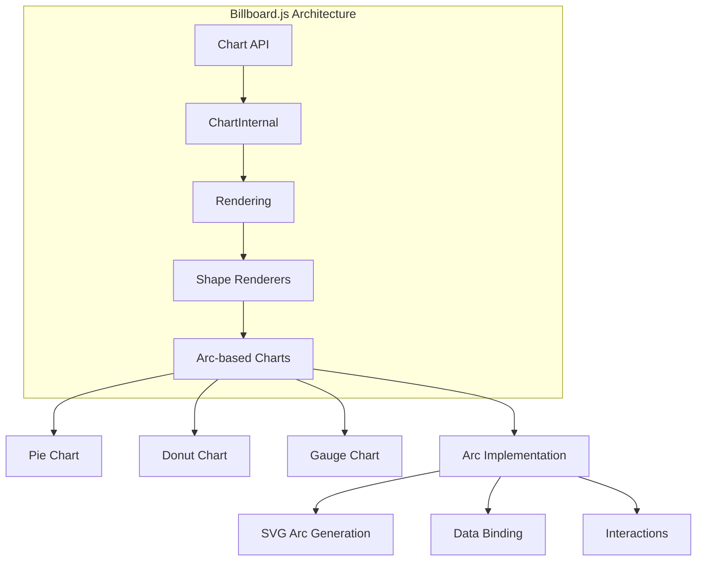
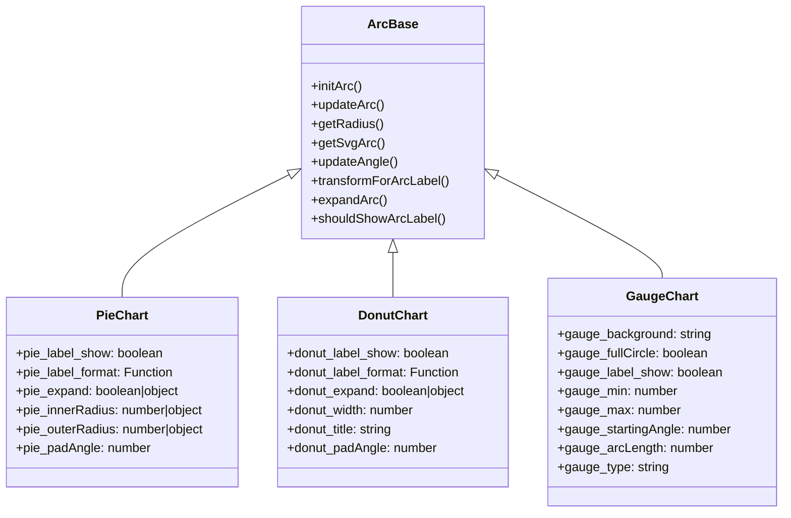
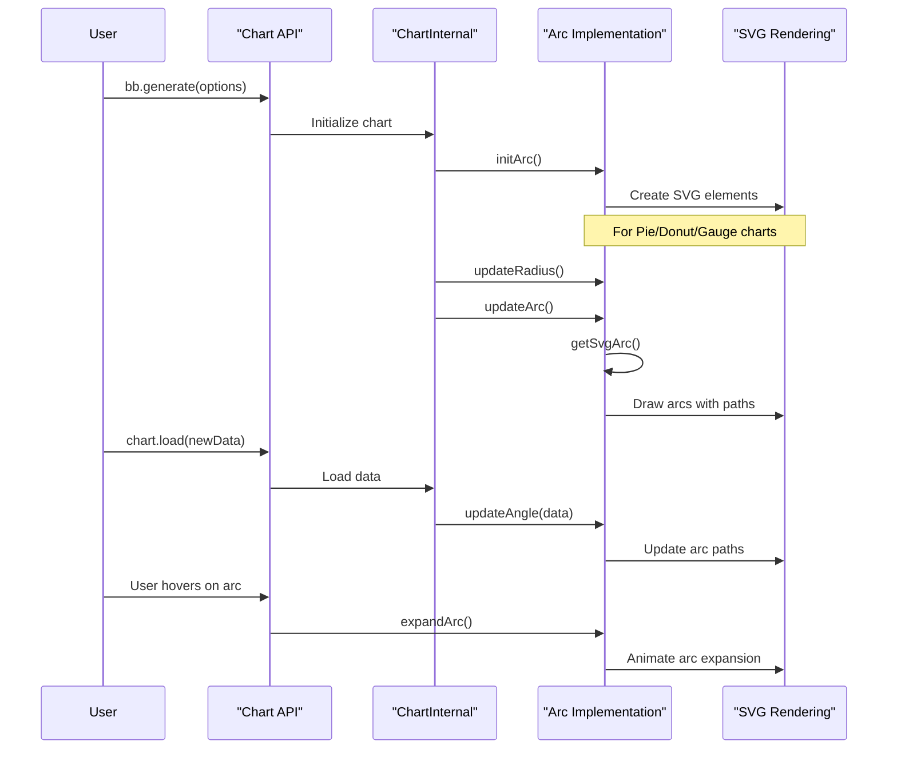
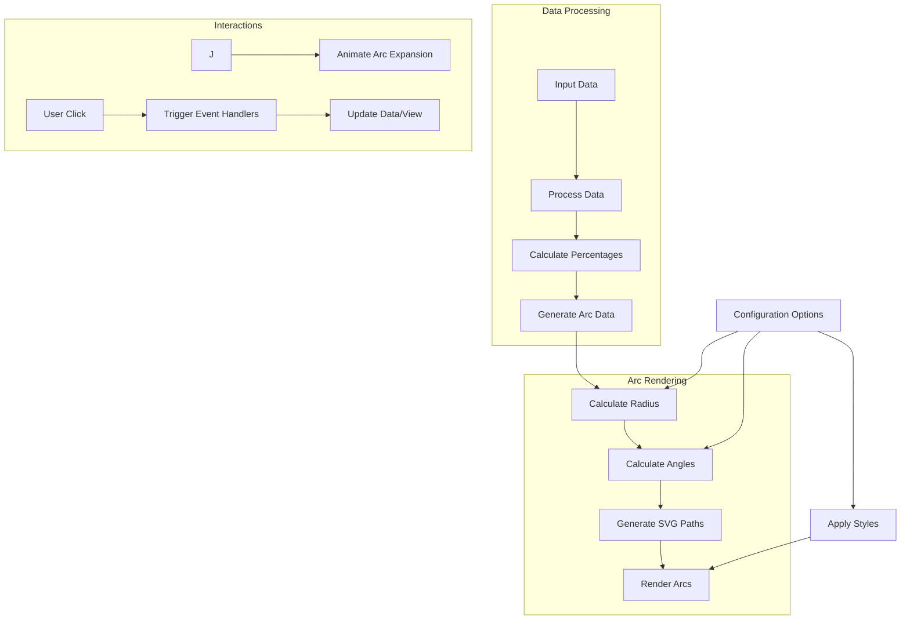

# Pie, Donut, and Gauge Charts

<details>
<summary>Relevant source files</summary>

The following files were used as context for generating this wiki page:

- [demo/demo.js](https://github.com/naver/billboard.js/blob/d6229c39/demo/demo.js)
- [src/ChartInternal/shape/arc.ts](https://github.com/naver/billboard.js/blob/d6229c39/src/ChartInternal/shape/arc.ts)
- [src/ChartInternal/shape/gauge.ts](https://github.com/naver/billboard.js/blob/d6229c39/src/ChartInternal/shape/gauge.ts)
- [src/config/Options/shape/arc.ts](https://github.com/naver/billboard.js/blob/d6229c39/src/config/Options/shape/arc.ts)
- [src/config/Options/shape/donut.ts](https://github.com/naver/billboard.js/blob/d6229c39/src/config/Options/shape/donut.ts)
- [src/config/Options/shape/gauge.ts](https://github.com/naver/billboard.js/blob/d6229c39/src/config/Options/shape/gauge.ts)
- [src/config/Options/shape/pie.ts](https://github.com/naver/billboard.js/blob/d6229c39/src/config/Options/shape/pie.ts)
- [src/config/classes.ts](https://github.com/naver/billboard.js/blob/d6229c39/src/config/classes.ts)
- [test/shape/arc-rangeText-spec.ts](https://github.com/naver/billboard.js/blob/d6229c39/test/shape/arc-rangeText-spec.ts)
- [test/shape/arc-spec.ts](https://github.com/naver/billboard.js/blob/d6229c39/test/shape/arc-spec.ts)
- [test/shape/gauge-spec.ts](https://github.com/naver/billboard.js/blob/d6229c39/test/shape/gauge-spec.ts)
- [types/options.d.ts](https://github.com/naver/billboard.js/blob/d6229c39/types/options.d.ts)
- [types/options.shape.d.ts](https://github.com/naver/billboard.js/blob/d6229c39/types/options.shape.d.ts)

</details>


This document details the circular chart types available in billboard.js: pie, donut, and gauge charts. All three chart types are arc-based visualizations that share common underlying implementations but serve different visualization purposes.

## Overview

Pie, donut, and gauge charts in billboard.js are all implemented using arc-based rendering. They differ primarily in their configuration and visual presentation:

- **Pie charts** display data as proportional slices of a circle
- **Donut charts** are similar to pie charts but with a hollow center
- **Gauge charts** display a single value or multiple values within a range using a semicircular or circular display

The following diagram illustrates how these chart types relate to billboard.js's architecture:



Sources:
- [src/ChartInternal/shape/arc.ts:1-1000](https://github.com/naver/billboard.js/blob/d6229c39/src/ChartInternal/shape/arc.ts#L1-L1000)
- [types/options.d.ts:1-300](https://github.com/naver/billboard.js/blob/d6229c39/types/options.d.ts#L1-L300)

## Implementation Structure

All three chart types share common arc implementation but have specific configurations and behaviors:



Sources:
- [src/ChartInternal/shape/arc.ts:150-800](https://github.com/naver/billboard.js/blob/d6229c39/src/ChartInternal/shape/arc.ts#L150-L800)
- [src/config/Options/shape/pie.ts:1-100](https://github.com/naver/billboard.js/blob/d6229c39/src/config/Options/shape/pie.ts#L1-L100)
- [src/config/Options/shape/donut.ts:1-85](https://github.com/naver/billboard.js/blob/d6229c39/src/config/Options/shape/donut.ts#L1-L85)
- [src/config/Options/shape/gauge.ts:1-150](https://github.com/naver/billboard.js/blob/d6229c39/src/config/Options/shape/gauge.ts#L1-L150)

## Common Arc Features

The underlying arc implementation provides several key functions shared by all three chart types:

| Function | Purpose |
|----------|---------|
| `initArc()` | Sets up the initial arc elements in the chart |
| `updateArc()` | Updates the arc elements when data changes |
| `getRadius()` | Calculates inner and outer radius values |
| `getSvgArc()` | Generates SVG path for arcs |
| `updateAngle()` | Calculates angles for each data point |
| `expandArc()` | Handles expansion animation on interaction |
| `transformForArcLabel()` | Positions labels correctly on arcs |

All arc-based charts leverage D3's arc and pie generators, with custom handling for animations, interactions, and styling.

Sources:
- [src/ChartInternal/shape/arc.ts:155-180](https://github.com/naver/billboard.js/blob/d6229c39/src/ChartInternal/shape/arc.ts#L155-L180)
- [src/ChartInternal/shape/arc.ts:350-400](https://github.com/naver/billboard.js/blob/d6229c39/src/ChartInternal/shape/arc.ts#L350-L400)

## Rendering Process

The following diagram illustrates the data flow and rendering process for arc-based charts:



Sources:
- [src/ChartInternal/shape/arc.ts:155-180](https://github.com/naver/billboard.js/blob/d6229c39/src/ChartInternal/shape/arc.ts#L155-L180)
- [src/ChartInternal/shape/arc.ts:560-605](https://github.com/naver/billboard.js/blob/d6229c39/src/ChartInternal/shape/arc.ts#L560-L605)

## Pie Chart

Pie charts display data as proportional slices of a complete circle, with each slice representing a data point's value relative to the total.

### Key Configuration Options

| Option | Type | Default | Description |
|--------|------|---------|-------------|
| `pie.label.show` | boolean | true | Show or hide labels on pie slices |
| `pie.label.format` | Function | undefined | Custom formatter for slice labels |
| `pie.label.threshold` | number | 0.05 | Minimum ratio to show labels |
| `pie.expand` | boolean\|object | true | Enable slice expansion on hover |
| `pie.innerRadius` | number\|object | 0 | Inner radius of pie slices |
| `pie.outerRadius` | number\|object | undefined | Outer radius of pie slices |
| `pie.padAngle` | number | 0 | Padding between slices |
| `pie.startingAngle` | number | 0 | Starting angle for the first slice |

### Example Configuration

```javascript
pie: {
  label: {
    show: true,
    format: function(value, ratio, id) {
      return d3.format("$")(value);
    },
    threshold: 0.1
  },
  expand: {
    duration: 500,
    rate: 0.98
  },
  innerRadius: 0,
  padAngle: 0.1,
  startingAngle: 0
}
```

Sources:
- [src/config/Options/shape/pie.ts:1-100](https://github.com/naver/billboard.js/blob/d6229c39/src/config/Options/shape/pie.ts#L1-L100)
- [demo/demo.js:697-735](https://github.com/naver/billboard.js/blob/d6229c39/demo/demo.js#L697-L735)

## Donut Chart

Donut charts are similar to pie charts but have a hollow center that can optionally display a title or additional information.

### Key Configuration Options

| Option | Type | Default | Description |
|--------|------|---------|-------------|
| `donut.label.show` | boolean | true | Show or hide labels on donut slices |
| `donut.label.format` | Function | undefined | Custom formatter for slice labels |
| `donut.label.threshold` | number | 0.05 | Minimum ratio to show labels |
| `donut.expand` | boolean\|object | true | Enable slice expansion on hover |
| `donut.width` | number | undefined | Width of the donut ring |
| `donut.title` | string | "" | Title to display in the center |
| `donut.padAngle` | number | 0 | Padding between slices |
| `donut.startingAngle` | number | 0 | Starting angle for the first slice |

### Example Configuration

```javascript
donut: {
  label: {
    show: true,
    format: function(value, ratio, id) {
      return d3.format("$")(value);
    },
    threshold: 0.1
  },
  expand: false,
  width: 10,
  title: "Donut Title",
  padAngle: 0.2,
  startingAngle: 1
}
```

Sources:
- [src/config/Options/shape/donut.ts:1-85](https://github.com/naver/billboard.js/blob/d6229c39/src/config/Options/shape/donut.ts#L1-L85)
- [demo/demo.js:434-477](https://github.com/naver/billboard.js/blob/d6229c39/demo/demo.js#L434-L477)

## Gauge Chart

Gauge charts display a single value (or multiple values in multi-gauge mode) within a range, typically using a circular or semi-circular display. Gauge charts can include features like color thresholds and optional needle indicators.

### Key Configuration Options

| Option | Type | Default | Description |
|--------|------|---------|-------------|
| `gauge.background` | string | "" | Background color for gauge |
| `gauge.fullCircle` | boolean | false | Show as full circle instead of half circle |
| `gauge.label.show` | boolean | true | Show or hide gauge labels |
| `gauge.label.format` | Function | undefined | Custom formatter for gauge values |
| `gauge.label.extents` | Function | undefined | Custom formatter for min/max labels |
| `gauge.min` | number | 0 | Minimum value for gauge scale |
| `gauge.max` | number | 100 | Maximum value for gauge scale |
| `gauge.startingAngle` | number | -Math.PI/2 | Starting angle for gauge |
| `gauge.arcLength` | number | 100 | Length of arc to draw (-100 to 100) |
| `gauge.type` | string | "single" | "single" or "multi" for multi-gauge |
| `gauge.width` | number | undefined | Width of gauge arc |
| `gauge.title` | string | "" | Title for gauge chart |
| `gauge.units` | string | undefined | Units for gauge values |
| `gauge.arcs.minWidth` | number | 5 | Minimum width for gauge arcs |

### Example Configuration

```javascript
gauge: {
  fullCircle: false,
  label: {
    show: true,
    format: function(value, ratio) {
      return value + "%";
    },
    extents: function(value, isMax) {
      return (isMax ? "Max:" : "Min:") + value;
    }
  },
  min: 0,
  max: 100,
  startingAngle: -Math.PI/2,
  arcLength: 100,
  width: 10,
  title: "Gauge Title",
  units: "%"
}
```

Sources:
- [src/config/Options/shape/gauge.ts:1-150](https://github.com/naver/billboard.js/blob/d6229c39/src/config/Options/shape/gauge.ts#L1-L150)
- [src/ChartInternal/shape/gauge.ts:1-130](https://github.com/naver/billboard.js/blob/d6229c39/src/ChartInternal/shape/gauge.ts#L1-L130)
- [demo/demo.js:551-625](https://github.com/naver/billboard.js/blob/d6229c39/demo/demo.js#L551-L625)

## Advanced Arc Options

All three chart types can leverage common arc customization options:

### Arc.cornerRadius

Allows setting corner radius for arcs, making them less sharp at corners:

```javascript
arc: {
  cornerRadius: 5,
  // or using a ratio
  cornerRadius: {
    ratio: 0.5
  },
  // or with a function for per-data customization
  cornerRadius: function(id, value, outerRadius) {
    return id === "data1" ? 10 : 5;
  }
}
```

### Arc.rangeText

Adds textual ranges around the arc:

```javascript
arc: {
  rangeText: {
    values: [0, 50, 100],
    unit: "%", // or "absolute"
    format: function(value) {
      return value + "%";
    },
    position: function(value) {
      return { x: 5, y: 10 };
    }
  }
}
```

### Arc.needle

Adds a needle indicator (for gauge charts):

```javascript
arc: {
  needle: {
    show: true,
    color: "red",
    length: 80,
    value: 50
  }
}
```

Sources:
- [types/options.shape.d.ts:1-150](https://github.com/naver/billboard.js/blob/d6229c39/types/options.shape.d.ts#L1-L150)
- [src/config/Options/shape/arc.ts:1-130](https://github.com/naver/billboard.js/blob/d6229c39/src/config/Options/shape/arc.ts#L1-L130)

## Data Flow and Interaction

The following diagram illustrates how data flows through the arc-based chart components and how interactions are handled:



Sources:
- [src/ChartInternal/shape/arc.ts:560-605](https://github.com/naver/billboard.js/blob/d6229c39/src/ChartInternal/shape/arc.ts#L560-L605)
- [test/shape/arc-spec.ts:390-440](https://github.com/naver/billboard.js/blob/d6229c39/test/shape/arc-spec.ts#L390-L440)

## CSS Classes

Billboard.js uses specific CSS classes for styling and selecting arc elements:

| Component | CSS Class |
|-----------|-----------|
| Arc container | `bb-chart-arcs` |
| Arc elements | `bb-arc` |
| Arc background | `bb-chart-arcs-background` |
| Gauge min value | `bb-chart-arcs-gauge-min` |
| Gauge max value | `bb-chart-arcs-gauge-max` |
| Gauge unit | `bb-chart-arcs-gauge-unit` |
| Gauge title | `bb-chart-arcs-gauge-title` |
| Arc label lines | `bb-arc-label-line` |
| Arc range text | `bb-arc-range` |

These classes are defined in the configuration and used throughout the codebase for consistent styling and selection.

Sources:
- [src/config/classes.ts:18-28](https://github.com/naver/billboard.js/blob/d6229c39/src/config/classes.ts#L18-L28)
- [src/config/classes.ts:87-93](https://github.com/naver/billboard.js/blob/d6229c39/src/config/classes.ts#L87-L93)

## Common Behaviors and Features

### Labels

All three chart types support labels with similar configuration options:
- Show/hide with `[type].label.show`
- Format with `[type].label.format`
- Set threshold for display with `[type].label.threshold`
- Position with `[type].label.ratio`

### Expansion

Both pie and donut charts support expansion on hover:
- Enable/disable with `[type].expand`
- Configure rate with `[type].expand.rate`
- Set duration with `[type].expand.duration`

### Starting Angle

All three chart types allow setting a starting angle:
- Configure with `[type].startingAngle`

## Special Gauge Features

Gauge charts have some unique features:

### Full Circle Mode

Enable with `gauge.fullCircle`:

```javascript
gauge: {
  fullCircle: true
}
```

### Arc Length Control

Control the drawn portion of the gauge with `gauge.arcLength`:

```javascript
gauge: {
  arcLength: 75 // 75% of the circle
}
```

### Min/Max Enforcement

Force values to stay within min/max range with `gauge.enforceMinMax`:

```javascript
gauge: {
  enforceMinMax: true,
  min: 0,
  max: 100
}
```

Sources:
- [src/config/Options/shape/gauge.ts:28-35](https://github.com/naver/billboard.js/blob/d6229c39/src/config/Options/shape/gauge.ts#L28-L35)
- [test/shape/gauge-spec.ts:195-230](https://github.com/naver/billboard.js/blob/d6229c39/test/shape/gauge-spec.ts#L195-L230)
- [test/shape/gauge-spec.ts:235-270](https://github.com/naver/billboard.js/blob/d6229c39/test/shape/gauge-spec.ts#L235-L270)

## Summary