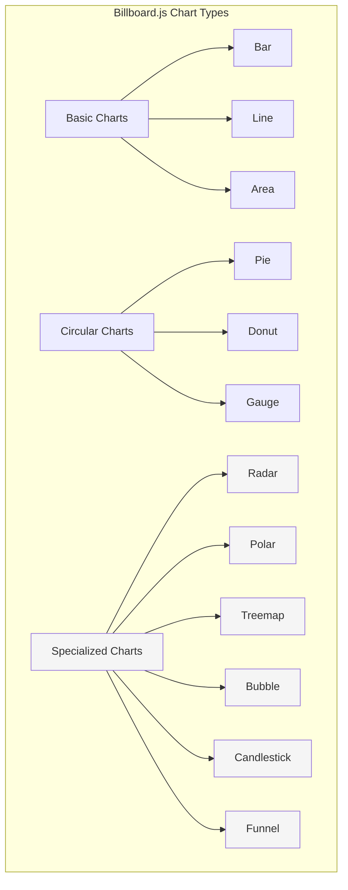
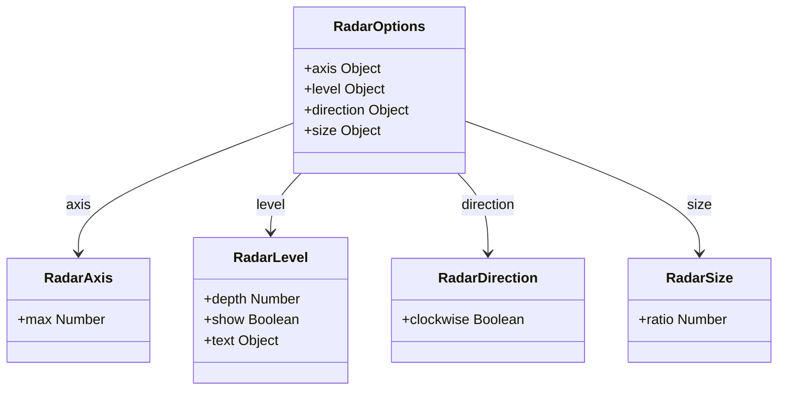
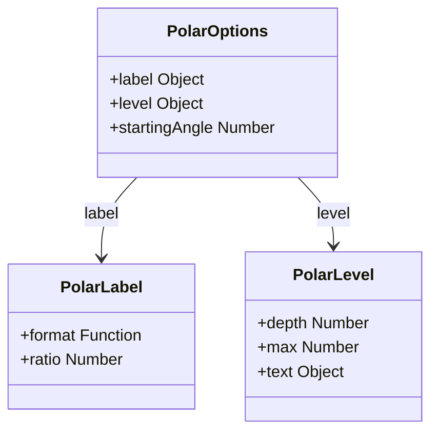
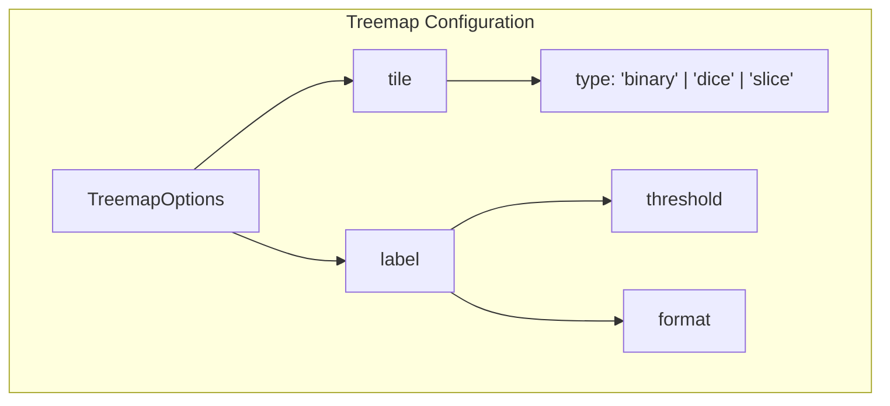
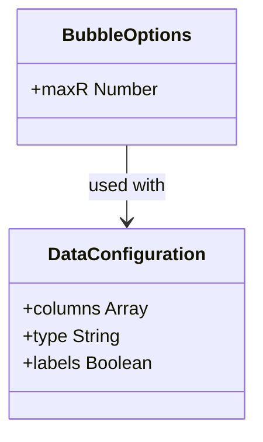
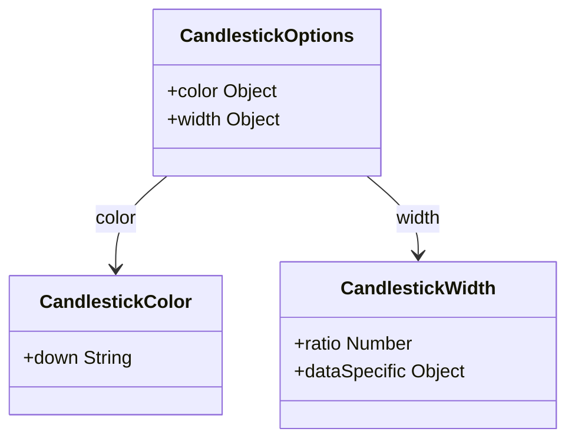
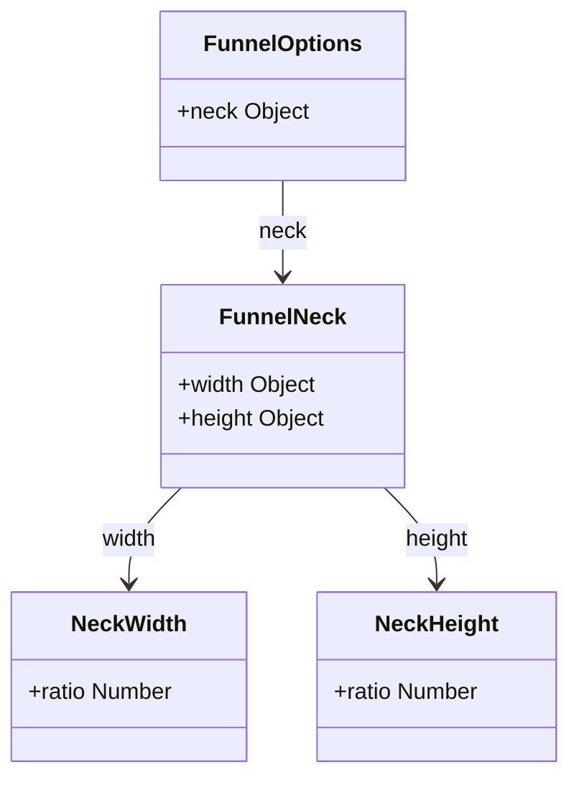
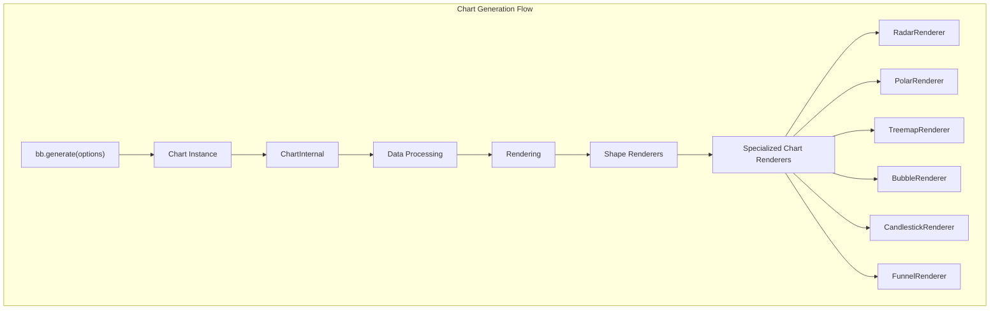
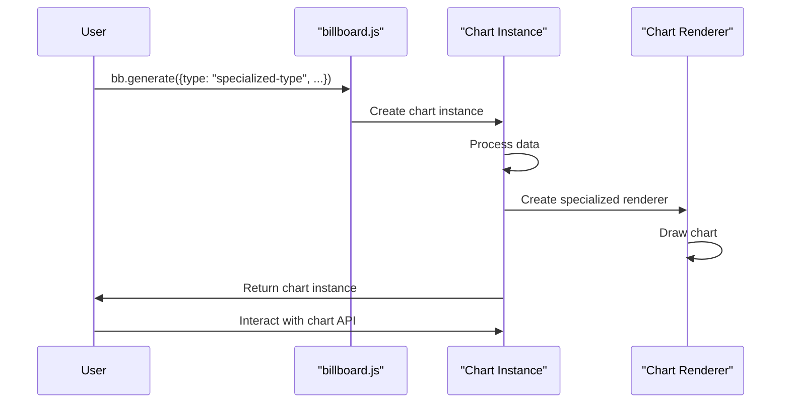

# Specialized Charts

<details>
<summary>Relevant source files</summary>

The following files were used as context for generating this wiki page:

- [.gitignore](https://github.com/naver/billboard.js/blob/d6229c39/.gitignore)
- [.yarnrc.yml](https://github.com/naver/billboard.js/blob/d6229c39/.yarnrc.yml)
- [README.md](https://github.com/naver/billboard.js/blob/d6229c39/README.md)
- [demo/demo.js](https://github.com/naver/billboard.js/blob/d6229c39/demo/demo.js)
- [demo/types/index.html](https://github.com/naver/billboard.js/blob/d6229c39/demo/types/index.html)
- [demo/types/types.css](https://github.com/naver/billboard.js/blob/d6229c39/demo/types/types.css)
- [demo/types/types.js](https://github.com/naver/billboard.js/blob/d6229c39/demo/types/types.js)
- [types/options.d.ts](https://github.com/naver/billboard.js/blob/d6229c39/types/options.d.ts)

</details>


Billboard.js provides a variety of specialized chart types beyond the basic bar, line, and pie charts. These specialized visualizations serve specific data representation needs and offer unique ways to display complex information. This page documents the specialized chart types available in billboard.js, their configuration options, and usage patterns.

For information about basic chart types like bar, line, or area charts, see [Bar Charts](#3.1) and [Line and Area Charts](#3.2). For circular charts like pie, donut, and gauge, see [Pie, Donut, and Gauge Charts](#3.3).

## Overview of Specialized Chart Types

Billboard.js includes the following specialized chart types:

- Radar charts
- Polar charts
- Treemap charts
- Bubble charts
- Candlestick charts
- Funnel charts

Each of these chart types has specific configuration options and is designed for particular use cases.



Sources: [demo/demo.js](https://github.com/naver/billboard.js/blob/d6229c39/demo/demo.js), [demo/types/types.js:1-37](https://github.com/naver/billboard.js/blob/d6229c39/demo/types/types.js#L1-L37), [README.md:42-44](https://github.com/naver/billboard.js/blob/d6229c39/README.md#L42-L44)

## Radar Chart

Radar charts (also known as spider or web charts) display multivariate data as a two-dimensional chart with three or more quantitative variables represented on axes starting from the same point.

### Configuration Options



Sources: [demo/demo.js:763-788](https://github.com/naver/billboard.js/blob/d6229c39/demo/demo.js#L763-L788), [demo/types/types.js:153-167](https://github.com/naver/billboard.js/blob/d6229c39/demo/types/types.js#L153-L167), [types/options.d.ts:305](https://github.com/naver/billboard.js/blob/d6229c39/types/options.d.ts#L305)

### Key Configuration Properties

| Property | Type | Description |
|----------|------|-------------|
| `axis.max` | Number | Maximum value for radar chart axes |
| `level.depth` | Number | Number of inner levels in the radar chart |
| `level.text.show` | Boolean | Whether to show level text |
| `direction.clockwise` | Boolean | Direction of the radar chart (clockwise or counterclockwise) |
| `size.ratio` | Number | Size ratio of the radar chart |

### Example Usage

Here's an example of a radar chart configuration:

```javascript
var chart = bb.generate({
    data: {
        x: "x",
        columns: [
            ["x", "Data A", "Data B", "Data C", "Data D", "Data E"],
            ["data1", 330, 350, 200, 380, 150],
            ["data2", 130, 100, 30, 200, 80],
            ["data3", 230, 153, 85, 300, 250]
        ],
        type: "radar",
        labels: true
    },
    radar: {
        axis: {
            max: 400
        },
        level: {
            depth: 4
        },
        direction: {
            clockwise: true
        }
    }
});
```

Sources: [demo/demo.js:763-788](https://github.com/naver/billboard.js/blob/d6229c39/demo/demo.js#L763-L788)

## Polar Chart

Polar charts display data in a circular graph where values are represented as the distance from the center, and categories are displayed around the circle.

### Configuration Options



Sources: [demo/demo.js:736-762](https://github.com/naver/billboard.js/blob/d6229c39/demo/demo.js#L736-L762), [demo/types/types.js:138-152](https://github.com/naver/billboard.js/blob/d6229c39/demo/types/types.js#L138-L152), [types/options.d.ts:304](https://github.com/naver/billboard.js/blob/d6229c39/types/options.d.ts#L304)

### Key Configuration Properties

| Property | Type | Description |
|----------|------|-------------|
| `label.format` | Function | Format function for labels |
| `label.ratio` | Number | Ratio positioning for labels |
| `level.depth` | Number | Number of inner levels in the polar chart |
| `level.max` | Number | Maximum value for levels |
| `level.text.backgroundColor` | String | Background color for level text |
| `startingAngle` | Number | Starting angle for the polar chart |

### Example Usage

Here's an example of a polar chart configuration:

```javascript
var chart = bb.generate({
    data: {
        columns: [
            ["data1", 60],
            ["data2", 120],
            ["data3", 75]
        ],
        type: "polar",
        order: null
    },
    polar: {
        label: {
            format: function(value, ratio, id) {
                return value + "\n" + (ratio * 100).toFixed(0) + "%";
            },
            ratio: 1.07
        },
        level: {
            depth: 5,
            max: 150
        }
    }
});
```

Sources: [demo/demo.js:736-762](https://github.com/naver/billboard.js/blob/d6229c39/demo/demo.js#L736-L762)

## Treemap Chart

Treemap charts display hierarchical data using nested rectangles, where the area of each rectangle represents a quantity.

### Configuration Options



Sources: [demo/demo.js:1092-1210](https://github.com/naver/billboard.js/blob/d6229c39/demo/demo.js#L1092-L1210), [demo/types/types.js:217-240](https://github.com/naver/billboard.js/blob/d6229c39/demo/types/types.js#L217-L240), [types/options.d.ts:308](https://github.com/naver/billboard.js/blob/d6229c39/types/options.d.ts#L308)

### Tile Types

Treemap supports three different tile algorithms:

1. **binary** (default): Divides rectangles using a binary layout
2. **dice**: Divides rectangles horizontally
3. **slice**: Divides rectangles vertically

### Key Configuration Properties

| Property | Type | Description |
|----------|------|-------------|
| `tile` | String | The tiling algorithm to use ("binary", "dice", "slice") |
| `label.threshold` | Number | Threshold for showing labels (based on area ratio) |
| `label.format` | Function | Format function for labels |

### Example Usage

Here's an example of a treemap chart configuration:

```javascript
var chart = bb.generate({
    data: {
        columns: [
            ["data1", 1300],
            ["data2", 200],
            ["data3", 500],
            ["data4", 50],
            ["data5", 100]
        ],
        type: "treemap",
        labels: {
            colors: "#fff"
        }
    },
    treemap: {
        label: {
            threshold: 0.03
        }
    }
});
```

Sources: [demo/demo.js:1092-1139](https://github.com/naver/billboard.js/blob/d6229c39/demo/demo.js#L1092-L1139)

## Bubble Chart

Bubble charts are similar to scatter plots but add a third dimension represented by the size of each bubble.

### Configuration Options



Sources: [demo/demo.js:207-257](https://github.com/naver/billboard.js/blob/d6229c39/demo/demo.js#L207-L257), [demo/types/types.js:106-108](https://github.com/naver/billboard.js/blob/d6229c39/demo/types/types.js#L106-L108), [types/options.d.ts:297](https://github.com/naver/billboard.js/blob/d6229c39/types/options.d.ts#L297)

### Key Configuration Properties

| Property | Type | Description |
|----------|------|-------------|
| `maxR` | Number | Maximum radius for the bubbles |
| `data.labels` | Boolean | Whether to show data labels |

### Data Format

Bubble charts support two forms of data input:

1. **Standard format**: Data points use the third dimension (array index 2) implicitly for bubble size
2. **Explicit dimensions**: Data contains objects with explicit `y` and `z` properties, where `z` determines bubble size

### Example Usage

```javascript
var chart = bb.generate({
    data: {
        columns: [
            ["data1", 30, 350, 200, 380, 150, 250, 50, 80, 55, 220],
            ["data2", 130, 100, 10, 200, 80, 50, 200, 123, 185, 98],
            ["data3", 230, 153, 85, 300, 250, 120, 5, 84, 99, 289]
        ],
        type: "bubble",
        labels: true
    },
    bubble: {
        maxR: 50
    },
    axis: {
        x: {
            type: "category"
        },
        y: {
            max: 450
        }
    }
});
```

Sources: [demo/demo.js:207-257](https://github.com/naver/billboard.js/blob/d6229c39/demo/demo.js#L207-L257)

## Candlestick Chart

Candlestick charts are primarily used for displaying price movements of financial instruments.

### Configuration Options



Sources: [demo/demo.js:284-406](https://github.com/naver/billboard.js/blob/d6229c39/demo/demo.js#L284-L406), [demo/types/types.js:54-64](https://github.com/naver/billboard.js/blob/d6229c39/demo/types/types.js#L54-L64), [types/options.d.ts:298](https://github.com/naver/billboard.js/blob/d6229c39/types/options.d.ts#L298)

### Data Format

Candlestick charts expect data in the format:

```
[open, high, low, close, volume (optional)]
```

Each data point can be an array or an object with these properties.

### Key Configuration Properties

| Property | Type | Description |
|----------|------|-------------|
| `color.down` | String \| Object | Color for downward movements (when close < open) |
| `width.ratio` | Number | Width ratio of candlesticks relative to category width |
| `width.dataSpecific` | Object | Width settings for specific data series |

### Example Usage

```javascript
var chart = bb.generate({
    data: {
        columns: [
            ["data1",
                [1327, 1369, 1289, 1348],
                [1348, 1371, 1314, 1320],
                [1320, 1412, 1314, 1394],
                // Additional data points...
            ]
        ],
        type: "candlestick",
        colors: {
            data1: "green"
        },
        labels: true
    },
    candlestick: {
        color: {
            down: "red"
        },
        width: {
            ratio: 0.5
        }
    }
});
```

Sources: [demo/demo.js:284-356](https://github.com/naver/billboard.js/blob/d6229c39/demo/demo.js#L284-L356)

## Funnel Chart

Funnel charts visualize sequential data that shows values decreasing progressively, typically used for sales pipeline or conversion analysis.

### Configuration Options



Sources: [demo/demo.js:478-549](https://github.com/naver/billboard.js/blob/d6229c39/demo/demo.js#L478-L549), [demo/types/types.js:109-118](https://github.com/naver/billboard.js/blob/d6229c39/demo/types/types.js#L109-L118), [types/options.d.ts:300](https://github.com/naver/billboard.js/blob/d6229c39/types/options.d.ts#L300)

### Key Configuration Properties

| Property | Type | Description |
|----------|------|-------------|
| `neck.width.ratio` | Number | Width ratio of the funnel neck (0-1) |
| `neck.height.ratio` | Number | Height ratio of the funnel neck (0-1) |
| `data.order` | String \| Null | Sorting order ("asc", "desc", or null) |

### Example Usage

```javascript
var chart = bb.generate({
    data: {
        columns: [
            ["data1", 30],
            ["data2", 45],
            ["data3", 25],
            ["data4", 55]
        ],
        type: "funnel",
        order: null,
        labels: {
            format: function(v, id, i, texts) {
                return id;
            }
        }
    },
    funnel: {
        neck: {
            width: {
                ratio: 0.3
            },
            height: {
                ratio: 0.5
            }
        }
    }
});
```

Sources: [demo/demo.js:478-549](https://github.com/naver/billboard.js/blob/d6229c39/demo/demo.js#L478-L549)

## Integration with Core Architecture

The specialized chart types integrate with billboard.js's core architecture through the chart generation and rendering system. Each chart type has its own shape renderer but follows the common data flow and lifecycle.



Sources: [README.md:235-262](https://github.com/naver/billboard.js/blob/d6229c39/README.md#L235-L262)

## Usage Pattern for Specialized Charts

All specialized charts follow the same general usage pattern in billboard.js:

1. Specify the chart type in the data configuration
2. Provide appropriate data format for the chart type
3. Configure chart-specific options
4. Generate the chart



Sources: [README.md:235-262](https://github.com/naver/billboard.js/blob/d6229c39/README.md#L235-L262)

## Common Customization Patterns

Most specialized charts support these common customization patterns:

| Customization | Applied To | Description |
|---------------|------------|-------------|
| Labels | All types | Control visibility and formatting of data labels |
| Colors | All types | Customize colors for data elements |
| Size | All types | Control dimensions of chart elements |
| Legend | All types | Customize or hide the chart legend |
| Tooltip | All types | Format tooltip content and behavior |
| Events | All types | Add click, hover, and other event handlers |

Sources: [types/options.d.ts:294-308](https://github.com/naver/billboard.js/blob/d6229c39/types/options.d.ts#L294-L308)

## Importing Specialized Chart Modules

When using ES modules, specialized chart types can be imported individually for smaller bundle sizes:

```javascript
// Import core and specialized chart types
import {bb, radar, polar, treemap} from "billboard.js";

// Generate chart with modular imports
const chart = bb.generate({
    data: {
        columns: [["data1", 30, 200, 100, 400, 150, 250]],
        type: radar()  // Use the imported function
    }
});
```