# Components

<details>
<summary>Relevant source files</summary>

The following files were used as context for generating this wiki page:

- [src/ChartInternal/ChartInternal.ts](https://github.com/naver/billboard.js/blob/d6229c39/src/ChartInternal/ChartInternal.ts)
- [src/ChartInternal/internals/clip.ts](https://github.com/naver/billboard.js/blob/d6229c39/src/ChartInternal/internals/clip.ts)
- [src/ChartInternal/internals/redraw.ts](https://github.com/naver/billboard.js/blob/d6229c39/src/ChartInternal/internals/redraw.ts)
- [src/ChartInternal/internals/size.ts](https://github.com/naver/billboard.js/blob/d6229c39/src/ChartInternal/internals/size.ts)
- [src/ChartInternal/internals/title.ts](https://github.com/naver/billboard.js/blob/d6229c39/src/ChartInternal/internals/title.ts)
- [src/ChartInternal/internals/transform.ts](https://github.com/naver/billboard.js/blob/d6229c39/src/ChartInternal/internals/transform.ts)
- [src/config/Options/common/main.ts](https://github.com/naver/billboard.js/blob/d6229c39/src/config/Options/common/main.ts)
- [test/internals/bb-spec.ts](https://github.com/naver/billboard.js/blob/d6229c39/test/internals/bb-spec.ts)
- [test/internals/padding-spec.ts](https://github.com/naver/billboard.js/blob/d6229c39/test/internals/padding-spec.ts)
- [test/internals/title-spec.ts](https://github.com/naver/billboard.js/blob/d6229c39/test/internals/title-spec.ts)
- [test/shape/arc-needle-spec.ts](https://github.com/naver/billboard.js/blob/d6229c39/test/shape/arc-needle-spec.ts)

</details>


This page provides an overview of the main visual components that make up billboard.js charts. These components work together to create the visualization, provide user interaction, and display contextual information. For detailed information about specific components, see the dedicated pages for [Axis System](#4.1), [Tooltip System](#4.2), [Legend System](#4.3), and [Grid and Regions](#4.4).

## Component Architecture Overview

Billboard.js follows a modular component architecture where different parts of the chart are handled by specialized components. The chart instance contains various visual components that are initialized, rendered, and updated together.

### Component Hierarchy

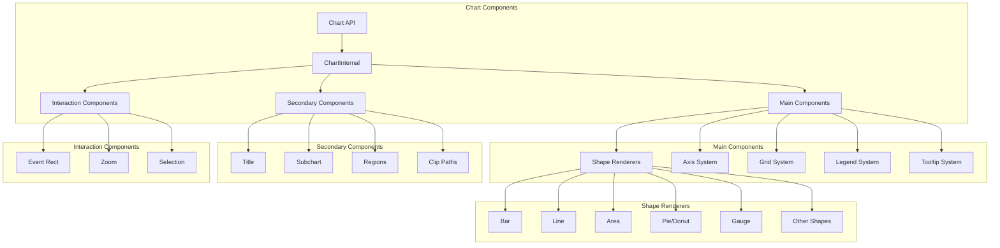

Sources:
- [src/ChartInternal/ChartInternal.ts:69-845](https://github.com/naver/billboard.js/blob/d6229c39/src/ChartInternal/ChartInternal.ts#L69-L845)
- [src/ChartInternal/internals/redraw.ts:11-217](https://github.com/naver/billboard.js/blob/d6229c39/src/ChartInternal/internals/redraw.ts#L11-L217)

### Component Initialization Flow

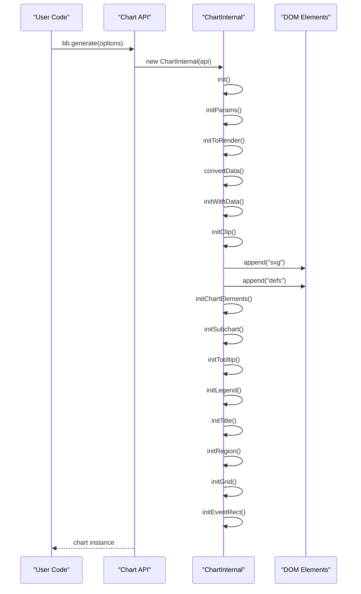

Sources:
- [src/ChartInternal/ChartInternal.ts:119-183](https://github.com/naver/billboard.js/blob/d6229c39/src/ChartInternal/ChartInternal.ts#L119-L183)
- [src/ChartInternal/ChartInternal.ts:246-282](https://github.com/naver/billboard.js/blob/d6229c39/src/ChartInternal/ChartInternal.ts#L246-L282)
- [src/ChartInternal/ChartInternal.ts:350-545](https://github.com/naver/billboard.js/blob/d6229c39/src/ChartInternal/ChartInternal.ts#L350-L545)

## Core Visual Components

Billboard.js charts consist of several key visual components that make up the chart's appearance and functionality.

### Chart Elements Structure

The DOM structure of billboard.js charts follows a hierarchical organization, with each component having its own element group:

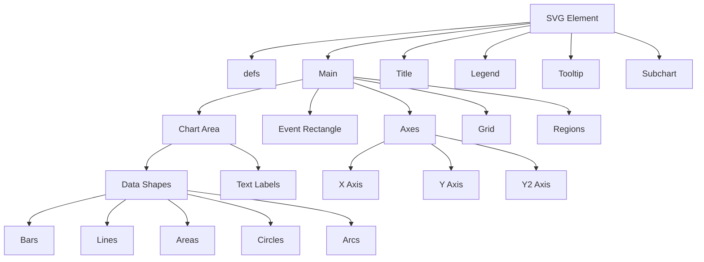

Sources:
- [src/ChartInternal/ChartInternal.ts:416-511](https://github.com/naver/billboard.js/blob/d6229c39/src/ChartInternal/ChartInternal.ts#L416-L511)
- [src/ChartInternal/ChartInternal.ts:601-642](https://github.com/naver/billboard.js/blob/d6229c39/src/ChartInternal/ChartInternal.ts#L601-L642)

### Exposed Component References

Billboard.js exposes references to chart components through the `$` property on the chart instance. This allows direct access to component DOM elements for custom manipulations:

```javascript
chart.$ = {
    chart,     // Chart container element
    svg,       // SVG element
    defs,      // Definitions element
    main,      // Main chart area
    tooltip,   // Tooltip element
    legend,    // Legend element
    title,     // Title element
    grid,      // Grid element
    arc,       // Arc element for pie/donut/gauge charts
    circles,   // Circle elements for scatter/bubble charts
    bar: {     // Bar chart elements
        bars
    },
    candlestick, // Candlestick chart elements
    line: {      // Line chart elements
        lines,
        areas
    },
    needle,      // Gauge needle element
    text: {      // Text labels
        texts
    }
}
```

Sources:
- [src/ChartInternal/ChartInternal.ts:601-642](https://github.com/naver/billboard.js/blob/d6229c39/src/ChartInternal/ChartInternal.ts#L601-L642)
- [test/internals/bb-spec.ts:65-85](https://github.com/naver/billboard.js/blob/d6229c39/test/internals/bb-spec.ts#L65-L85)

## Component Sizing and Layout

Billboard.js components are organized within the chart container according to a sizing and layout system that adapts to the chart's configuration, container size, and component dimensions.

### Margin and Padding System

The chart uses a margin system to create space for components like axes, legend, and title. The available space for the main chart area is calculated after setting these margins.

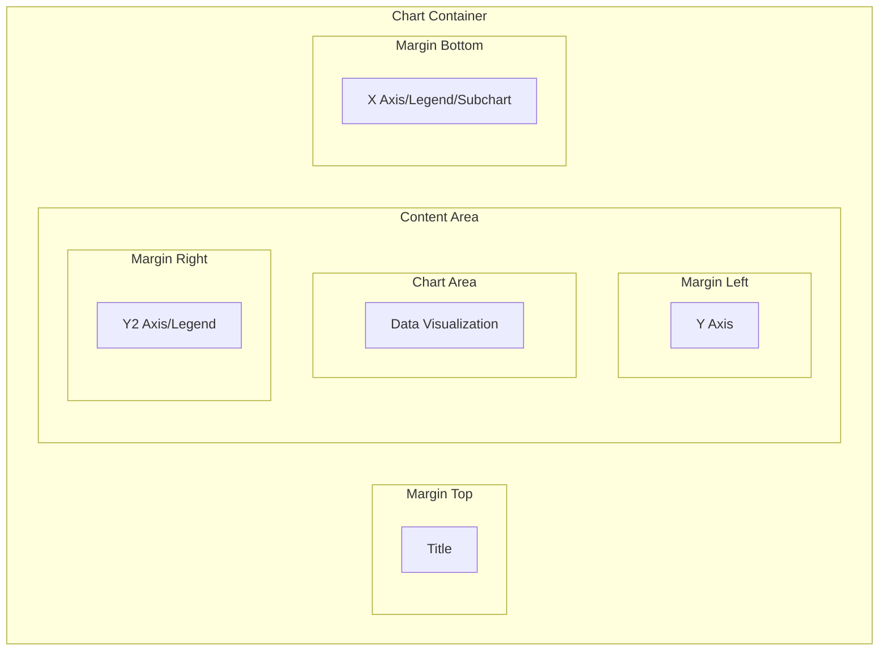

Sources:
- [src/ChartInternal/internals/size.ts:356-395](https://github.com/naver/billboard.js/blob/d6229c39/src/ChartInternal/internals/size.ts#L356-L395)
- [test/internals/padding-spec.ts:34-172](https://github.com/naver/billboard.js/blob/d6229c39/test/internals/padding-spec.ts#L34-L172)

### Sizing Calculation Flow

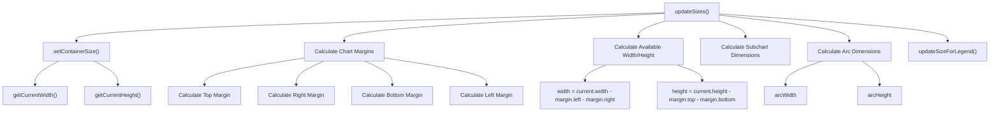

Sources:
- [src/ChartInternal/internals/size.ts:313-455](https://github.com/naver/billboard.js/blob/d6229c39/src/ChartInternal/internals/size.ts#L313-L455)
- [src/ChartInternal/internals/redraw.ts:26-36](https://github.com/naver/billboard.js/blob/d6229c39/src/ChartInternal/internals/redraw.ts#L26-L36)

### Component Positioning

Component positions are calculated and applied through transformations based on the calculated margins:

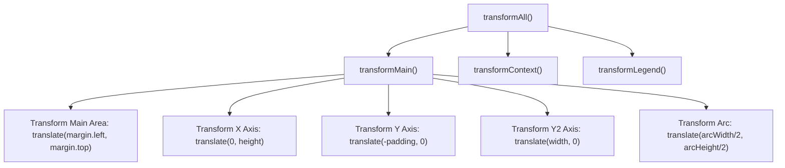

Sources:
- [src/ChartInternal/internals/transform.ts:12-103](https://github.com/naver/billboard.js/blob/d6229c39/src/ChartInternal/internals/transform.ts#L12-L103)
- [src/ChartInternal/internals/size.ts:176-216](https://github.com/naver/billboard.js/blob/d6229c39/src/ChartInternal/internals/size.ts#L176-L216)

## Component Interaction and Updating

Billboard.js components interact with each other during initialization, updates, and user interactions. The update process ensures all components stay in sync when data or settings change.

### Component Redraw Process

```mermaid
flowchart TD
    A["redraw()"] --> B["updateSizes()"]
    A --> C["updateLegend()"]
    A --> D["redrawAxis()"]
    A --> E["updateGrid()"]
    A --> F["updateRegion()"]
    
    A --> G1["updateBar()"]
    A --> G2["updateCandlestick()"]
    A --> G3["updateLine()"]
    A --> G4["updateArea()"]
    
    A --> H["redrawArc()"]
    A --> I["redrawRadar()"]
    A --> J["redrawPolar()"]
    A --> K["redrawFunnel()"]
    A --> L["updateTreemap()"]
    
    A --> M["updateCircle()"]
    A --> N["updateText()"]
    A --> O["redrawTitle()"]
    
    A --> P["generateRedrawList()"]
    P --> P1["redrawSubchart()"]
    P --> P2["generateFlow()"]
    P --> P3["getRedrawList()"]
    
    A --> Q["updateTooltipOnRedraw()"]
```

Sources:
- [src/ChartInternal/internals/redraw.ts:11-254](https://github.com/naver/billboard.js/blob/d6229c39/src/ChartInternal/internals/redraw.ts#L11-L254)

### Component Clipping System

Billboard.js uses SVG clip paths to limit the visibility of components to their designated areas:

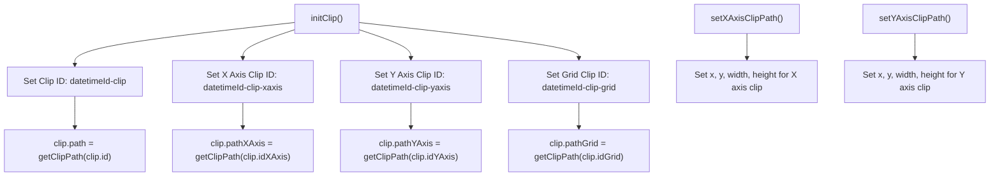

Sources:
- [src/ChartInternal/internals/clip.ts:6-147](https://github.com/naver/billboard.js/blob/d6229c39/src/ChartInternal/internals/clip.ts#L6-L147)
- [src/ChartInternal/ChartInternal.ts:439-445](https://github.com/naver/billboard.js/blob/d6229c39/src/ChartInternal/ChartInternal.ts#L439-L445)

## Component Customization

Billboard.js components can be customized through the chart configuration options. Each component has specific options that control its appearance and behavior.

### Common Component Configuration

The table below shows the main configuration options that affect multiple components:

| Option | Description | Affected Components |
|--------|-------------|---------------------|
| `padding` | Controls chart padding | All components |
| `size` | Sets chart dimensions | All components |
| `resize` | Controls resize behavior | All components |
| `transition` | Sets animation duration | All components |
| `bindto` | Target element for the chart | All components |
| `clipPath` | Controls clip-path usage | Chart area components |
| `svg_classname` | Class name for SVG element | SVG container |
| `background` | Chart background settings | Background |

Sources:
- [src/config/Options/common/main.ts:10-452](https://github.com/naver/billboard.js/blob/d6229c39/src/config/Options/common/main.ts#L10-L452)
- [test/internals/bb-spec.ts:665-724](https://github.com/naver/billboard.js/blob/d6229c39/test/internals/bb-spec.ts#L665-L724)

### Component-Specific Configuration Options

Each component in billboard.js has its own set of configuration options:

1. **Axis**:
   - `axis_x`, `axis_y`, `axis_y2` for axis settings
   - Controls for ticks, labels, padding, etc.

2. **Legend**:
   - `legend_show`, `legend_position`, etc.
   - Control for appearance and behavior

3. **Tooltip**:
   - `tooltip_show` and other tooltip settings
   - Format, content, and positioning

4. **Title**:
   - `title_text`, `title_position`, `title_padding`

5. **Grid**:
   - `grid_x_lines`, `grid_y_lines` for grid lines
   - Styling and positioning

Sources:
- [src/config/Options/common/main.ts:37-452](https://github.com/naver/billboard.js/blob/d6229c39/src/config/Options/common/main.ts#L37-L452)
- [test/internals/title-spec.ts:27-142](https://github.com/naver/billboard.js/blob/d6229c39/test/internals/title-spec.ts#L27-L142)

## Specialized Components

Beyond the core components, billboard.js includes specialized components for specific chart types and features.

### Title Component

The title component displays the chart title and is positioned based on configuration:

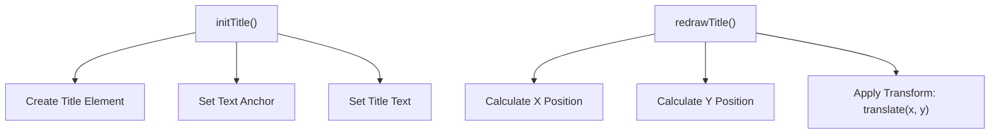

Sources:
- [src/ChartInternal/internals/title.ts:15-81](https://github.com/naver/billboard.js/blob/d6229c39/src/ChartInternal/internals/title.ts#L15-L81)
- [test/internals/title-spec.ts:35-143](https://github.com/naver/billboard.js/blob/d6229c39/test/internals/title-spec.ts#L35-L143)

### Arc Needle Component (for Gauge Charts)

The needle component is used in gauge charts to indicate a specific value:

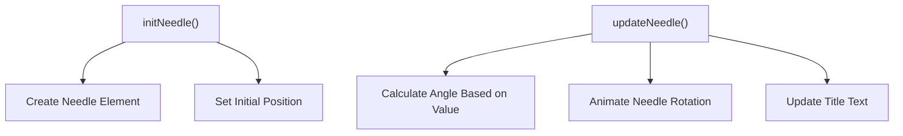

Sources:
- [test/shape/arc-needle-spec.ts:44-436](https://github.com/naver/billboard.js/blob/d6229c39/test/shape/arc-needle-spec.ts#L44-L436)

## Component Resize and Responsiveness

Billboard.js components adjust automatically when the chart is resized, either through window resizing or explicit API calls.

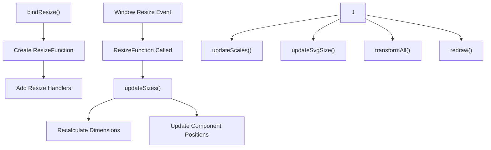

Sources:
- [src/ChartInternal/ChartInternal.ts:788-827](https://github.com/naver/billboard.js/blob/d6229c39/src/ChartInternal/ChartInternal.ts#L788-L827)
- [test/internals/bb-spec.ts:154-358](https://github.com/naver/billboard.js/blob/d6229c39/test/internals/bb-spec.ts#L154-L358)

## Summary

The components in billboard.js work together to create a cohesive chart. Each component has a specific role and responsibilities:

1. **Chart Container**: Holds all chart elements and manages overall chart dimensions
2. **Main Area**: Contains the primary data visualization elements
3. **Axes**: Display scales and provide context for data values
4. **Legend**: Shows data series information and allows toggling visibility
5. **Tooltip**: Provides detailed information on hover
6. **Title**: Displays the chart title
7. **Subchart**: Offers navigation for large datasets
8. **Grid**: Provides reference lines
9. **Regions**: Highlights specific areas of the chart

These components are managed by the `ChartInternal` class, which coordinates their initialization, rendering, and interaction. Understanding these components is essential for fully utilizing billboard.js's capabilities and customizing charts to meet specific requirements.

Sources:
- [src/ChartInternal/ChartInternal.ts:69-845](https://github.com/naver/billboard.js/blob/d6229c39/src/ChartInternal/ChartInternal.ts#L69-L845)