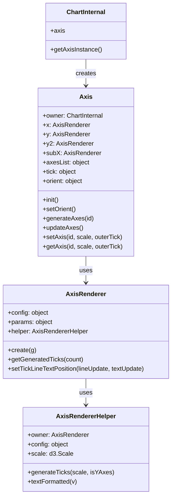
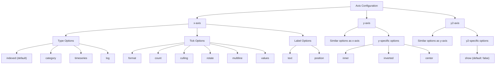
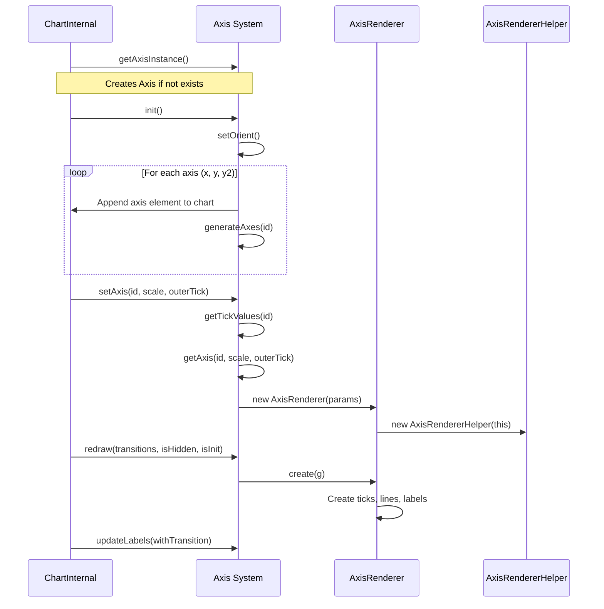
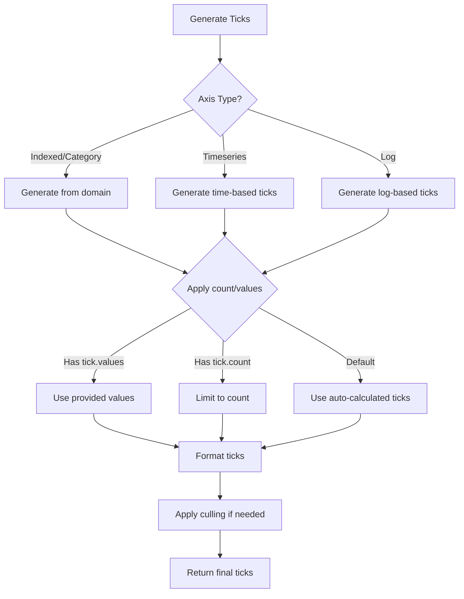
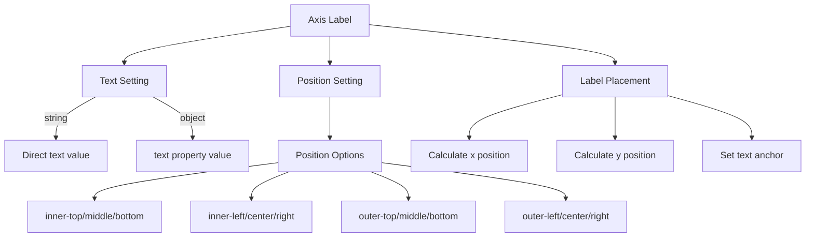
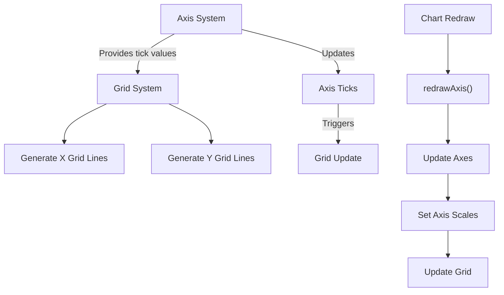

# Axis System

<details>
<summary>Relevant source files</summary>

The following files were used as context for generating this wiki page:

- [src/Chart/api/axis.ts](https://github.com/naver/billboard.js/blob/d6229c39/src/Chart/api/axis.ts)
- [src/ChartInternal/Axis/Axis.ts](https://github.com/naver/billboard.js/blob/d6229c39/src/ChartInternal/Axis/Axis.ts)
- [src/ChartInternal/Axis/AxisRenderer.ts](https://github.com/naver/billboard.js/blob/d6229c39/src/ChartInternal/Axis/AxisRenderer.ts)
- [src/ChartInternal/Axis/AxisRendererHelper.ts](https://github.com/naver/billboard.js/blob/d6229c39/src/ChartInternal/Axis/AxisRendererHelper.ts)
- [src/ChartInternal/internals/grid.ts](https://github.com/naver/billboard.js/blob/d6229c39/src/ChartInternal/internals/grid.ts)
- [src/ChartInternal/internals/size.axis.ts](https://github.com/naver/billboard.js/blob/d6229c39/src/ChartInternal/internals/size.axis.ts)
- [src/config/Options/axis/x.ts](https://github.com/naver/billboard.js/blob/d6229c39/src/config/Options/axis/x.ts)
- [src/config/Options/axis/y.ts](https://github.com/naver/billboard.js/blob/d6229c39/src/config/Options/axis/y.ts)
- [src/config/Options/axis/y2.ts](https://github.com/naver/billboard.js/blob/d6229c39/src/config/Options/axis/y2.ts)
- [test/api/axis-spec.ts](https://github.com/naver/billboard.js/blob/d6229c39/test/api/axis-spec.ts)
- [test/api/export-spec.ts](https://github.com/naver/billboard.js/blob/d6229c39/test/api/export-spec.ts)
- [test/internals/axis-spec.ts](https://github.com/naver/billboard.js/blob/d6229c39/test/internals/axis-spec.ts)
- [test/internals/axis-x-spec.ts](https://github.com/naver/billboard.js/blob/d6229c39/test/internals/axis-x-spec.ts)
- [test/internals/grid-spec.ts](https://github.com/naver/billboard.js/blob/d6229c39/test/internals/grid-spec.ts)
- [types/axis.d.ts](https://github.com/naver/billboard.js/blob/d6229c39/types/axis.d.ts)

</details>


The Axis System in billboard.js manages the creation, rendering, and configuration of chart axes (x, y, and optional y2). It handles axis initialization, tick generation, formatting, positioning, and integration with other chart components like the grid system. For information about grid lines specifically, see [Grid and Regions](#4.4).

## Core Components

The Axis System consists of three main components that work together to render and manage axes:



Sources: [src/ChartInternal/Axis/Axis.ts:30-34](https://github.com/naver/billboard.js/blob/d6229c39/src/ChartInternal/Axis/Axis.ts#L30-L34), [src/ChartInternal/Axis/Axis.ts:36-57](https://github.com/naver/billboard.js/blob/d6229c39/src/ChartInternal/Axis/Axis.ts#L36-L57), [src/ChartInternal/Axis/AxisRenderer.ts:11-17](https://github.com/naver/billboard.js/blob/d6229c39/src/ChartInternal/Axis/AxisRenderer.ts#L11-L17), [src/ChartInternal/Axis/AxisRendererHelper.ts:10-14](https://github.com/naver/billboard.js/blob/d6229c39/src/ChartInternal/Axis/AxisRendererHelper.ts#L10-L14)

### Axis Class

The `Axis` class is the primary controller for axis functionality and serves as the main entry point for axis operations. It:

1. Initializes axes and their orientations
2. Creates and manages axis elements
3. Handles ticks generation and updates
4. Controls axis labels and positioning
5. Manages axis transitions during chart updates

Sources: [src/ChartInternal/Axis/Axis.ts:58-79](https://github.com/naver/billboard.js/blob/d6229c39/src/ChartInternal/Axis/Axis.ts#L58-L79), [src/ChartInternal/Axis/Axis.ts:132-160](https://github.com/naver/billboard.js/blob/d6229c39/src/ChartInternal/Axis/Axis.ts#L132-L160)

### AxisRenderer

The `AxisRenderer` class handles the actual rendering of axis elements, including:

1. Creating ticks, lines, and text elements
2. Positioning axis elements correctly
3. Applying formatting to tick text
4. Handling multiline tick text
5. Applying tick rotations

Sources: [src/ChartInternal/Axis/AxisRenderer.ts:18-47](https://github.com/naver/billboard.js/blob/d6229c39/src/ChartInternal/Axis/AxisRenderer.ts#L18-L47), [src/ChartInternal/Axis/AxisRenderer.ts:48-240](https://github.com/naver/billboard.js/blob/d6229c39/src/ChartInternal/Axis/AxisRenderer.ts#L48-L240)

### AxisRendererHelper

The `AxisRendererHelper` class provides utility functions for the `AxisRenderer`, such as:

1. Calculating scales and ranges
2. Generating tick values
3. Formatting text for ticks
4. Computing dimensions for text elements
5. Managing transitions

Sources: [src/ChartInternal/Axis/AxisRendererHelper.ts:15-35](https://github.com/naver/billboard.js/blob/d6229c39/src/ChartInternal/Axis/AxisRendererHelper.ts#L15-L35), [src/ChartInternal/Axis/AxisRendererHelper.ts:38-65](https://github.com/naver/billboard.js/blob/d6229c39/src/ChartInternal/Axis/AxisRendererHelper.ts#L38-L65)

## Axis Types and Configuration

Billboard.js supports multiple axis types with extensive configuration options:



Sources: [types/axis.d.ts:7-29](https://github.com/naver/billboard.js/blob/d6229c39/types/axis.d.ts#L7-L29), [src/config/Options/axis/x.ts:8-46](https://github.com/naver/billboard.js/blob/d6229c39/src/config/Options/axis/x.ts#L8-L46), [src/config/Options/axis/y.ts:8-46](https://github.com/naver/billboard.js/blob/d6229c39/src/config/Options/axis/y.ts#L8-L46), [src/config/Options/axis/y2.ts:8-26](https://github.com/naver/billboard.js/blob/d6229c39/src/config/Options/axis/y2.ts#L8-L26)

### Common Configuration Options

All axes share some common configuration options:

- `show`: Show or hide the axis
- `type`: Axis type (indexed, category, timeseries, log)
- `tick`: Extensive tick formatting options
- `label`: Axis label text and positioning
- `min`/`max`: Set the minimum/maximum value for the axis

Sources: [types/axis.d.ts:31-47](https://github.com/naver/billboard.js/blob/d6229c39/types/axis.d.ts#L31-L47)

### X-Axis Specific Options

The x-axis has several unique configuration options:

- `categories`: Define category names for category type
- `localtime`: Control timezone handling for timeseries
- `height`: Set a specific height for the x-axis
- `padding`: Control padding around axis domain
- `forceAsSingle`: Force treating as a single axis
- `clipPath`: Control clipping of axis elements

Sources: [types/axis.d.ts:49-150](https://github.com/naver/billboard.js/blob/d6229c39/types/axis.d.ts#L49-L150), [src/config/Options/axis/x.ts:9-530](https://github.com/naver/billboard.js/blob/d6229c39/src/config/Options/axis/x.ts#L9-L530)

### Y/Y2-Axis Specific Options

The y and y2 axes have their own specific options:

- `inner`: Show axis inside the chart area
- `inverted`: Invert the direction of the axis
- `center`: Set a center value for the axis
- `default`: Set default range for axis when no data exists

Sources: [types/axis.d.ts:152-222](https://github.com/naver/billboard.js/blob/d6229c39/types/axis.d.ts#L152-L222), [src/config/Options/axis/y.ts:8-113](https://github.com/naver/billboard.js/blob/d6229c39/src/config/Options/axis/y.ts#L8-L113), [src/config/Options/axis/y2.ts:8-133](https://github.com/naver/billboard.js/blob/d6229c39/src/config/Options/axis/y2.ts#L8-L133)

## Axis Initialization and Rendering Process

The axis initialization and rendering follows a specific sequence:



Sources: [src/ChartInternal/Axis/Axis.ts:132-160](https://github.com/naver/billboard.js/blob/d6229c39/src/ChartInternal/Axis/Axis.ts#L132-L160), [src/ChartInternal/Axis/Axis.ts:276-294](https://github.com/naver/billboard.js/blob/d6229c39/src/ChartInternal/Axis/Axis.ts#L276-L294), [src/ChartInternal/Axis/Axis.ts:916-937](https://github.com/naver/billboard.js/blob/d6229c39/src/ChartInternal/Axis/Axis.ts#L916-L937)

## Tick Management

The Axis System provides extensive control over ticks:

### Tick Generation

Ticks are generated based on the axis type, domain, and configuration options:



Sources: [src/ChartInternal/Axis/Axis.ts:863-904](https://github.com/naver/billboard.js/blob/d6229c39/src/ChartInternal/Axis/Axis.ts#L863-L904), [src/ChartInternal/Axis/AxisRendererHelper.ts:95-143](https://github.com/naver/billboard.js/blob/d6229c39/src/ChartInternal/Axis/AxisRendererHelper.ts#L95-L143)

### Tick Positioning and Rotation

The system handles complex tick positioning and rotation logic:

1. Calculates optimal tick positions based on available space
2. Supports automatic rotation when ticks would otherwise overlap
3. Handles multiline ticks for long texts
4. Supports custom positioning via configuration

Sources: [src/ChartInternal/Axis/AxisRenderer.ts:304-386](https://github.com/naver/billboard.js/blob/d6229c39/src/ChartInternal/Axis/AxisRenderer.ts#L304-L386), [src/ChartInternal/internals/size.axis.ts:110-174](https://github.com/naver/billboard.js/blob/d6229c39/src/ChartInternal/internals/size.axis.ts#L110-L174)

## Axis Labels

Axis labels are configurable through options:



Sources: [src/ChartInternal/Axis/Axis.ts:458-470](https://github.com/naver/billboard.js/blob/d6229c39/src/ChartInternal/Axis/Axis.ts#L458-L470), [src/ChartInternal/Axis/Axis.ts:482-501](https://github.com/naver/billboard.js/blob/d6229c39/src/ChartInternal/Axis/Axis.ts#L482-L501), [src/ChartInternal/Axis/Axis.ts:804-836](https://github.com/naver/billboard.js/blob/d6229c39/src/ChartInternal/Axis/Axis.ts#L804-L836)

## Integration with Other Systems

The Axis System integrates with other chart components:

### Grid System Integration

The Axis System provides tick information to the Grid System for generating grid lines:



Sources: [src/ChartInternal/internals/grid.ts:53-59](https://github.com/naver/billboard.js/blob/d6229c39/src/ChartInternal/internals/grid.ts#L53-L59), [src/ChartInternal/internals/grid.ts:85-126](https://github.com/naver/billboard.js/blob/d6229c39/src/ChartInternal/internals/grid.ts#L85-L126), [src/ChartInternal/internals/grid.ts:127-164](https://github.com/naver/billboard.js/blob/d6229c39/src/ChartInternal/internals/grid.ts#L127-L164)

### Scale System Integration

The Axis System works closely with the Scale System:

1. Uses scales for positioning axis elements
2. Updates domains based on data and configuration
3. Handles different scale types (linear, log, time)
4. Manages extent calculations for zooming and navigation

Sources: [src/ChartInternal/Axis/Axis.ts:114-130](https://github.com/naver/billboard.js/blob/d6229c39/src/ChartInternal/Axis/Axis.ts#L114-L130), [src/ChartInternal/Axis/Axis.ts:97-107](https://github.com/naver/billboard.js/blob/d6229c39/src/ChartInternal/Axis/Axis.ts#L97-L107)

## Axis API

Billboard.js provides several API methods for axis manipulation:

### axis.labels()

Set or get axis labels:

```javascript
// Set axis labels
chart.axis.labels({
  x: "X Axis Label",
  y: "Y Axis Label",
  y2: "Y2 Axis Label"
});

// Get current axis labels
const labels = chart.axis.labels();
```

Sources: [test/api/axis-spec.ts:51-97](https://github.com/naver/billboard.js/blob/d6229c39/test/api/axis-spec.ts#L51-L97)

### axis.min() / axis.max()

Set or get axis minimum/maximum values:

```javascript
// Set axis minimum values
chart.axis.min({
  x: 0,
  y: 100,
  y2: -100
});

// Get current minimum values
const min = chart.axis.min();

// Set axis maximum values
chart.axis.max({
  x: 1000,
  y: 2000,
  y2: 500
});
```

Sources: [test/api/axis-spec.ts:101-242](https://github.com/naver/billboard.js/blob/d6229c39/test/api/axis-spec.ts#L101-L242)

## Common Customization Examples

### Rotated Axis

```javascript
const chart = bb.generate({
  data: {
    columns: [
      ["data1", 30, 200, 100, 400, 150, 250]
    ]
  },
  axis: {
    rotated: true  // Make x axis vertical and y axis horizontal
  }
});
```

Sources: [test/internals/axis-x-spec.ts:120-135](https://github.com/naver/billboard.js/blob/d6229c39/test/internals/axis-x-spec.ts#L120-L135)

### Log Scale

```javascript
const chart = bb.generate({
  data: {
    columns: [
      ["data1", 30, 200, 100, 400, 150, 250]
    ]
  },
  axis: {
    y: {
      type: "log"
    }
  }
});
```

Sources: [test/internals/grid-spec.ts:227-240](https://github.com/naver/billboard.js/blob/d6229c39/test/internals/grid-spec.ts#L227-L240)

### Custom Tick Values and Formatting

```javascript
const chart = bb.generate({
  data: {
    columns: [
      ["data1", 30, 200, 100, 400, 150, 250]
    ]
  },
  axis: {
    x: {
      tick: {
        values: [0, 1, 2, 4, 8, 16],
        format: function(x) {
          return "Value: " + x;
        }
      }
    }
  }
});
```

Sources: [test/internals/axis-spec.ts:582-612](https://github.com/naver/billboard.js/blob/d6229c39/test/internals/axis-spec.ts#L582-L612)

## Best Practices

1. **Choose the appropriate axis type** for your data (category for categorical data, timeseries for dates, etc.)
2. **Configure tick density** based on your data and available space
3. **Use axis labels** to provide context for your chart
4. **Consider tick rotation** for long tick texts to avoid overlap
5. **Use appropriate min/max values** to focus on relevant data ranges