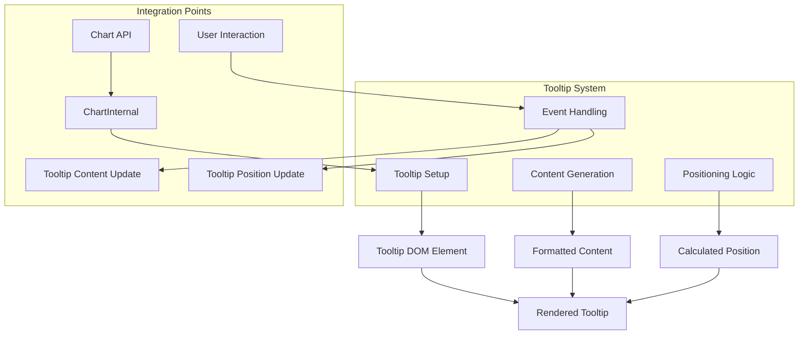
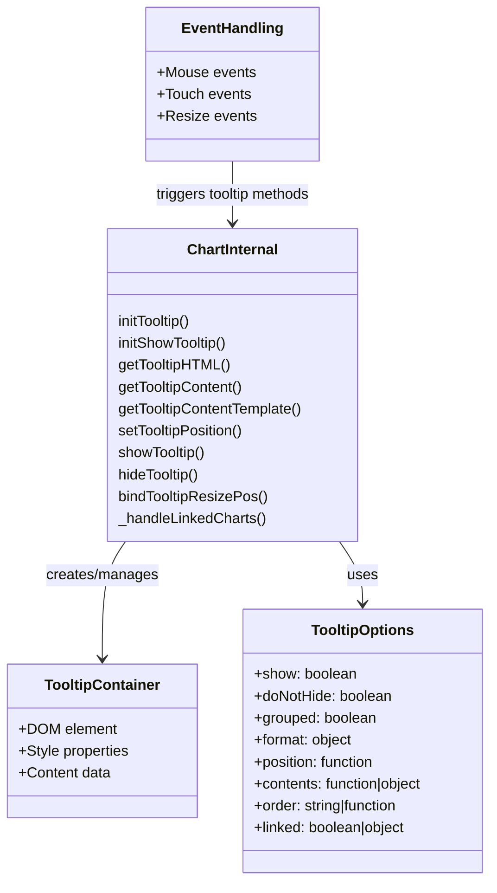
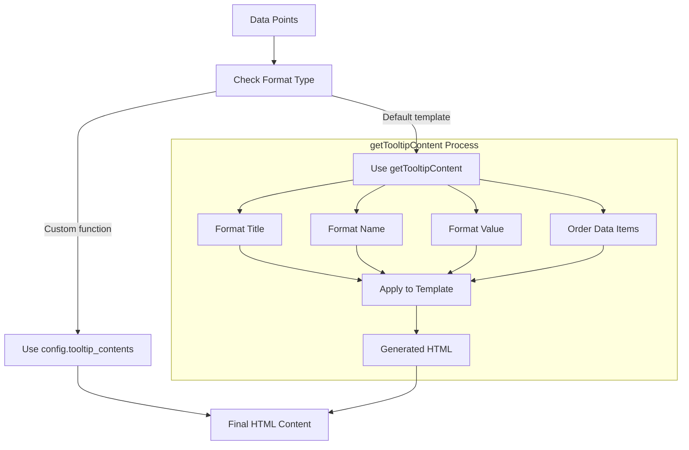
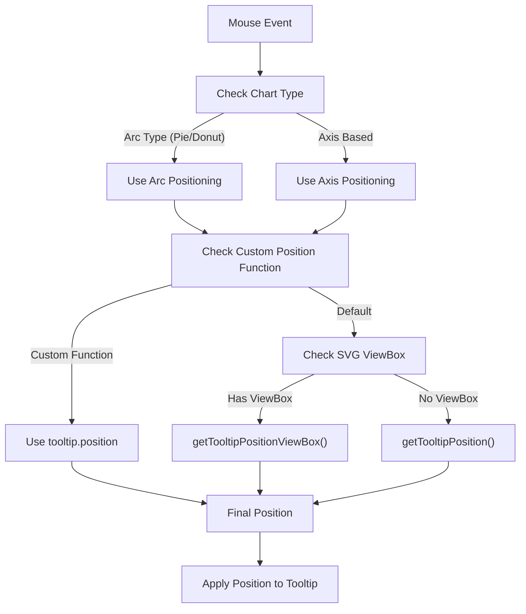
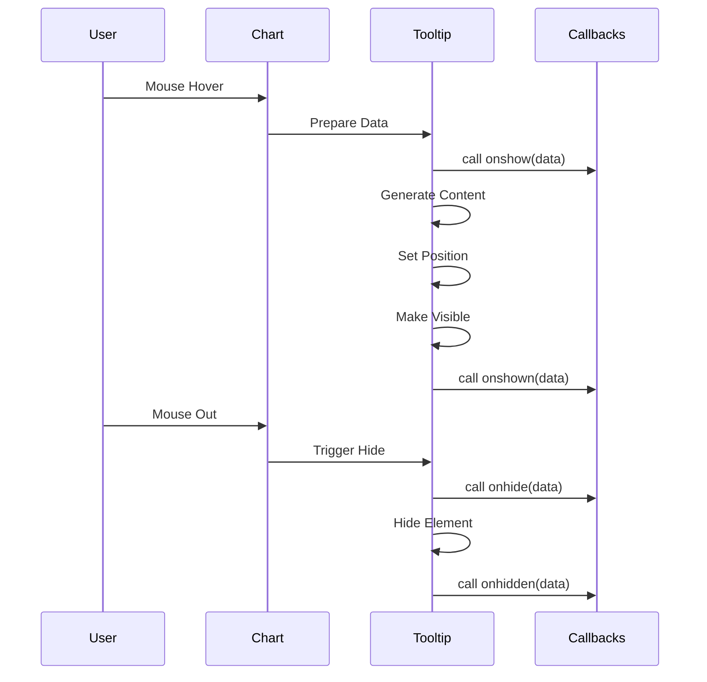
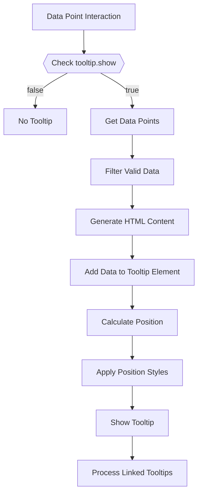

# Tooltip System

<details>
<summary>Relevant source files</summary>

The following files were used as context for generating this wiki page:

- [src/ChartInternal/internals/format.ts](https://github.com/naver/billboard.js/blob/d6229c39/src/ChartInternal/internals/format.ts)
- [src/ChartInternal/internals/tooltip.ts](https://github.com/naver/billboard.js/blob/d6229c39/src/ChartInternal/internals/tooltip.ts)
- [src/config/Options/common/tooltip.ts](https://github.com/naver/billboard.js/blob/d6229c39/src/config/Options/common/tooltip.ts)
- [test/internals/text-spec.ts](https://github.com/naver/billboard.js/blob/d6229c39/test/internals/text-spec.ts)
- [test/internals/tooltip-spec.ts](https://github.com/naver/billboard.js/blob/d6229c39/test/internals/tooltip-spec.ts)

</details>


This document provides a technical overview of the tooltip system in billboard.js, explaining how tooltips are implemented, configured, positioned, and customized.

## 1. Overview

The tooltip system provides interactive data information display when users hover over chart elements. The system handles tooltip initialization, content formatting, positioning, and event handling across different chart types.



Sources: [src/ChartInternal/internals/tooltip.ts:30-46](https://github.com/naver/billboard.js/blob/d6229c39/src/ChartInternal/internals/tooltip.ts#L30-L46), [src/ChartInternal/internals/tooltip.ts:89-96](https://github.com/naver/billboard.js/blob/d6229c39/src/ChartInternal/internals/tooltip.ts#L89-L96), [src/ChartInternal/internals/tooltip.ts:297-363](https://github.com/naver/billboard.js/blob/d6229c39/src/ChartInternal/internals/tooltip.ts#L297-L363)

## 2. Tooltip Architecture

The tooltip system consists of several key components that handle different aspects of tooltip functionality:



Sources: [src/ChartInternal/internals/tooltip.ts:25-46](https://github.com/naver/billboard.js/blob/d6229c39/src/ChartInternal/internals/tooltip.ts#L25-L46), [src/config/Options/common/tooltip.ts:8-253](https://github.com/naver/billboard.js/blob/d6229c39/src/config/Options/common/tooltip.ts#L8-L253)

### 2.1 Initialization

Tooltips are initialized during chart creation through the `initTooltip()` method. The system either:
- Uses a user-specified container element via `tooltip_contents.bindto` option
- Creates a new div element as the tooltip container with proper styling

```javascript
// Simplified logic of tooltip initialization
$el.tooltip = d3Select(config.tooltip_contents.bindto);

if ($el.tooltip.empty()) {
  $el.tooltip = $el.chart
    .append("div")
    .attr("class", $TOOLTIP.tooltipContainer)
    .style("position", "absolute")
    .style("pointer-events", "none")
    .style("display", "none");
}
```

Sources: [src/ChartInternal/internals/tooltip.ts:30-46](https://github.com/naver/billboard.js/blob/d6229c39/src/ChartInternal/internals/tooltip.ts#L30-L46)

### 2.2 Show/Hide Logic

The tooltip visibility is controlled by the `showTooltip()` and `hideTooltip()` methods which:
1. Determine which data points to display
2. Generate the appropriate HTML content 
3. Position the tooltip correctly
4. Handle user-defined callbacks

Sources: [src/ChartInternal/internals/tooltip.ts:507-597](https://github.com/naver/billboard.js/blob/d6229c39/src/ChartInternal/internals/tooltip.ts#L507-L597)

## 3. Content Generation

The tooltip content is generated through a series of steps that transform raw data into formatted HTML.



Sources: [src/ChartInternal/internals/tooltip.ts:89-269](https://github.com/naver/billboard.js/blob/d6229c39/src/ChartInternal/internals/tooltip.ts#L89-L269), [src/ChartInternal/internals/tooltip.ts:277-289](https://github.com/naver/billboard.js/blob/d6229c39/src/ChartInternal/internals/tooltip.ts#L277-L289)

### 3.1 Content Customization

Billboard.js offers several ways to customize tooltip content:

1. **Format Functions**: Configure format functions for title, name, and value
   ```javascript
   tooltip: {
     format: {
       title: function(x) { return "Data " + x; },
       name: function(name, ratio, id, index) { return name; },
       value: function(value, ratio, id, index) { return ratio; }
     }
   }
   ```

2. **Custom Content Function**: Provide a complete custom function
   ```javascript
   tooltip: {
     contents: function(d, defaultTitleFormat, defaultValueFormat, color) {
       return "<custom HTML>"; // return completely custom HTML
     }
   }
   ```

3. **Template-based Content**: Use template syntax for easier customization
   ```javascript
   tooltip: {
     contents: {
       template: '<ul class={=CLASS_TOOLTIP}>{{' +
         '<li class="{=CLASS_TOOLTIP_NAME}"><span>{=VALUE}</span><br>' +
         '<span style=color:{=COLOR}>{=NAME}</span></li>' +
       '}}</ul>'
     }
   }
   ```

Sources: [src/config/Options/common/tooltip.ts:22-86](https://github.com/naver/billboard.js/blob/d6229c39/src/config/Options/common/tooltip.ts#L22-L86), [src/ChartInternal/internals/tooltip.ts:107-269](https://github.com/naver/billboard.js/blob/d6229c39/src/ChartInternal/internals/tooltip.ts#L107-L269)

### 3.2 Data Ordering

Tooltip data can be ordered using the `tooltip.order` option:

- `null` (default): Maintains original data order (for stacked data, follows visual order)
- `"asc"`: Ascending order based on values
- `"desc"`: Descending order based on values
- Custom function: User-defined sorting logic

Sources: [src/ChartInternal/internals/tooltip.ts:131-169](https://github.com/naver/billboard.js/blob/d6229c39/src/ChartInternal/internals/tooltip.ts#L131-L169), [src/config/Options/common/tooltip.ts:72-79](https://github.com/naver/billboard.js/blob/d6229c39/src/config/Options/common/tooltip.ts#L72-L79)

## 4. Positioning System

The tooltip positioning system calculates where to place the tooltip based on data point position, chart type, and available space.



Sources: [src/ChartInternal/internals/tooltip.ts:297-499](https://github.com/naver/billboard.js/blob/d6229c39/src/ChartInternal/internals/tooltip.ts#L297-L499)

### 4.1 Default Positioning

The default positioning logic:
1. Determines chart type (arc-based or axis-based)
2. Calculates initial position based on mouse coordinates or data point
3. Adjusts position to ensure tooltip remains within viewport
4. Handles special cases for rotated axes, funnel/treemap types

The positioning logic in `getTooltipPosition()` method handles:

- Calculating base position considering chart's SVG coordinates
- Adjusting for rotated axes
- Ensuring tooltip doesn't overflow the chart boundaries
- Special positioning for different chart types

Sources: [src/ChartInternal/internals/tooltip.ts:428-499](https://github.com/naver/billboard.js/blob/d6229c39/src/ChartInternal/internals/tooltip.ts#L428-L499)

### 4.2 Custom Positioning

Users can provide custom positioning logic through the `tooltip.position` function:

```javascript
tooltip: {
  position: function(data, width, height, element, pos) {
    // data: Current data points
    // width/height: Tooltip dimensions
    // element: Event target element
    // pos: Default position information
    
    return {
      top: 100,  // pixels from top
      left: 150  // pixels from left
    };
  }
}
```

The position function receives detailed coordinates including:
- `x` and `y`: Mouse position coordinates
- `xAxis`: X axis position value
- `yAxis`: Y axis position value or function for multiple data points

Sources: [src/ChartInternal/internals/tooltip.ts:31-38](https://github.com/naver/billboard.js/blob/d6229c39/src/ChartInternal/internals/tooltip.ts#L31-L38), [src/config/Options/common/tooltip.ts:100-133](https://github.com/naver/billboard.js/blob/d6229c39/src/config/Options/common/tooltip.ts#L100-L133)

## 5. Events and Lifecycle

The tooltip system provides several lifecycle events that allow custom code execution at different stages.



Sources: [src/ChartInternal/internals/tooltip.ts:507-547](https://github.com/naver/billboard.js/blob/d6229c39/src/ChartInternal/internals/tooltip.ts#L507-L547), [src/ChartInternal/internals/tooltip.ts:579-597](https://github.com/naver/billboard.js/blob/d6229c39/src/ChartInternal/internals/tooltip.ts#L579-L597), [src/config/Options/common/tooltip.ts:192-219](https://github.com/naver/billboard.js/blob/d6229c39/src/config/Options/common/tooltip.ts#L192-L219)

### 5.1 Linked Tooltips

The system supports linked tooltips between multiple charts with the `tooltip.linked` option. When enabled:

1. Tooltips show simultaneously across charts with the same x-coordinate
2. Charts can be grouped using the `tooltip.linked.name` option
3. Tooltips respond together when one chart's tooltip is triggered

```javascript
// Enable linked tooltips for all charts
tooltip: {
  linked: true
}

// Enable linked tooltips only for charts with the same group name
tooltip: {
  linked: {
    name: "chart-group-1"
  }
}
```

Sources: [src/ChartInternal/internals/tooltip.ts:606-635](https://github.com/naver/billboard.js/blob/d6229c39/src/ChartInternal/internals/tooltip.ts#L606-L635), [src/config/Options/common/tooltip.ts:221-228](https://github.com/naver/billboard.js/blob/d6229c39/src/config/Options/common/tooltip.ts#L221-L228)

## 6. Special Cases and Chart Type Handling

### 6.1 Range Values

For chart types with range values (area-range, bar-range, candlestick), the tooltip shows multiple values:

- **Area Range**: Shows high, mid, and low values
- **Candlestick**: Shows open, high, low, close (and volume if available)
- **Bar Range**: Shows the range values

Sources: [src/ChartInternal/internals/tooltip.ts:207-236](https://github.com/naver/billboard.js/blob/d6229c39/src/ChartInternal/internals/tooltip.ts#L207-L236)

### 6.2 Tooltip Initial State

Tooltips can be shown at chart initialization using `tooltip.init` options:

```javascript
tooltip: {
  init: {
    show: true,      // Show tooltip on initialization
    x: 2,            // Show for this x index/value
    position: {      // Custom initial position
      top: "150px",
      left: 250
    }
  }
}
```

Sources: [src/ChartInternal/internals/tooltip.ts:53-80](https://github.com/naver/billboard.js/blob/d6229c39/src/ChartInternal/internals/tooltip.ts#L53-L80), [src/config/Options/common/tooltip.ts:65-68](https://github.com/naver/billboard.js/blob/d6229c39/src/config/Options/common/tooltip.ts#L65-L68)

### 6.3 Dynamic Updates

The tooltip system handles updates to data through the `updateTooltipOnRedraw()` method, which ensures tooltips show correct data after:

- Data loading
- Chart resizing
- Data toggling

For axis-based charts, the method updates tooltip based on current mouse position or index, while for arc/treemap charts, it recalculates the tooltip based on data under the cursor.

Sources: [src/ChartInternal/internals/tooltip.ts:644-691](https://github.com/naver/billboard.js/blob/d6229c39/src/ChartInternal/internals/tooltip.ts#L644-L691)

## 7. Tooltip Configuration Table

Here's a summary of the main tooltip configuration options:

| Option | Type | Default | Description |
|--------|------|---------|-------------|
| `show` | boolean | true | Show or hide tooltip |
| `doNotHide` | boolean | false | Keep tooltip visible on interaction |
| `grouped` | boolean | true | Group data points in tooltip |
| `format.title` | function | undefined | Format function for tooltip title |
| `format.name` | function | undefined | Format function for data point name |
| `format.value` | function | undefined | Format function for data point value |
| `position` | function | undefined | Custom positioning function |
| `contents` | function\|object | {} | Custom content generator or template config |
| `order` | string\|function | null | Data display order ("asc", "desc", null, or function) |
| `linked` | boolean\|object | false | Link tooltips across charts |
| `init.show` | boolean | false | Show tooltip at initialization |
| `init.x` | number | 0 | X index to show at initialization |
| `init.position` | object | undefined | Initial tooltip position |

Sources: [src/config/Options/common/tooltip.ts:8-253](https://github.com/naver/billboard.js/blob/d6229c39/src/config/Options/common/tooltip.ts#L8-L253)

## 8. Tooltip Rendering Process



Sources: [src/ChartInternal/internals/tooltip.ts:507-547](https://github.com/naver/billboard.js/blob/d6229c39/src/ChartInternal/internals/tooltip.ts#L507-L547), [src/ChartInternal/internals/tooltip.ts:297-363](https://github.com/naver/billboard.js/blob/d6229c39/src/ChartInternal/internals/tooltip.ts#L297-L363)

## 9. Integration with Default Formatters

The tooltip system integrates with the default formatting system to ensure consistent display of values:

1. For title formatting: Uses X-axis tick format if defined
2. For value formatting:
   - For arc types: Uses the `defaultArcValueFormat` which shows percentage values
   - For axis types: Uses Y-axis or Y2-axis tick format depending on the data point
   - For stacked normalized data: Shows percentage values